# Borrow Flow

End-to-end execution flow for borrowing assets from Aave V3.

## Quick Reference

| Aspect | Details |
|--------|---------|
| **Entry Point** | `Pool.borrow(asset, amount, interestRateMode, referralCode, onBehalfOf)` |
| **Key Transformations** | [Amount → Scaled Debt](../transformations/index.md#debt-token-transformations) |
| **State Changes** | `_scaledBalance[onBehalfOf] += scaledAmount` |
| **Events Emitted** | `Borrow`, `IsolationModeTotalDebtUpdated` (conditional) |

---

## Flow Diagram

```mermaid
flowchart TD
    %% Styling definitions
    classDef validation fill:#ffcccc,stroke:#ff0000,stroke-width:2px
    classDef transformation fill:#ccffcc,stroke:#00aa00,stroke-width:2px
    classDef storage fill:#ccccff,stroke:#0000ff,stroke-width:2px
    classDef event fill:#ffffcc,stroke:#aaaa00,stroke-width:2px
    classDef error fill:#ff0000,stroke:#000000,color:#fff
    classDef critical stroke:#ff0000,stroke-width:3px

    %% Entry point
    Entry["Pool.borrow<br/>asset, amount,<br/>interestRateMode,<br/>onBehalfOf"] --> Execute["BorrowLogic<br/>executeBorrow"]
    
    subgraph StateUpdate ["1. State Updates"]
        direction TB
        UpdateState["ReserveLogic<br/>updateState<br/>Updates indexes"] --> Validate["ValidationLogic<br/>validateBorrow<br/>CRITICAL: Borrows cap"]
        class Validate validation
    end
    
    subgraph HealthCheck ["2. Health Factor / Safety Checks"]
        direction TB
        CalcAccount["GenericLogic<br/>calculateUserAccountData<br/>Calculates HF, totalDebt"] --> IsolationMode{"Isolation<br/>Mode Active?"}
        
        IsolationMode -->|Yes| IsoDebt["STORAGE UPDATE<br/>isolationModeTotalDebt += amount"]
        class IsoDebt storage
        
        IsoDebt --> IsoEvent["EMIT<br/>IsolationModeTotalDebtUpdated"]
        class IsoEvent event
        
        IsolationMode -->|No| SkipIso[Continue]
    end
    
    subgraph TokenOps ["3. Token Operations"]
        direction TB
        IsoEvent --> RateCheck{"Interest<br/>Rate Mode?"}
        SkipIso --> RateCheck
        
        RateCheck -->|STABLE| StableMint["StableDebtToken<br/>mint"]
        
        RateCheck -->|VARIABLE| VariableMint["VariableDebtToken<br/>mint"]
        
        StableMint --> StableTransform["TRANSFORMATION<br/>principal += amount<br/>NOT scaled"]
        class StableTransform transformation
        
        VariableMint --> VariableTransform["TRANSFORMATION<br/>scaledAmount =<br/>amount.rayDiv(index)"]
        class VariableTransform transformation
        
        StableTransform --> StoreStable["STORAGE UPDATE<br/>_balances.principal += amount"]
        class StoreStable storage
        
        VariableTransform --> StoreVariable["STORAGE UPDATE<br/>_scaledBalance +=<br/>scaledAmount"]
        class StoreVariable storage
        
        StoreStable --> FirstBorrow1{"First<br/>Borrow?"}
        StoreVariable --> FirstBorrow2{"First<br/>Borrow?"}
        
        FirstBorrow1 -->|Yes| SetBorrow1["UserConfig<br/>setBorrowing"]
        class SetBorrow1 storage
        
        FirstBorrow2 -->|Yes| SetBorrow2["UserConfig<br/>setBorrowing"]
        class SetBorrow2 storage
        
        FirstBorrow1 -->|No| Skip1[Continue]
        FirstBorrow2 -->|No| Skip2[Continue]
        
        SetBorrow1 --> UpdateRates1["ReserveLogic<br/>updateInterestRates"]
        SetBorrow2 --> UpdateRates2["ReserveLogic<br/>updateInterestRates"]
    end
    
    Execute --> StateUpdate
    StateUpdate --> HealthCheck
    
    %% Critical path: Isolation mode check + HF validation
    UpdateRates1 --> Transfer1["AToken<br/>transferUnderlyingTo"]
    UpdateRates2 --> Transfer2["AToken<br/>transferUnderlyingTo"]
    
    Transfer1 --> FinalEvent["EMIT<br/>Borrow"]
    class FinalEvent event
    
    Transfer2 --> FinalEvent
    
    %% Error annotations
    %% CRITICAL: Isolation mode debt ceiling enforced
    %% CRITICAL: Health factor validated via calculateUserAccountData
    %% CRITICAL: Borrow cap prevents protocol overflow
    
    %% Link styles for critical paths
    linkStyle 10 stroke:#ff0000,stroke-width:3px
    linkStyle 17 stroke:#ff0000,stroke-width:3px
```



---

## Step-by-Step Execution

### 1. Entry Point

**File:** `contracts/protocol/pool/Pool.sol`

```solidity
function borrow(
    address asset,
    uint256 amount,
    uint256 interestRateMode,
    uint16 referralCode,
    address onBehalfOf
) external virtual override {
    BorrowLogic.executeBorrow(
        _reserves,
        _reservesList,
        _eModeCategories,
        _usersConfig[onBehalfOf],
        DataTypes.ExecuteBorrowParams({
            asset: asset,
            user: msg.sender,
            onBehalfOf: onBehalfOf,
            amount: amount,
            interestRateMode: DataTypes.InterestRateMode(interestRateMode),
            referralCode: referralCode,
            releaseUnderlying: true,
            maxStableRateBorrowSizePercent: _maxStableRateBorrowSizePercent,
            reservesCount: _reservesCount,
            oracle: ADDRESSES_PROVIDER.getPriceOracle(),
            userEModeCategory: _usersEModeCategory[onBehalfOf],
            priceOracleSentinel: ADDRESSES_PROVIDER.getPriceOracleSentinel()
        })
    );
}
```

### 2. Execute Borrow

**File:** `contracts/protocol/libraries/logic/BorrowLogic.sol`

```solidity
function executeBorrow(
    mapping(address => DataTypes.ReserveData) storage reserves,
    mapping(uint256 => address) storage reservesList,
    mapping(uint8 => DataTypes.EModeCategory) storage eModeCategories,
    DataTypes.UserConfigurationMap storage userConfig,
    DataTypes.ExecuteBorrowParams memory params
) external {
    DataTypes.ReserveData storage reserve = reserves[params.asset];
    DataTypes.ReserveCache memory reserveCache = reserve.cache();
    
    // Update state
    reserve.updateState(reserveCache);
    
    // Validate borrow
    ValidationLogic.validateBorrow(
        reserves,
        reservesList,
        eModeCategories,
        DataTypes.ValidateBorrowParams({
            reserveCache: reserveCache,
            userConfig: userConfig,
            asset: params.asset,
            user: params.user,
            amount: params.amount,
            interestRateMode: params.interestRateMode,
            maxStableLoanPercent: params.maxStableRateBorrowSizePercent,
            reservesCount: params.reservesCount,
            oracle: params.oracle,
            userEModeCategory: params.userEModeCategory
        })
    );
    
    // Calculate user account data
    (
        uint256 totalCollateralInBaseCurrency,
        uint256 totalDebtInBaseCurrency,
        uint256 avgLtv,
        uint256 avgLiquidationThreshold,
        uint256 healthFactor,
        bool hasZeroLtvCollateral
    ) = GenericLogic.calculateUserAccountData(
        reserves,
        reservesList,
        eModeCategories,
        DataTypes.CalculateUserAccountDataParams({
            userConfig: userConfig,
            reservesCount: params.reservesCount,
            user: params.onBehalfOf,
            oracle: params.oracle,
            userEModeCategory: params.userEModeCategory
        })
    );
    
    // Handle isolation mode
    if (hasZeroLtvCollateral) {
        reserve.isolationModeTotalDebt += uint128(params.amount);
        emit IsolationModeTotalDebtUpdated(
            params.asset,
            reserve.isolationModeTotalDebt
        );
    }
    
    // Mint debt tokens based on interest rate mode
    bool isFirstBorrowing = false;
    if (params.interestRateMode == DataTypes.InterestRateMode.STABLE) {
        isFirstBorrowing = IStableDebtToken(reserveCache.stableDebtTokenAddress)
            .mint(
                params.user,
                params.onBehalfOf,
                params.amount,
                reserveCache.currStableBorrowRate
            );
    } else {
        isFirstBorrowing = IVariableDebtToken(reserveCache.variableDebtTokenAddress)
            .mint(
                params.user,
                params.onBehalfOf,
                params.amount,
                reserveCache.nextVariableBorrowIndex
            );
    }
    
    // Update user configuration
    if (isFirstBorrowing) {
        userConfig.setBorrowing(reserve.id, true);
    }
    
    // Update interest rates
    reserve.updateInterestRates(
        reserveCache,
        params.asset,
        0,              // liquidityAdded
        params.amount   // liquidityTaken
    );
    
    // Transfer underlying to borrower
    IAToken(reserveCache.aTokenAddress).transferUnderlyingTo(
        params.user,
        params.amount
    );
    
    emit Borrow(
        params.asset,
        params.user,
        params.onBehalfOf,
        params.amount,
        params.interestRateMode,
        reserveCache.currVariableBorrowRate,
        params.referralCode
    );
}
```

### 3. Variable Debt Token Mint

**File:** `contracts/protocol/tokenization/VariableDebtToken.sol`

```solidity
function mint(
    address user,
    address onBehalfOf,
    uint256 amount,
    uint256 index
) external override onlyPool returns (bool) {
    return _mintScaled(user, onBehalfOf, amount, index);
}

function _mintScaled(
    address user,
    address onBehalfOf,
    uint256 amount,
    uint256 index
) internal returns (bool) {
    uint256 scaledAmount = amount.rayDiv(index);  // [TRANSFORMATION]
    _scaledBalance[onBehalfOf] += scaledAmount;
    
    return (scaledAmount != 0 && _scaledBalance[onBehalfOf] == scaledAmount);
}
```

**[TRANSFORMATION]:** See [Debt Token Transformations](../transformations/index.md#debt-token-transformations) for details on `amount.rayDiv(index)`

### 4. Stable Debt Token Mint

**File:** `contracts/protocol/tokenization/StableDebtToken.sol`

```solidity
function mint(
    address user,
    address onBehalfOf,
    uint256 amount,
    uint256 rate
) external override onlyPool returns (bool) {
    return _mint(user, onBehalfOf, amount, rate);
}

function _mint(
    address user,
    address onBehalfOf,
    uint256 amount,
    uint256 rate
) internal returns (bool) {
    // Stable debt is NOT scaled - stored as principal + timestamp
    uint256 previousBalance = _balances[onBehalfOf].principal;
    uint256 balanceIncrease = 0;
    
    if (previousBalance != 0) {
        balanceIncrease = previousBalance.rayMul(
            MathUtils.calculateCompoundedInterest(
                _balances[onBehalfOf].stableRate,
                _balances[onBehalfOf].lastUpdateTimestamp
            )
        ) - previousBalance;
    }
    
    _balances[onBehalfOf].principal = previousBalance + amount + balanceIncrease;
    _balances[onBehalfOf].stableRate = _calcAvgStableRate(
        previousBalance + balanceIncrease,
        _balances[onBehalfOf].stableRate,
        amount,
        rate
    );
    _balances[onBehalfOf].lastUpdateTimestamp = block.timestamp;
    
    return (previousBalance == 0);
}
```

**Note:** Stable debt is NOT scaled - it accrues interest via timestamp-based calculation.

### 5. Validation Checks

**File:** `contracts/protocol/libraries/logic/ValidationLogic.sol`

```solidity
function validateBorrow(
    mapping(address => DataTypes.ReserveData) storage reserves,
    mapping(uint256 => address) storage reservesList,
    mapping(uint8 => DataTypes.EModeCategory) storage eModeCategories,
    DataTypes.ValidateBorrowParams memory params
) internal view {
    require(params.amount != 0, Errors.INVALID_AMOUNT);
    
    // Check reserve is active and borrowing enabled
    require(
        params.reserveCache.reserveConfiguration.getActive(),
        Errors.RESERVE_INACTIVE
    );
    require(
        params.reserveCache.reserveConfiguration.getBorrowingEnabled(),
        Errors.BORROWING_NOT_ENABLED
    );
    require(
        !params.reserveCache.reserveConfiguration.getFrozen(),
        Errors.RESERVE_FROZEN
    );
    
    // Validate oracle
    require(
        params.oracle != address(0),
        Errors.PRICE_ORACLE_SENTINEL_CHECK_FAILED
    );
    
    // Get asset price
    uint256 assetPrice = IPriceOracleGetter(params.oracle).getAssetPrice(
        params.asset
    );
    require(assetPrice != 0, Errors.PRICE_ORACLE_SENTINEL_CHECK_FAILED);
    
    // Calculate user account data
    (
        uint256 totalCollateralInBaseCurrency,
        uint256 totalDebtInBaseCurrency,
        uint256 avgLtv,
        ,
        uint256 healthFactor,
        bool hasZeroLtvCollateral
    ) = GenericLogic.calculateUserAccountData(
        reserves,
        reservesList,
        eModeCategories,
        DataTypes.CalculateUserAccountDataParams({
            userConfig: params.userConfig,
            reservesCount: params.reservesCount,
            user: params.onBehalfOf,
            oracle: params.oracle,
            userEModeCategory: params.userEModeCategory
        })
    );
    
    // Check borrow cap
    uint256 borrowCap = params.reserveCache.reserveConfiguration.getBorrowCap();
    if (borrowCap != 0) {
        uint256 totalDebt = IERC20(params.reserveCache.variableDebtTokenAddress)
            .scaledTotalSupply()
            .rayMul(params.reserveCache.nextVariableBorrowIndex);
        totalDebt += IERC20(params.reserveCache.stableDebtTokenAddress).totalSupply();
        
        uint256 scaledCap = borrowCap * 10**params.reserveCache.reserveConfiguration.getDecimals();
        require(totalDebt + params.amount <= scaledCap, Errors.BORROW_CAP_EXCEEDED);
    }
    
    // Check isolation mode debt ceiling
    if (hasZeroLtvCollateral) {
        uint256 isolationModeDebtCeiling = params.reserveCache
            .reserveConfiguration
            .getDebtCeiling();
        
        require(
            params.reserveCache.isolationModeTotalDebt + params.amount <=
            isolationModeDebtCeiling,
            Errors.DEBT_CEILING_EXCEEDED
        );
    }
    
    // Check available liquidity
    uint256 availableLiquidity = IERC20(params.asset).balanceOf(
        params.reserveCache.aTokenAddress
    );
    require(availableLiquidity >= params.amount, Errors.INVALID_AMOUNT);
}
```

---

## Amount Transformations

### Variable Rate Borrow

```
User requests borrow (WAD decimals)
    ↓
amount = 1000 * 10^18  // 1000 tokens
    ↓
nextVariableBorrowIndex = 1.0003 * 10^27  // Current index
    ↓
scaledAmount = amount.rayDiv(nextVariableBorrowIndex)
             = (1000 * 10^18 * 10^27) / (1.0003 * 10^27)
             = 999.7 * 10^18  (approximate)
    ↓
_scaledBalance[onBehalfOf] += scaledAmount
```

### Stable Rate Borrow

```
User requests borrow (WAD decimals)
    ↓
amount = 1000 * 10^18  // 1000 tokens
    ↓
// No scaling! Stored directly with timestamp
_balances[onBehalfOf].principal += amount
_balances[onBehalfOf].lastUpdateTimestamp = block.timestamp
```

**Key Differences:**
- **Variable Rate:** Uses scaled balances with index-based interest accrual
- **Stable Rate:** Uses principal + timestamp, interest calculated on-demand
- Variable rate interest compounds automatically via index
- Stable rate interest calculated via `calculateCompoundedInterest()`

---

## Event Details

### Borrow Event

```solidity
event Borrow(
    address indexed reserve,          // Asset address
    address indexed user,             // msg.sender
    address indexed onBehalfOf,       // Debt recipient
    uint256 amount,                   // Amount borrowed
    DataTypes.InterestRateMode interestRateMode,  // 1=Stable, 2=Variable
    uint256 borrowRate,               // Current borrow rate
    uint16 referralCode               // Referral code
);
```

### IsolationModeTotalDebtUpdated Event

Emitted when borrowing against isolated collateral.

```solidity
event IsolationModeTotalDebtUpdated(
    address indexed asset,
    uint256 totalDebt
);
```

---

## Error Conditions

| Error | Condition | File |
|-------|-----------|------|
| `INVALID_AMOUNT` | `amount == 0` or `amount > availableLiquidity` | ValidationLogic.sol |
| `RESERVE_INACTIVE` | Reserve is not active | ValidationLogic.sol |
| `BORROWING_NOT_ENABLED` | Borrowing is disabled for reserve | ValidationLogic.sol |
| `RESERVE_FROZEN` | Reserve is frozen | ValidationLogic.sol |
| `BORROW_CAP_EXCEEDED` | `totalDebt + amount > borrowCap` | ValidationLogic.sol |
| `DEBT_CEILING_EXCEEDED` | `isolationModeTotalDebt + amount > debtCeiling` | ValidationLogic.sol |
| `PRICE_ORACLE_SENTINEL_CHECK_FAILED` | Oracle price is 0 or sentinel check fails | ValidationLogic.sol |

---

## Related Flows

- [Repay Flow](./repay.md) - Debt repayment
- [Liquidation Flow](./liquidation.md) - When health factor drops too low
- [Rate Swap Flow](./rate_swap.md) - Switching between stable and variable rates

---

## Source File Locations

```
contracts/protocol/pool/Pool.sol
contracts/protocol/libraries/logic/BorrowLogic.sol
contracts/protocol/libraries/logic/ValidationLogic.sol
contracts/protocol/libraries/logic/GenericLogic.sol
contracts/protocol/tokenization/VariableDebtToken.sol
contracts/protocol/tokenization/StableDebtToken.sol
contracts/protocol/tokenization/AToken.sol
contracts/protocol/libraries/logic/ReserveLogic.sol
```
