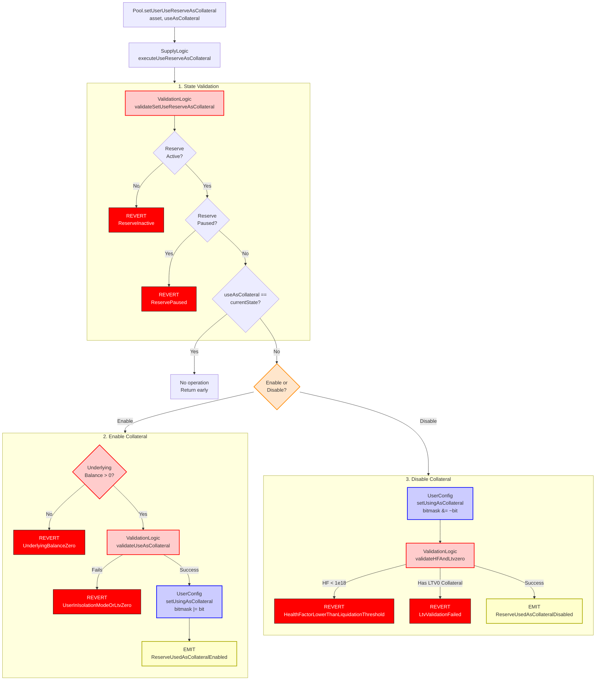

# Collateral Management Flow

End-to-end execution flow for enabling or disabling a supplied asset as collateral in Aave V3.

## Quick Reference

| Aspect | Details |
|--------|---------|
| **Entry Point** | `Pool.setUserUseReserveAsCollateral(asset, useAsCollateral)` |
| **Key Transformations** | None (bitmask operation only) |
| **State Changes** | `userConfig.data` bitmask updated via `setUsingAsCollateral` |
| **Events Emitted** | `ReserveUsedAsCollateralEnabled` or `ReserveUsedAsCollateralDisabled` |

---

## Flow Diagram



---

## Step-by-Step Execution

### 1. Entry Point

**File:** `contracts/protocol/pool/Pool.sol`

```solidity
function setUserUseReserveAsCollateral(
    address asset,
    bool useAsCollateral
) public virtual override {
    SupplyLogic.executeUseReserveAsCollateral(
        _reserves,
        _reservesList,
        _eModeCategories,
        _usersConfig[msg.sender],
        msg.sender,
        asset,
        useAsCollateral,
        ADDRESSES_PROVIDER.getPriceOracle(),
        _usersEModeCategory[msg.sender]
    );
}
```

### 2. Execute Use Reserve As Collateral

**File:** `contracts/protocol/libraries/logic/SupplyLogic.sol`

```solidity
function executeUseReserveAsCollateral(
    mapping(address => DataTypes.ReserveData) storage reservesData,
    mapping(uint256 => address) storage reservesList,
    mapping(uint8 => DataTypes.EModeCategory) storage eModeCategories,
    DataTypes.UserConfigurationMap storage userConfig,
    address user,
    address asset,
    bool useAsCollateral,
    address priceOracle,
    uint8 userEModeCategory
) external {
    DataTypes.ReserveData storage reserve = reservesData[asset];
    DataTypes.ReserveConfigurationMap memory reserveConfigCached = reserve.configuration;

    // Validate reserve state (active, not paused)
    ValidationLogic.validateSetUseReserveAsCollateral(reserveConfigCached);

    // Check if state is already as requested
    if (useAsCollateral == userConfig.isUsingAsCollateral(reserve.id)) return;

    if (useAsCollateral) {
        // ENABLING: Must have balance and pass collateral validation
        require(
            IAToken(reserve.aTokenAddress).scaledBalanceOf(user) != 0,
            Errors.UnderlyingBalanceZero()
        );

        require(
            ValidationLogic.validateUseAsCollateral(
                reservesData,
                reservesList,
                eModeCategories,
                userConfig,
                reserveConfigCached,
                asset,
                userEModeCategory
            ),
            Errors.UserInIsolationModeOrLtvZero()
        );

        userConfig.setUsingAsCollateral(reserve.id, asset, user, true);
    } else {
        // DISABLING: Update config first, then validate HF
        userConfig.setUsingAsCollateral(reserve.id, asset, user, false);
        ValidationLogic.validateHFAndLtvzero(
            reservesData,
            reservesList,
            eModeCategories,
            userConfig,
            asset,
            user,
            priceOracle,
            userEModeCategory
        );
    }
}
```

### 3. Validate Set Use Reserve As Collateral

**File:** `contracts/protocol/libraries/logic/ValidationLogic.sol`

```solidity
function validateSetUseReserveAsCollateral(
    DataTypes.ReserveConfigurationMap memory reserveConfig
) internal pure {
    (bool isActive, , , bool isPaused) = reserveConfig.getFlags();
    require(isActive, Errors.ReserveInactive());
    require(!isPaused, Errors.ReservePaused());
}
```

### 4. Validate Use As Collateral (Enable Path)

**File:** `contracts/protocol/libraries/logic/ValidationLogic.sol`

```solidity
function validateUseAsCollateral(
    mapping(address => DataTypes.ReserveData) storage reservesData,
    mapping(uint256 => address) storage reservesList,
    mapping(uint8 => DataTypes.EModeCategory) storage eModeCategories,
    DataTypes.UserConfigurationMap memory userConfig,
    DataTypes.ReserveConfigurationMap memory reserveConfig,
    address asset,
    uint8 userEModeCategory
) internal view returns (bool) {
    // Check if asset can be used as collateral (LTV > 0)
    if (reserveConfig.getLtv() == 0) {
        return false;
    }

    // Check eMode compatibility
    if (userEModeCategory != 0) {
        DataTypes.EModeCategory memory eModeCategory = eModeCategories[userEModeCategory];
        
        // In eMode, can only use collateral assets from the category
        if (!eModeCategory.collateralBitmap.getBit(reserveConfig.getReserveId())) {
            return false;
        }
    }

    // Check isolation mode restrictions
    if (userConfig.isUsingAsCollateralAny()) {
        // If user has any zero-LTV collateral, cannot add new collateral
        // unless it's the same asset
    }

    return true;
}
```

### 5. Set Using As Collateral (UserConfiguration)

**File:** `contracts/protocol/libraries/configuration/UserConfiguration.sol`

```solidity
function setUsingAsCollateral(
    DataTypes.UserConfigurationMap storage self,
    uint256 reserveIndex,
    address asset,
    address user,
    bool usingAsCollateral
) internal {
    unchecked {
        require(reserveIndex < ReserveConfiguration.MAX_RESERVES_COUNT, Errors.InvalidReserveIndex());
        
        // Calculate bit position: collateral flag is at (reserveIndex * 2) + 1
        // Borrow flag is at (reserveIndex * 2)
        uint256 bit = 1 << ((reserveIndex << 1) + 1);
        
        if (usingAsCollateral) {
            self.data |= bit;  // Set bit
            emit IPool.ReserveUsedAsCollateralEnabled(asset, user);
        } else {
            self.data &= ~bit;  // Clear bit
            emit IPool.ReserveUsedAsCollateralDisabled(asset, user);
        }
    }
}
```

### 6. Validate HF And LTV Zero (Disable Path)

**File:** `contracts/protocol/libraries/logic/ValidationLogic.sol`

```solidity
function validateHFAndLtvzero(
    mapping(address => DataTypes.ReserveData) storage reservesData,
    mapping(uint256 => address) storage reservesList,
    mapping(uint8 => DataTypes.EModeCategory) storage eModeCategories,
    DataTypes.UserConfigurationMap memory userConfig,
    address asset,
    address from,
    address oracle,
    uint8 userEModeCategory
) internal view {
    (, bool hasZeroLtvCollateral) = validateHealthFactor(
        reservesData,
        reservesList,
        eModeCategories,
        userConfig,
        from,
        userEModeCategory,
        oracle
    );

    // If the user has an LTV-zero asset, the selected asset must be the LTV0 asset.
    // This mechanism ensures that a multi-collateral position needs to withdraw/transfer
    // the LTV0 asset first.
    if (hasZeroLtvCollateral) {
        require(
            getUserReserveLtv(
                reservesData[asset],
                eModeCategories[userEModeCategory],
                userEModeCategory
            ) == 0,
            Errors.LtvValidationFailed()
        );
    }
}
```

### 7. Is Using As Collateral Check

**File:** `contracts/protocol/libraries/configuration/UserConfiguration.sol`

```solidity
function isUsingAsCollateral(
    DataTypes.UserConfigurationMap memory self,
    uint256 reserveIndex
) internal pure returns (bool) {
    unchecked {
        require(reserveIndex < ReserveConfiguration.MAX_RESERVES_COUNT, Errors.InvalidReserveIndex());
        // Check bit at position (reserveIndex * 2) + 1
        return (self.data >> ((reserveIndex << 1) + 1)) & 1 != 0;
    }
}
```

---

## Amount Transformations

Collateral management does not involve amount transformations. It is a configuration change that updates a bitmask in the `UserConfigurationMap` data structure.

### UserConfiguration Bitmap Structure

```
UserConfigurationMap.data (256 bits)
    
    Bits 0-1:   Reserve 0 (bit 0 = borrowing, bit 1 = collateral)
    Bits 2-3:   Reserve 1 (bit 2 = borrowing, bit 3 = collateral)
    Bits 4-5:   Reserve 2 (bit 4 = borrowing, bit 5 = collateral)
    ...
    Bits 2n, 2n+1: Reserve n
    
Collateral bit position = (reserveIndex << 1) + 1
```

### Bit Operations

**Enabling Collateral:**
```solidity
uint256 bit = 1 << ((reserveIndex << 1) + 1);
self.data |= bit;  // Sets the collateral bit to 1
```

**Disabling Collateral:**
```solidity
uint256 bit = 1 << ((reserveIndex << 1) + 1);
self.data &= ~bit;  // Clears the collateral bit to 0
```

---

## Event Details

### ReserveUsedAsCollateralEnabled Event

Emitted when a user enables an asset as collateral.

```solidity
event ReserveUsedAsCollateralEnabled(
    address indexed reserve,  // Asset address
    address indexed user      // User address
);
```

### ReserveUsedAsCollateralDisabled Event

Emitted when a user disables an asset as collateral.

```solidity
event ReserveUsedAsCollateralDisabled(
    address indexed reserve,  // Asset address
    address indexed user      // User address
);
```

---

## Error Conditions

| Error | Condition | File |
|-------|-----------|------|
| `ReserveInactive` | Reserve is not active | ValidationLogic.sol |
| `ReservePaused` | Reserve is paused | ValidationLogic.sol |
| `UnderlyingBalanceZero` | User has no aToken balance when enabling | SupplyLogic.sol |
| `UserInIsolationModeOrLtvZero` | Cannot enable as collateral (LTV=0 or isolation mode) | SupplyLogic.sol |
| `HealthFactorLowerThanLiquidationThreshold` | Disabling would make HF < 1.0 | ValidationLogic.sol |
| `LtvValidationFailed` | Has LTV0 collateral but trying to disable non-LTV0 asset | ValidationLogic.sol |
| `InvalidReserveIndex` | Reserve index exceeds maximum | UserConfiguration.sol |

---

## Related Flows

- [Supply Flow](./supply.md) - Initial deposit that creates collateral
- [Withdraw Flow](./withdraw.md) - Removing collateral from position
- [Borrow Flow](./borrow.md) - Borrowing against collateral
- [Liquidation Flow](./liquidation.md) - When collateral is seized

---

## Source File Locations

```
contracts/protocol/pool/Pool.sol
contracts/protocol/libraries/logic/SupplyLogic.sol
contracts/protocol/libraries/logic/ValidationLogic.sol
contracts/protocol/libraries/configuration/UserConfiguration.sol
contracts/protocol/libraries/types/DataTypes.sol
```
