# Eliminate Reserve Deficit Flow

End-to-end execution flow for covering a reserve's deficit by burning aToken positions.

## Quick Reference

| Aspect | Details |
|--------|---------|
| **Entry Point** | `Pool.eliminateReserveDeficit(asset, amount)` |
| **Key Transformations** | [Amount → Scaled Balance](../transformations/index.md#collateral-token-transformations) |
| **State Changes** | `reserve.deficit -= balanceWriteOff`, `_scaledBalance[user] -= scaledBalanceWriteOff` |
| **Events Emitted** | `DeficitCovered`, `ReserveUsedAsCollateralDisabled` (conditional) |

---

## Flow Diagram

```mermaid
flowchart TD
    %% Styling definitions
    classDef validation fill:#ffcccc,stroke:#ff0000,stroke-width:2px
    classDef transformation fill:#ccffcc,stroke:#00aa00,stroke-width:2px
    classDef storage fill:#ccccff,stroke:#0000ff,stroke-width:2px
    classDef event fill:#ffffcc,stroke:#aaaa00,stroke-width:2px
    classDef error fill:#ff0000,stroke:#000000,color:#fff
    classDef bridge fill:#ffccff,stroke:#aa00aa,stroke-width:2px
    classDef critical stroke:#ff0000,stroke-width:3px
    
    %% Entry point
    Entry["Pool.eliminateReserveDeficit
    asset, amount"] --> PermissionCheck["VALIDATION
    Caller must be Umbrella"]
    class PermissionCheck validation
    
    PermissionCheck --> Execute["LiquidationLogic
    executeEliminateDeficit"]
    
    subgraph ValidationPhase ["1. Initial Validations"]
        direction TB
        CheckAmount["VALIDATION
    amount != 0"]
        class CheckAmount validation
        
        CheckDeficit["VALIDATION
    reserve.deficit != 0"]
        class CheckDeficit validation
        
        CheckDebt["VALIDATION
    !userConfig.isBorrowingAny()"]
        class CheckDebt validation
    end
    
    Execute --> ValidationPhase
    
    subgraph StateUpdates ["2. State Updates"]
        direction TB
        UpdateState["ReserveLogic
    updateState
    Updates indexes,
    accrues interest"] --> CheckActive["VALIDATION
    reserve is active"]
        class CheckActive validation
    end
    
    ValidationPhase --> StateUpdates
    
    subgraph AmountCalculation ["3. Amount Calculations"]
        direction TB
        CapAmount["TRANSFORMATION
    balanceWriteOff =
    min(amount,
    currentDeficit)"] --> GetScaledBalance["AToken
    scaledBalanceOf(user)"]
        
        class CapAmount transformation
        
        CalcScaled["TRANSFORMATION
    scaledBalanceWriteOff =
    balanceWriteOff.
    getATokenBurnScaledAmount
    (nextLiquidityIndex)"]
        class CalcScaled transformation
        
        CheckUserBalance["VALIDATION
    scaledBalanceWriteOff <=
    userScaledBalance"]
        class CheckUserBalance validation
    end
    
    StateUpdates --> AmountCalculation
    
    subgraph CollateralCheck ["4. Collateral Configuration"]
        direction TB
        IsCollateral{"Is Using as
    Collateral?"} -->|Yes| IsFullBalance{"scaledBalanceWriteOff ==
    userScaledBalance?"}
        
        IsFullBalance -->|Yes| DisableCollat["UserConfig
    setUsingAsCollateral
    (reserve.id, false)"]
        class DisableCollat storage
        
        DisableCollat --> CollatEvent["EMIT
    ReserveUsedAsCollateralDisabled"]
        class CollatEvent event
        
        IsFullBalance -->|No| SkipCollat1[Continue]
        IsCollateral -->|No| SkipCollat1
    end
    
    AmountCalculation --> CollateralCheck
    
    subgraph TokenBurn ["5. Token Burn & Storage Updates"]
        direction TB
        Burn["AToken
    burn
    from: user,
    receiverOfUnderlying: aTokenAddress"] --> UpdateDeficit["STORAGE UPDATE
    reserve.deficit -=
    balanceWriteOff.toUint128()"]
        class UpdateDeficit storage
        
        Burn --> UpdateScaled["STORAGE UPDATE
    _scaledBalance[user] -=
    scaledBalanceWriteOff"]
        class UpdateScaled storage
    end
    
    CollateralCheck --> TokenBurn
    
    subgraph FinalUpdates ["6. Interest Rate Updates"]
        direction TB
        UpdateRates["ReserveLogic
    updateInterestRatesAndVirtualBalance
    (liquidityAdded: 0,
    liquidityTaken: 0)"] --> FinalEvent["EMIT
    DeficitCovered"]
        class FinalEvent event
    end
    
    TokenBurn --> FinalUpdates
    
    %% Link styles for critical paths
    linkStyle 0 stroke:#ff0000,stroke-width:3px
    linkStyle 4 stroke:#ff0000,stroke-width:3px
    linkStyle 8 stroke:#ff0000,stroke-width:3px
    linkStyle 12 stroke:#ff0000,stroke-width:3px
```



---

## Step-by-Step Execution

### 1. Entry Point

**File:** `contracts/protocol/pool/Pool.sol`

```solidity
function eliminateReserveDeficit(
    address asset,
    uint256 amount
) external override onlyUmbrella returns (uint256) {
    return
      LiquidationLogic.executeEliminateDeficit(
        _reserves,
        _usersConfig[_msgSender()],
        DataTypes.ExecuteEliminateDeficitParams({
          user: _msgSender(),
          asset: asset,
          amount: amount,
          interestRateStrategyAddress: RESERVE_INTEREST_RATE_STRATEGY
        })
      );
}
```

**Permission Check:** The `onlyUmbrella` modifier ensures only the registered Umbrella contract can call this function.

```solidity
modifier onlyUmbrella() {
    require(ADDRESSES_PROVIDER.getAddress(UMBRELLA) == _msgSender(), Errors.CallerNotUmbrella());
    _;
}
```

### 2. Execute Eliminate Deficit

**File:** `contracts/protocol/libraries/logic/LiquidationLogic.sol`

```solidity
function executeEliminateDeficit(
    mapping(address => DataTypes.ReserveData) storage reservesData,
    DataTypes.UserConfigurationMap storage userConfig,
    DataTypes.ExecuteEliminateDeficitParams memory params
) external returns (uint256) {
    require(params.amount != 0, Errors.InvalidAmount());

    DataTypes.ReserveData storage reserve = reservesData[params.asset];
    uint256 currentDeficit = reserve.deficit;

    require(currentDeficit != 0, Errors.ReserveNotInDeficit());
    require(!userConfig.isBorrowingAny(), Errors.UserCannotHaveDebt());

    DataTypes.ReserveCache memory reserveCache = reserve.cache();
    reserve.updateState(reserveCache);
    bool isActive = reserveCache.reserveConfiguration.getActive();
    require(isActive, Errors.ReserveInactive());

    uint256 balanceWriteOff = params.amount;

    if (params.amount > currentDeficit) {
      balanceWriteOff = currentDeficit;
    }

    uint256 userScaledBalance = IAToken(reserveCache.aTokenAddress).scaledBalanceOf(params.user);
    uint256 scaledBalanceWriteOff = balanceWriteOff.getATokenBurnScaledAmount(
      reserveCache.nextLiquidityIndex
    );
    require(scaledBalanceWriteOff <= userScaledBalance, Errors.NotEnoughAvailableUserBalance());

    bool isCollateral = userConfig.isUsingAsCollateral(reserve.id);
    if (isCollateral && scaledBalanceWriteOff == userScaledBalance) {
      userConfig.setUsingAsCollateral(reserve.id, params.asset, params.user, false);
    }

    IAToken(reserveCache.aTokenAddress).burn({
      from: params.user,
      receiverOfUnderlying: reserveCache.aTokenAddress,
      amount: balanceWriteOff,
      scaledAmount: scaledBalanceWriteOff,
      index: reserveCache.nextLiquidityIndex
    });

    reserve.deficit -= balanceWriteOff.toUint128();

    reserve.updateInterestRatesAndVirtualBalance(
      reserveCache,
      params.asset,
      0,
      0,
      params.interestRateStrategyAddress
    );

    emit IPool.DeficitCovered(params.asset, params.user, balanceWriteOff);

    return balanceWriteOff;
}
```

### 3. What is a Reserve Deficit?

A reserve deficit occurs when the protocol has bad debt that cannot be fully liquidated. This typically happens during liquidation when:

1. A borrower's position is undercollateralized (Health Factor < 1)
2. The liquidator seizes all available collateral
3. The seized collateral is insufficient to cover the entire debt
4. The remaining unpaid debt becomes a deficit

**How Deficit is Created:**

```solidity
// In liquidation, when borrower has no collateral left but still has debt:
uint256 outstandingDebt = borrowerReserveDebt - actualDebtToLiquidate;
if (hasNoCollateralLeft && outstandingDebt != 0) {
    debtReserve.deficit += outstandingDebt.toUint128();
    emit IPool.DeficitCreated(borrower, debtAsset, outstandingDebt);
}
```

### 4. Amount Transformations

**File:** `contracts/protocol/libraries/logic/GenericLogic.sol`

```solidity
function getATokenBurnScaledAmount(
    uint256 amount,
    uint256 liquidityIndex
) internal pure returns (uint256) {
    return amount.rayDivCeil(liquidityIndex);
}
```

---

## Amount Transformations

### Input → Storage

```
User Input (WAD decimals)
    ↓
amount = 1000 * 10^18  // Maximum aTokens to burn
    ↓
currentDeficit = reserve.deficit
    ↓
balanceWriteOff = min(amount, currentDeficit)
    ↓
liquidityIndex = 1.0001 * 10^27  // Current index
    ↓
scaledBalanceWriteOff = balanceWriteOff.rayDivCeil(liquidityIndex)
                      = ceil((balanceWriteOff * 10^27) / liquidityIndex)
                      // Rounded UP to ensure sufficient burn
    ↓
reserve.deficit -= balanceWriteOff
_scaledBalance[user] -= scaledBalanceWriteOff
```

**Key Points:**
- User provides aToken amount (WAD decimals - typically 18)
- Scaled balance uses RAY precision (27 decimals)
- `rayDivCeil` rounds UP to ensure the user's position is sufficiently reduced
- Deficit reduction is capped at current deficit amount
- Underlying assets are sent to the aToken contract (not withdrawn by user)

---

## Event Details

### DeficitCovered Event

Emitted when deficit coverage is successfully executed.

```solidity
event DeficitCovered(
    address indexed reserve,      // Asset address whose deficit is covered
    address indexed caller,       // User who provided coverage (burned aTokens)
    uint256 amountCovered         // Amount of deficit covered (in underlying asset)
);
```

### ReserveUsedAsCollateralDisabled Event

Emitted conditionally when the user burns their entire aToken balance for a collateral asset.

```solidity
event ReserveUsedAsCollateralDisabled(
    address indexed reserve,
    address indexed user
);
```

---

## Error Conditions

| Error | Condition | File |
|-------|-----------|------|
| `CallerNotUmbrella` | `msg.sender != ADDRESSES_PROVIDER.getAddress(UMBRELLA)` | Pool.sol |
| `InvalidAmount` | `amount == 0` | LiquidationLogic.sol |
| `ReserveNotInDeficit` | `reserve.deficit == 0` | LiquidationLogic.sol |
| `UserCannotHaveDebt` | `userConfig.isBorrowingAny() == true` | LiquidationLogic.sol |
| `ReserveInactive` | `!reserveCache.reserveConfiguration.getActive()` | LiquidationLogic.sol |
| `NotEnoughAvailableUserBalance` | `scaledBalanceWriteOff > userScaledBalance` | LiquidationLogic.sol |

**Key Constraints:**
- **Umbrella-only access:** Only the protocol's Umbrella contract can initiate deficit elimination
- **No debt allowed:** The coverage provider must have no outstanding debt positions
- **Deficit required:** The reserve must actually have a deficit to cover
- **Sufficient balance:** The user must have enough aTokens to burn

---

## Related Flows

- [Liquidation Flow](./liquidation.md) - Where deficits are created from bad debt
- [Supply Flow](./supply.md) - Creating aToken positions that can be burned for deficit coverage
- [Withdraw Flow](./withdraw.md) - Similar aToken burn mechanics

---

## Source File Locations

```
contracts/protocol/pool/Pool.sol
contracts/protocol/libraries/logic/LiquidationLogic.sol
contracts/protocol/libraries/logic/ReserveLogic.sol
contracts/protocol/libraries/logic/GenericLogic.sol
contracts/protocol/tokenization/AToken.sol
```

---

## Permission Requirements

This function has **restricted access** - only callable by the **Umbrella contract**. The Umbrella is a protocol-level safety mechanism that:

1. Accumulates protocol revenue/fees over time
2. Can use accumulated funds to cover deficits via deficit elimination
3. Acts as a backstop for protocol solvency

The call flow is typically:
1. Umbrella contract calls `eliminateReserveDeficit`
2. A specified amount of Umbrella's aTokens are burned
3. The reserve's deficit is reduced
4. Protocol solvency is maintained
