# E-Mode Management Flow

End-to-end execution flow for setting a user's Efficiency Mode (eMode) category in Aave V3.

## Quick Reference

| Aspect | Details |
|--------|---------|
| **Entry Point** | `Pool.setUserEMode(categoryId)` or `Pool.setUserEModeOnBehalfOf(categoryId, onBehalfOf)` |
| **Key Transformations** | [Health Factor Calculation](../transformations/index.md#health-factor-calculations) |
| **State Changes** | `_usersEModeCategory[user] = categoryId` |
| **Events Emitted** | `UserEModeSet` |

---

## Flow Diagram

```mermaid
flowchart TD
    %% Styling definitions
    classDef validation fill:#ffcccc,stroke:#ff0000,stroke-width:2px
    classDef transformation fill:#ccffcc,stroke:#00aa00,stroke-width:2px
    classDef storage fill:#ccccff,stroke:#0000ff,stroke-width:2px
    classDef event fill:#ffffcc,stroke:#aaaa00,stroke-width:2px
    classDef error fill:#ff0000,stroke:#000000,color:#fff
    classDef position fill:#ccffff,stroke:#00aaaa,stroke-width:2px

    %% Entry points
    Entry1["Pool.setUserEMode<br/>categoryId"] --> Execute["SupplyLogic<br/>executeSetUserEMode"]

    Entry2["Pool.setUserEModeOnBehalfOf<br/>categoryId, onBehalfOf"] --> PositionManager{"Is Position<br/>Manager Approved?"}
    class PositionManager position

    PositionManager -->|Yes| Execute
    PositionManager -->|No| RevertNotManager["REVERT<br/>CallerNotPositionManager"]
    class RevertNotManager error

    subgraph ValidationPhase ["1. Validation Phase"]
        direction TB
        CategoryCheck{"categoryId ==<br/>currentCategory?"} -->|Yes| ReturnEarly[Return Early]
        CategoryCheck -->|No| ValidateCategory["ValidationLogic<br/>validateSetUserEMode"]
        class ValidateCategory validation

        ValidateCategory --> CategoryExists{"categoryId != 0 AND<br/>liqThreshold == 0?"}
        CategoryExists -->|Yes| RevertInvalidCategory["REVERT<br/>InconsistentEModeCategory"]
        class RevertInvalidCategory error
        CategoryExists -->|No| CheckEmptyConfig

        CheckEmptyConfig{"userConfig<br/>.isEmpty()?"} -->|Yes| SkipAssetValidation
        CheckEmptyConfig -->|No| ValidateAssets

        ValidateAssets --> IterateAssets["Iterate through<br/>user assets"]
        IterateAssets --> CheckBorrowed{"Asset is<br/>Borrowed?"}
        CheckBorrowed -->|Yes| CheckBorrowable["Asset in category borrowableBitmap"]
        class CheckBorrowable validation
        CheckBorrowable -->|No| RevertInvalidDebt["REVERT<br/>InvalidDebtInEmode"]
        class RevertInvalidDebt error
        CheckBorrowable -->|Yes| NextAsset
        CheckBorrowed -->|No| CheckCollateral

        CheckCollateral{"Asset is<br/>Collateral?"} -->|Yes| CheckLtv["getUserReserveLtv<br/>!= 0?"]
        class CheckLtv validation
        CheckLtv -->|No| RevertInvalidCollateral["REVERT<br/>InvalidCollateralInEmode"]
        class RevertInvalidCollateral error
        CheckLtv -->|Yes| NextAsset
        CheckCollateral -->|No| NextAsset

        NextAsset --> MoreAssets{"More Assets?"}
        MoreAssets -->|Yes| IterateAssets
        MoreAssets -->|No| SkipAssetValidation
    end

    Execute --> ValidationPhase

    SkipAssetValidation --> UpdateStorage["STORAGE UPDATE<br/>_usersEModeCategory<br/>[user] = categoryId"]
    class UpdateStorage storage

    subgraph HealthFactorCheck ["2. Health Factor Validation"]
        direction TB
        ValidateHF["ValidationLogic<br/>validateHealthFactor"]
        class ValidateHF validation

        ValidateHF --> CalculateHF["GenericLogic<br/>calculateUserAccountData<br/>with new eMode"]
        class CalculateHF transformation

        CalculateHF --> HFCheck{"healthFactor >=<br/>LIQUIDATION_THRESHOLD?"}
        HFCheck -->|No| RevertHF["REVERT<br/>HealthFactorLowerThanLiquidationThreshold"]
        class RevertHF error
        HFCheck -->|Yes| EmitEvent
    end

    UpdateStorage --> HealthFactorCheck

    EmitEvent["EMIT<br/>UserEModeSet"]
    class EmitEvent event

    %% Error annotations
    %% CRITICAL: All asset validations must pass for target category
    %% CRITICAL: Health factor must remain healthy after category switch
    %% CRITICAL: Category 0 is always valid (no eMode)

    %% Link styles for critical paths
    linkStyle 6 stroke:#ff0000,stroke-width:3px
    linkStyle 15 stroke:#ff0000,stroke-width:3px
    linkStyle 21 stroke:#ff0000,stroke-width:3px
```



---

## Step-by-Step Execution

### 1. Entry Points

#### Direct Call (User setting their own eMode)

**File:** `contracts/protocol/pool/Pool.sol`

```solidity
function setUserEMode(uint8 categoryId) external virtual override {
    SupplyLogic.executeSetUserEMode(
        _reserves,
        _reservesList,
        _eModeCategories,
        _usersEModeCategory,
        _usersConfig[_msgSender()],
        _msgSender(),
        ADDRESSES_PROVIDER.getPriceOracle(),
        categoryId
    );
}
```

#### On Behalf Of Call (Position Manager)

**File:** `contracts/protocol/pool/Pool.sol`

```solidity
function setUserEModeOnBehalfOf(
    uint8 categoryId,
    address onBehalfOf
) external override onlyPositionManager(onBehalfOf) {
    SupplyLogic.executeSetUserEMode(
        _reserves,
        _reservesList,
        _eModeCategories,
        _usersEModeCategory,
        _usersConfig[onBehalfOf],
        onBehalfOf,
        ADDRESSES_PROVIDER.getPriceOracle(),
        categoryId
    );
}
```

**Note:** `setUserEModeOnBehalfOf` requires the caller to be an approved position manager for the user.

### 2. Execute Set User EMode

**File:** `contracts/protocol/libraries/logic/SupplyLogic.sol`

```solidity
function executeSetUserEMode(
    mapping(address => DataTypes.ReserveData) storage reservesData,
    mapping(uint256 => address) storage reservesList,
    mapping(uint8 => DataTypes.EModeCategory) storage eModeCategories,
    mapping(address => uint8) storage usersEModeCategory,
    DataTypes.UserConfigurationMap storage userConfig,
    address user,
    address oracle,
    uint8 categoryId
) external {
    // Early return if already in target category
    if (usersEModeCategory[user] == categoryId) return;

    // Validate that all user assets are valid in target category
    ValidationLogic.validateSetUserEMode(
        reservesData,
        reservesList,
        eModeCategories,
        userConfig,
        categoryId
    );

    // Update user's eMode category
    usersEModeCategory[user] = categoryId;

    // Validate health factor remains healthy with new category
    ValidationLogic.validateHealthFactor(
        reservesData,
        reservesList,
        eModeCategories,
        userConfig,
        user,
        categoryId,
        oracle
    );

    emit IPool.UserEModeSet(user, categoryId);
}
```

### 3. Validate Set User EMode

**File:** `contracts/protocol/libraries/logic/ValidationLogic.sol`

```solidity
function validateSetUserEMode(
    mapping(address => DataTypes.ReserveData) storage reservesData,
    mapping(uint256 => address) storage reservesList,
    mapping(uint8 => DataTypes.EModeCategory) storage eModeCategories,
    DataTypes.UserConfigurationMap memory userConfig,
    uint8 categoryId
) internal view {
    DataTypes.EModeCategory storage eModeCategory = eModeCategories[categoryId];

    // Category is invalid if liquidation threshold is not set (except category 0)
    require(
        categoryId == 0 || eModeCategory.liquidationThreshold != 0,
        Errors.InconsistentEModeCategory()
    );

    // eMode can always be enabled if user hasn't supplied anything
    if (userConfig.isEmpty()) {
        return;
    }

    uint256 i = 0;
    bool isBorrowed = false;
    bool isEnabledAsCollateral = false;
    uint256 unsafe_cachedUserConfig = userConfig.data;

    // Iterate through all user assets
    unchecked {
        while (unsafe_cachedUserConfig != 0) {
            (unsafe_cachedUserConfig, isBorrowed, isEnabledAsCollateral) = UserConfiguration
                .getNextFlags(unsafe_cachedUserConfig);

            // Ensure borrowed assets can be borrowed in target category
            if (isBorrowed) {
                require(
                    categoryId != 0
                        ? EModeConfiguration.isReserveEnabledOnBitmap(eModeCategory.borrowableBitmap, i)
                        : reservesData[reservesList[i]].configuration.getBorrowingEnabled(),
                    Errors.InvalidDebtInEmode(reservesList[i], categoryId)
                );
            }

            // Ensure collateral assets have non-zero LTV in target category
            if (isEnabledAsCollateral) {
                require(
                    getUserReserveLtv(reservesData[reservesList[i]], eModeCategory, categoryId) != 0,
                    Errors.InvalidCollateralInEmode(reservesList[i], categoryId)
                );
            }
            ++i;
        }
    }
}
```

### 4. Get User Reserve LTV

**File:** `contracts/protocol/libraries/logic/ValidationLogic.sol`

```solidity
function getUserReserveLtv(
    DataTypes.ReserveData storage reserve,
    DataTypes.EModeCategory storage eModeCategory,
    uint8 categoryId
) internal view returns (uint256) {
    // Category 0 uses regular reserve LTV
    if (categoryId == 0) {
        return reserve.configuration.getLtv();
    }

    // Check if asset is in category's collateral bitmap
    bool isCollateral = EModeConfiguration.isReserveEnabledOnBitmap(
        eModeCategory.collateralBitmap,
        reserve.id
    );

    // Check if asset has zero LTV in eMode
    bool hasLtvZero = EModeConfiguration.isReserveEnabledOnBitmap(
        eModeCategory.ltvzeroBitmap,
        reserve.id
    );

    // Return eMode LTV if asset is collateral and not ltv-zero
    if (isCollateral && !hasLtvZero) {
        return eModeCategory.ltv;
    }

    return 0;
}
```

### 5. Validate Health Factor

**File:** `contracts/protocol/libraries/logic/ValidationLogic.sol`

```solidity
function validateHealthFactor(
    mapping(address => DataTypes.ReserveData) storage reservesData,
    mapping(uint256 => address) storage reservesList,
    mapping(uint8 => DataTypes.EModeCategory) storage eModeCategories,
    DataTypes.UserConfigurationMap storage userConfig,
    address user,
    uint8 categoryId,
    address oracle
) internal view {
    (
        uint256 totalCollateralInBaseCurrency,
        uint256 totalDebtInBaseCurrency,
        uint256 avgLtv,
        uint256 avgLiquidationThreshold,
        uint256 healthFactor,

    ) = GenericLogic.calculateUserAccountData(
        reservesData,
        reservesList,
        eModeCategories,
        DataTypes.CalculateUserAccountDataParams({
            userConfig: userConfig,
            reservesCount: reservesCount,
            user: user,
            oracle: oracle,
            userEModeCategory: categoryId  // [CRITICAL] Use new category for calculation
        })
    );

    require(
        healthFactor >= HEALTH_FACTOR_LIQUIDATION_THRESHOLD,
        Errors.HealthFactorLowerThanLiquidationThreshold()
    );
}
```

---

## Amount Transformations

### E-Mode Category Configuration

E-Mode categories define enhanced parameters for correlated assets:

```
Category Configuration (set by PoolConfigurator):
    ltv: 97_00                    // 97% LTV (e.g., ETH-correlated)
    liquidationThreshold: 98_00   // 98% liquidation threshold
    liquidationBonus: 101_00      // 1% liquidation bonus
    collateralBitmap: 0b1010      // Which reserves can be collateral
    borrowableBitmap: 0b1100      // Which reserves can be borrowed
    ltvzeroBitmap: 0b0000         // Which collaterals have 0 LTV

Standard Reserve LTV (outside eMode):
    ltv: 82_50                    // 82.5% typical for volatile assets
    liquidationThreshold: 86_00   // 86% typical threshold
```

### Health Factor Calculation with E-Mode

```
User enters eMode category 1 (ETH-correlated):

Before (eMode 0 - no efficiency mode):
    Collateral: 10 ETH @ $2000 = $20,000
    LTV: 82.5%
    Borrowing Power: $20,000 * 0.825 = $16,500
    Debt: 5 ETH @ $2000 = $10,000
    Health Factor: (20,000 * 0.86) / 10,000 = 1.72

After (eMode 1 - ETH correlated):
    Collateral: 10 ETH @ $2000 = $20,000
    LTV: 97%
    Borrowing Power: $20,000 * 0.97 = $19,400
    Debt: 5 ETH @ $2000 = $10,000
    Health Factor: (20,000 * 0.98) / 10,000 = 1.96

Key Points:
- Higher LTV = more borrowing power
- Higher liquidation threshold = safer position
- Only works for correlated assets in same category
- Price correlation reduces liquidation risk
```

---

## Event Details

### UserEModeSet Event

```solidity
event UserEModeSet(
    address indexed user,      // The user whose eMode was updated
    uint8 categoryId           // The new eMode category (0 = no eMode)
);
```

**Emitted when:**
- User successfully changes their eMode category
- Position manager changes eMode on behalf of a user

**Category 0:** Represents "no eMode" - standard protocol behavior with individual reserve LTVs

---

## Error Conditions

| Error | Condition | File |
|-------|-----------|------|
| `InconsistentEModeCategory` | `categoryId != 0` AND `eModeCategory.liquidationThreshold == 0` | ValidationLogic.sol |
| `InvalidDebtInEmode` | User has borrowed asset not in target category's `borrowableBitmap` | ValidationLogic.sol |
| `InvalidCollateralInEmode` | User has collateral with zero LTV in target category | ValidationLogic.sol |
| `HealthFactorLowerThanLiquidationThreshold` | HF < 1 after switching categories | ValidationLogic.sol |
| `CallerNotPositionManager` | Caller is not approved position manager for `onBehalfOf` | Pool.sol |

---

## Related Flows

- [Supply Flow](./supply.md) - Supplying assets to use as collateral
- [Borrow Flow](./borrow.md) - Borrowing against eMode collateral
- [Withdraw Flow](./withdraw.md) - Withdrawing collateral affects eMode eligibility
- [Liquidation Flow](./liquidation.md) - Liquidation uses eMode thresholds
- [Collateral Management](./collateral_management.md) - Managing collateral in eMode

---

## Source File Locations

```
contracts/protocol/pool/Pool.sol
contracts/protocol/libraries/logic/SupplyLogic.sol
contracts/protocol/libraries/logic/ValidationLogic.sol
contracts/protocol/libraries/logic/GenericLogic.sol
contracts/protocol/libraries/configuration/EModeConfiguration.sol
contracts/protocol/libraries/types/DataTypes.sol
```

---

## E-Mode Category Details

### What is E-Mode?

**Efficiency Mode (eMode)** allows users to maximize borrowing power when using correlated assets as collateral and debt. It works by:

1. **Category-based LTV:** Assets in the same category share higher LTV/liquidation thresholds
2. **Correlation assumption:** Assumes assets in same category move together in price
3. **Reduced liquidation risk:** Lower risk of liquidation due to price correlation

### Category Structure

```solidity
struct EModeCategory {
    uint16 ltv;                       // Loan to Value (in bps, e.g., 97_00 = 97%)
    uint16 liquidationThreshold;      // Liquidation threshold (in bps)
    uint16 liquidationBonus;          // Liquidation bonus (in bps)
    string label;                     // Human-readable label
    uint128 collateralBitmap;         // Bitmap of reserves usable as collateral
    uint128 borrowableBitmap;         // Bitmap of reserves that can be borrowed
    uint128 ltvzeroBitmap;            // Bitmap of collaterals with 0 LTV
}
```

### Common Categories

| Category | Label | Typical LTV | Typical LT | Assets |
|----------|-------|-------------|------------|--------|
| 0 | None | Reserve-specific | Reserve-specific | All (no efficiency) |
| 1 | ETH Correlated | 97% | 98% | ETH, stETH, rETH, cbETH |
| 2 | Stablecoins | 97% | 98% | USDC, USDT, DAI, LUSD |
| 3 | LSTs | 95% | 96% | stETH, rETH only |

### Important Notes

- **Category 0 is always valid:** It represents standard protocol behavior
- **Category 0 cannot be configured:** Reserved for volatile heterogeneous assets
- **Bitmap system:** Uses 128-bit bitmaps to track up to 128 reserves per category
- **Health factor recalculation:** Changing categories recalculates HF with new parameters
- **Position managers:** Approved contracts can change eMode on behalf of users
