# Flash Loan Flow

End-to-end execution flow for flash loans in Aave V3.

## Quick Reference

| Aspect | Details |
|--------|---------|
| **Entry Point** | `Pool.flashLoan(receiverAddress, assets, amounts, interestRateModes, onBehalfOf, params, referralCode)` |
| **Key Transformations** | [Flash Loan Premium](../transformations/index.md#flash-loan-premiums) |
| **State Changes** | `virtualUnderlyingBalance -= amount`, `accruedToTreasury += premium` |
| **Events Emitted** | `FlashLoan` |

---

## Flow Diagram

```mermaid
flowchart TD
    %% Styling definitions
    classDef validation fill:#ffcccc,stroke:#ff0000,stroke-width:2px
    classDef transformation fill:#ccffcc,stroke:#00aa00,stroke-width:2px
    classDef storage fill:#ccccff,stroke:#0000ff,stroke-width:2px
    classDef event fill:#ffffcc,stroke:#aaaa00,stroke-width:2px
    classDef error fill:#ff0000,stroke:#000000,color:#fff
    classDef bridge fill:#ffccff,stroke:#aa00aa,stroke-width:2px
    
    %% Entry point
    Entry["Pool.flashLoan<br/>receiverAddress, assets[],<br/>amounts[], interestRateModes[],<br/>onBehalfOf, params,<br/>referralCode"] --> Validate["ValidationLogic<br/>validateFlashloan"]
    class Validate validation
    
    %% Validation checks
    subgraph Validation["1. Pre-Validation"]
        direction TB
        CheckLength{"assets.length ==<br/>amounts.length?"}
        CheckUnique{"Duplicate<br/>assets?"}
        CheckPaused{"Reserve<br/>paused?"}
        CheckActive{"Reserve<br/>active?"}
        CheckEnabled{"FlashLoan<br/>enabled?"}
        CheckLiquidity{"Sufficient<br/>liquidity?"}
    end
    
    Validate --> CheckLength
    CheckLength --> CheckUnique
    CheckUnique --> CheckPaused
    CheckPaused --> CheckActive
    CheckActive --> CheckEnabled
    CheckEnabled --> CheckLiquidity
    
    %% Transfer funds to receiver
    CheckLiquidity --> Transfer["IERC20<br/>transferUnderlyingTo<br/>Pool -> Receiver"]
    
    subgraph TransferPhase["2. Fund Transfer"]
        direction TB
        CalcPremium["TRANSFORMATION<br/>totalPremium =<br/>amount.percentMulCeil<br/>'flashLoanPremium'"]
        class CalcPremium transformation
        
        UpdateVirtual["STORAGE UPDATE<br/>virtualUnderlyingBalance<br/>-= amount"]
        class UpdateVirtual storage
        
        TransferTo["AToken.transfer<br/>UnderlyingTo<br/>receiverAddress"]
    end
    
    Transfer --> CalcPremium
    CalcPremium --> UpdateVirtual
    UpdateVirtual --> TransferTo
    
    %% Execute callback
    TransferTo --> Callback["IFlashLoanReceiver<br/>executeOperation"]
    
    subgraph CallbackPhase["3. Receiver Callback"]
        direction TB
        Execute["Receiver executes<br/>arbitrary logic<br/>with borrowed funds"]
        
        MustRepay["Receiver must:<br/>- Approve Pool for<br/>amount + premium<br/>- Return true"]
        class MustRepay validation
    end
    
    Callback --> Execute
    Execute --> MustRepay
    
    %% Repayment handling
    MustRepay --> CheckMode{"interestRateMode<br/>== NONE?"}
    
    %% Mode 0: Repay with funds
    CheckMode -->|Yes| Repay["_handleFlashLoanRepayment"]
    
    subgraph RepayPhase["4a. Repayment Flow"]
        direction TB
        CalcTotal["TRANSFORMATION<br/>amountPlusPremium =<br/>amount + totalPremium"]
        class CalcTotal transformation
        
        UpdateTreasury["STORAGE UPDATE<br/>accruedToTreasury +=<br/>premium scaled"]
        class UpdateTreasury storage
        
        UpdateRates["ReserveLogic<br/>updateInterestRates<br/>AndVirtualBalance"]
        
        PullFunds["IERC20<br/>safeTransferFrom<br/>receiver -> aToken"]
    end
    
    Repay --> CalcTotal
    CalcTotal --> UpdateTreasury
    UpdateTreasury --> UpdateRates
    UpdateRates --> PullFunds
    
    PullFunds --> Event["EMIT<br/>FlashLoan"]
    class Event event
    
    %% Mode 2: Take on debt
    CheckMode -->|No| Borrow["BorrowLogic<br/>executeBorrow"]
    
    subgraph BorrowPhase["4b. Debt Mode"]
        direction TB
        ValidateBorrow["ValidationLogic<br/>validateBorrow<br/>collateral check"]
        class ValidateBorrow validation
        
        OpenDebt["STORAGE UPDATE<br/>Mint variable debt<br/>to onBehalfOf"]
        class OpenDebt storage
        
        NoPremium["premium = 0<br/>No fee when<br/>taking debt"]
    end
    
    Borrow --> ValidateBorrow
    ValidateBorrow --> OpenDebt
    OpenDebt --> NoPremium
    NoPremium --> Event
    
    %% Error annotations
    %% CRITICAL: All validations must pass before any transfers
    %% CRITICAL: Receiver MUST return true from executeOperation
    %% CRITICAL: Receiver MUST approve Pool for amount + premium
    
    %% Link styles for critical paths
    linkStyle 0 stroke:#ff0000,stroke-width:3px
    linkStyle 20 stroke:#ff0000,stroke-width:3px
```



---

## Step-by-Step Execution

### 1. Entry Point

**File:** `contracts/protocol/pool/Pool.sol`

```solidity
function flashLoan(
    address receiverAddress,
    address[] calldata assets,
    uint256[] calldata amounts,
    uint256[] calldata interestRateModes,
    address onBehalfOf,
    bytes calldata params,
    uint16 referralCode
) public virtual override {
    DataTypes.FlashloanParams memory flashParams = DataTypes.FlashloanParams({
        user: _msgSender(),
        receiverAddress: receiverAddress,
        assets: assets,
        amounts: amounts,
        interestRateModes: interestRateModes,
        interestRateStrategyAddress: RESERVE_INTEREST_RATE_STRATEGY,
        onBehalfOf: onBehalfOf,
        params: params,
        referralCode: referralCode,
        flashLoanPremium: _flashLoanPremium,
        addressesProvider: address(ADDRESSES_PROVIDER),
        pool: address(this),
        userEModeCategory: _usersEModeCategory[onBehalfOf],
        isAuthorizedFlashBorrower: IACLManager(ADDRESSES_PROVIDER.getACLManager()).isFlashBorrower(
            _msgSender()
        )
    });

    FlashLoanLogic.executeFlashLoan(
        _reserves,
        _reservesList,
        _eModeCategories,
        _usersConfig[onBehalfOf],
        flashParams
    );
}
```

### 2. Execute Flash Loan

**File:** `contracts/protocol/libraries/logic/FlashLoanLogic.sol`

```solidity
function executeFlashLoan(
    mapping(address => DataTypes.ReserveData) storage reservesData,
    mapping(uint256 => address) storage reservesList,
    mapping(uint8 => DataTypes.EModeCategory) storage eModeCategories,
    DataTypes.UserConfigurationMap storage userConfig,
    DataTypes.FlashloanParams memory params
) external {
    // The usual action flow (cache -> updateState -> validation -> changeState -> updateRates)
    // is altered to (validation -> user payload -> cache -> updateState -> changeState -> updateRates) for flashloans.
    // This is done to protect against reentrance and rate manipulation within the user specified payload.

    ValidationLogic.validateFlashloan(reservesData, params.assets, params.amounts);

    FlashLoanLocalVars memory vars;

    vars.totalPremiums = new uint256[](params.assets.length);

    vars.receiver = IFlashLoanReceiver(params.receiverAddress);
    vars.flashloanPremium = params.isAuthorizedFlashBorrower ? 0 : params.flashLoanPremium;

    for (uint256 i = 0; i < params.assets.length; i++) {
        vars.currentAmount = params.amounts[i];
        vars.totalPremiums[i] = DataTypes.InterestRateMode(params.interestRateModes[i]) ==
            DataTypes.InterestRateMode.NONE
            ? vars.currentAmount.percentMulCeil(vars.flashloanPremium)
            : 0;

        reservesData[params.assets[i]].virtualUnderlyingBalance -= vars.currentAmount.toUint128();

        IAToken(reservesData[params.assets[i]].aTokenAddress).transferUnderlyingTo(
            params.receiverAddress,
            vars.currentAmount
        );
    }

    require(
        vars.receiver.executeOperation(
            params.assets,
            params.amounts,
            vars.totalPremiums,
            params.user,
            params.params
        ),
        Errors.InvalidFlashloanExecutorReturn()
    );

    for (uint256 i = 0; i < params.assets.length; i++) {
        vars.currentAsset = params.assets[i];
        vars.currentAmount = params.amounts[i];

        if (
            DataTypes.InterestRateMode(params.interestRateModes[i]) == DataTypes.InterestRateMode.NONE
        ) {
            _handleFlashLoanRepayment(
                reservesData[vars.currentAsset],
                DataTypes.FlashLoanRepaymentParams({
                    user: params.user,
                    asset: vars.currentAsset,
                    interestRateStrategyAddress: params.interestRateStrategyAddress,
                    receiverAddress: params.receiverAddress,
                    amount: vars.currentAmount,
                    totalPremium: vars.totalPremiums[i],
                    referralCode: params.referralCode
                })
            );
        } else {
            // If the user chose to not return the funds, the system checks if there is enough collateral and
            // eventually opens a debt position
            BorrowLogic.executeBorrow(
                reservesData,
                reservesList,
                eModeCategories,
                userConfig,
                DataTypes.ExecuteBorrowParams({
                    asset: vars.currentAsset,
                    interestRateStrategyAddress: params.interestRateStrategyAddress,
                    user: params.user,
                    onBehalfOf: params.onBehalfOf,
                    amount: vars.currentAmount,
                    interestRateMode: DataTypes.InterestRateMode(params.interestRateModes[i]),
                    referralCode: params.referralCode,
                    releaseUnderlying: false,
                    oracle: IPoolAddressesProvider(params.addressesProvider).getPriceOracle(),
                    userEModeCategory: IPool(params.pool).getUserEMode(params.onBehalfOf).toUint8(),
                    priceOracleSentinel: IPoolAddressesProvider(params.addressesProvider)
                        .getPriceOracleSentinel()
                })
            );
            // no premium is paid when taking on the flashloan as debt
            emit IPool.FlashLoan(
                params.receiverAddress,
                params.user,
                vars.currentAsset,
                vars.currentAmount,
                DataTypes.InterestRateMode(params.interestRateModes[i]),
                0,
                params.referralCode
            );
        }
    }
}
```

### 3. Validation Checks

**File:** `contracts/protocol/libraries/logic/ValidationLogic.sol`

```solidity
function validateFlashloan(
    mapping(address => DataTypes.ReserveData) storage reservesData,
    address[] memory assets,
    uint256[] memory amounts
) internal view {
    require(assets.length == amounts.length, Errors.InconsistentFlashloanParams());
    for (uint256 i = 0; i < assets.length; i++) {
        for (uint256 j = i + 1; j < assets.length; j++) {
            require(assets[i] != assets[j], Errors.InconsistentFlashloanParams());
        }
        validateFlashloanSimple(reservesData[assets[i]], amounts[i]);
    }
}

function validateFlashloanSimple(
    DataTypes.ReserveData storage reserve,
    uint256 amount
) internal view {
    DataTypes.ReserveConfigurationMap memory configuration = reserve.configuration;
    require(!configuration.getPaused(), Errors.ReservePaused());
    require(configuration.getActive(), Errors.ReserveInactive());
    require(configuration.getFlashLoanEnabled(), Errors.FlashloanDisabled());
    require(IERC20(reserve.aTokenAddress).totalSupply() >= amount, Errors.InvalidAmount());
}
```

### 4. IFlashLoanReceiver Interface

**File:** `contracts/flashloan/interfaces/IFlashLoanReceiver.sol`

```solidity
interface IFlashLoanReceiver {
    /**
     * @notice Executes an operation after receiving the flash-borrowed assets
     * @dev Ensure that the contract can return the debt + premium, e.g., has
     *      enough funds to repay and has approved the Pool to pull the total amount
     * @param assets The addresses of the flash-borrowed assets
     * @param amounts The amounts of the flash-borrowed assets
     * @param premiums The fee of each flash-borrowed asset
     * @param initiator The address of the flashloan initiator
     * @param params The byte-encoded params passed when initiating the flashloan
     * @return True if the execution of the operation succeeds, false otherwise
     */
    function executeOperation(
        address[] calldata assets,
        uint256[] calldata amounts,
        uint256[] calldata premiums,
        address initiator,
        bytes calldata params
    ) external returns (bool);

    function ADDRESSES_PROVIDER() external view returns (IPoolAddressesProvider);

    function POOL() external view returns (IPool);
}
```

### 5. Handle Flash Loan Repayment

**File:** `contracts/protocol/libraries/logic/FlashLoanLogic.sol`

```solidity
function _handleFlashLoanRepayment(
    DataTypes.ReserveData storage reserve,
    DataTypes.FlashLoanRepaymentParams memory params
) internal {
    uint256 amountPlusPremium = params.amount + params.totalPremium;

    DataTypes.ReserveCache memory reserveCache = reserve.cache();
    reserve.updateState(reserveCache);

    reserve.accruedToTreasury += params
        .totalPremium
        .getATokenMintScaledAmount(reserveCache.nextLiquidityIndex)
        .toUint128();

    reserve.updateInterestRatesAndVirtualBalance(
        reserveCache,
        params.asset,
        amountPlusPremium,
        0,
        params.interestRateStrategyAddress
    );

    IERC20(params.asset).safeTransferFrom(
        params.receiverAddress,
        reserveCache.aTokenAddress,
        amountPlusPremium
    );

    emit IPool.FlashLoan(
        params.receiverAddress,
        params.user,
        params.asset,
        params.amount,
        DataTypes.InterestRateMode.NONE,
        params.totalPremium,
        params.referralCode
    );
}
```

---

## Amount Transformations

### Flash Loan Premium Calculation

```
Input Amount
    ↓
amount = 1000 * 10^18  // 1000 tokens
    ↓
flashLoanPremium = 9  // 0.09% in bps (default: 0.09%)
    ↓
totalPremium = amount.percentMulCeil(flashLoanPremium)
             = (amount * flashLoanPremium + 9999) / 10000
             = (1000 * 10^18 * 9 + 9999) / 10000
             = 0.9 * 10^18  // ~0.9 tokens
    ↓
amountPlusPremium = amount + totalPremium
                  = 1000.9 * 10^18
```

**Key Points:**
- Premium is calculated using `percentMulCeil` (ceiling division for rounding up)
- Premium is waived for authorized flash borrowers (checked via ACLManager)
- When taking flash loan as debt (`interestRateMode != 0`), premium is 0
- Premium is accrued to treasury and minted as aTokens

### Interest Rate Modes

| Mode | Value | Description |
|------|-------|-------------|
| `NONE` | 0 | Must repay flash loan + premium in same transaction |
| `VARIABLE` | 2 | Flash loan amount converted to variable debt for `onBehalfOf` |

---

## Event Details

### FlashLoan Event

```solidity
event FlashLoan(
    address indexed target,              // Flash loan receiver contract
    address initiator,                   // Transaction initiator (msg.sender)
    address indexed asset,               // Asset flash borrowed
    uint256 amount,                      // Amount flash borrowed
    DataTypes.InterestRateMode interestRateMode,  // 0 (repay) or 2 (debt)
    uint256 premium,                     // Premium paid (0 if debt mode)
    uint16 indexed referralCode         // Referral code
);
```

---

## Error Conditions

| Error | Condition | File |
|-------|-----------|------|
| `InconsistentFlashloanParams` | `assets.length != amounts.length` | ValidationLogic.sol |
| `InconsistentFlashloanParams` | Duplicate assets in array | ValidationLogic.sol |
| `ReservePaused` | Reserve is paused | ValidationLogic.sol |
| `ReserveInactive` | Reserve is not active | ValidationLogic.sol |
| `FlashloanDisabled` | Flash loans disabled for reserve | ValidationLogic.sol |
| `InvalidAmount` | Requested amount exceeds available liquidity | ValidationLogic.sol |
| `InvalidFlashloanExecutorReturn` | `executeOperation()` returns false | FlashLoanLogic.sol |

---

## Related Flows

- [Borrow Flow](./borrow.md) - When flash loan is taken as debt (interestRateMode = 2)
- [Supply Flow](./supply.md) - Flash loan premium minted to treasury
- [Liquidation Flow](./liquidation.md) - Common use case for flash loans

---

## Source File Locations

```
contracts/protocol/pool/Pool.sol
contracts/protocol/libraries/logic/FlashLoanLogic.sol
contracts/protocol/libraries/logic/ValidationLogic.sol
contracts/flashloan/interfaces/IFlashLoanReceiver.sol
contracts/protocol/libraries/types/DataTypes.sol
```
