# Flash Loan Simple Flow

End-to-end execution flow for simple flash loans in Aave V3 (single asset only).

## Quick Reference

| Aspect | Details |
|--------|---------|
| **Entry Point** | `Pool.flashLoanSimple(receiverAddress, asset, amount, params, referralCode)` |
| **Key Transformations** | [Premium Calculation](../transformations/index.md#flash-loan-premiums) |
| **State Changes** | `reserve.accruedToTreasury += premiumToProtocol.rayDiv(liquidityIndex)` |
| **Events Emitted** | `FlashLoan` |

---

## Flow Diagram

```mermaid
flowchart TD
    %% Styling definitions
    classDef validation fill:#ffcccc,stroke:#ff0000,stroke-width:2px
    classDef transformation fill:#ccffcc,stroke:#00aa00,stroke-width:2px
    classDef storage fill:#ccccff,stroke:#0000ff,stroke-width:2px
    classDef event fill:#ffffcc,stroke:#aaaa00,stroke-width:2px
    classDef error fill:#ff0000,stroke:#000000,color:#fff
    classDef critical stroke:#ff0000,stroke-width:3px
    classDef callback fill:#ccffff,stroke:#00aaaa,stroke-width:2px

    %% Entry point
    Entry["Pool.flashLoanSimple<br/>receiverAddress, asset,<br/>amount, params,<br/>referralCode"] --> Execute["FlashLoanLogic<br/>executeFlashLoanSimple"]

    %% Validation Phase
    subgraph ValidationPhase ["1. Validation Phase"]
        direction TB
        Validate["ValidationLogic<br/>validateFlashloanSimple<br/>CRITICAL: Reserve state"]
        class Validate validation
    end

    Execute --> ValidationPhase

    %% Token Transfer Phase
    subgraph TransferPhase ["2. Token Transfer Phase"]
        direction TB
        CalcPremium["TRANSFORMATION<br/>totalPremium =<br/>amount.percentMul<br/>flashLoanPremiumTotal"]
        class CalcPremium transformation

        CalcPremium --> Transfer["AToken<br/>transferUnderlyingTo<br/>receiverAddress"]
    end

    ValidationPhase --> TransferPhase

    %% Callback Phase
    subgraph CallbackPhase ["3. Callback Phase"]
        direction TB
        Callback["IFlashLoanSimpleReceiver<br/>executeOperation<br/>CALLBACK"]
        class Callback callback

        Callback --> CheckReturn{"Return Value"}
        CheckReturn -->|true| Continue[Continue]
        CheckReturn -->|false| Error1["REVERT<br/>INVALID_FLASHLOAN_EXECUTOR_RETURN"]
        class Error1 error
    end

    TransferPhase --> CallbackPhase

    %% Repayment Phase
    subgraph RepaymentPhase ["4. Repayment Phase"]
        direction TB
        SplitPremium["TRANSFORMATION<br/>premiumToProtocol =<br/>totalPremium.percentMul<br/>flashLoanPremiumToProtocol<br/>premiumToLP =<br/>totalPremium - premiumToProtocol"]
        class SplitPremium transformation

        SplitPremium --> UpdateState["ReserveLogic<br/>updateState<br/>Updates indexes"]

        UpdateState --> AccrueLP["STORAGE UPDATE<br/>liquidityIndex +=<br/>premiumToLP accrued"]
        class AccrueLP storage

        AccrueLP --> AccrueProtocol["STORAGE UPDATE<br/>accruedToTreasury +=<br/>premiumToProtocol.<br/>rayDiv(liquidityIndex)"]
        class AccrueProtocol storage

        AccrueProtocol --> UpdateRates["ReserveLogic<br/>updateInterestRates<br/>amount + totalPremium added"]

        UpdateRates --> PullRepayment["IERC20<br/>safeTransferFrom<br/>receiver -> aToken<br/>amount + totalPremium"]
    end

    Continue --> RepaymentPhase

    PullRepayment --> FinalEvent["EMIT<br/>FlashLoan"]
    class FinalEvent event

    %% Error annotations
    %% CRITICAL: Receiver must approve pool to pull repayment
    %% CRITICAL: Receiver must return true from executeOperation
    %% CRITICAL: Total premium must be available in receiver contract

    %% Link styles for critical paths
    linkStyle 2 stroke:#ff0000,stroke-width:3px
    linkStyle 10 stroke:#ff0000,stroke-width:3px
```



---

## Step-by-Step Execution

### 1. Entry Point

**File:** `contracts/protocol/pool/Pool.sol`

```solidity
function flashLoanSimple(
    address receiverAddress,
    address asset,
    uint256 amount,
    bytes calldata params,
    uint16 referralCode
) public virtual override {
    DataTypes.FlashloanSimpleParams memory flashParams = DataTypes.FlashloanSimpleParams({
        receiverAddress: receiverAddress,
        asset: asset,
        amount: amount,
        params: params,
        referralCode: referralCode,
        flashLoanPremiumToProtocol: _flashLoanPremiumToProtocol,
        flashLoanPremiumTotal: _flashLoanPremiumTotal
    });
    FlashLoanLogic.executeFlashLoanSimple(_reserves[asset], flashParams);
}
```

**Key difference from `flashLoan`:**
- `flashLoanSimple` handles a single asset (no arrays)
- Simpler interface with direct parameters instead of arrays
- Lower gas overhead for single-asset flash loans

### 2. Execute Flash Loan Simple

**File:** `contracts/protocol/libraries/logic/FlashLoanLogic.sol`

```solidity
function executeFlashLoanSimple(
    DataTypes.ReserveData storage reserve,
    DataTypes.FlashloanSimpleParams memory params
) external {
    // The usual action flow (cache -> updateState -> validation -> changeState -> updateRates)
    // is altered to (validation -> user payload -> cache -> updateState -> changeState -> updateRates) for flashloans.
    // This is done to protect against reentrance and rate manipulation within the user specified payload.

    ValidationLogic.validateFlashloanSimple(reserve);

    IFlashLoanSimpleReceiver receiver = IFlashLoanSimpleReceiver(params.receiverAddress);
    uint256 totalPremium = params.amount.percentMul(params.flashLoanPremiumTotal);
    IAToken(reserve.aTokenAddress).transferUnderlyingTo(params.receiverAddress, params.amount);

    require(
        receiver.executeOperation(
            params.asset,
            params.amount,
            totalPremium,
            msg.sender,
            params.params
        ),
        Errors.INVALID_FLASHLOAN_EXECUTOR_RETURN
    );

    _handleFlashLoanRepayment(
        reserve,
        DataTypes.FlashLoanRepaymentParams({
            asset: params.asset,
            receiverAddress: params.receiverAddress,
            amount: params.amount,
            totalPremium: totalPremium,
            flashLoanPremiumToProtocol: params.flashLoanPremiumToProtocol,
            referralCode: params.referralCode
        })
    );
}
```

### 3. Validation Checks

**File:** `contracts/protocol/libraries/logic/ValidationLogic.sol`

```solidity
function validateFlashloanSimple(DataTypes.ReserveData storage reserve) internal view {
    DataTypes.ReserveConfigurationMap memory configuration = reserve.configuration;
    require(!configuration.getPaused(), Errors.RESERVE_PAUSED);
    require(configuration.getActive(), Errors.RESERVE_INACTIVE);
    require(configuration.getFlashLoanEnabled(), Errors.FLASHLOAN_DISABLED);
}
```

### 4. Handle Flash Loan Repayment

**File:** `contracts/protocol/libraries/logic/FlashLoanLogic.sol`

```solidity
function _handleFlashLoanRepayment(
    DataTypes.ReserveData storage reserve,
    DataTypes.FlashLoanRepaymentParams memory params
) internal {
    uint256 premiumToProtocol = params.totalPremium.percentMul(params.flashLoanPremiumToProtocol);
    uint256 premiumToLP = params.totalPremium - premiumToProtocol;
    uint256 amountPlusPremium = params.amount + params.totalPremium;

    DataTypes.ReserveCache memory reserveCache = reserve.cache();
    reserve.updateState(reserveCache);
    reserveCache.nextLiquidityIndex = reserve.cumulateToLiquidityIndex(
        IERC20(reserveCache.aTokenAddress).totalSupply() +
            uint256(reserve.accruedToTreasury).rayMul(reserveCache.nextLiquidityIndex),
        premiumToLP
    );

    reserve.accruedToTreasury += premiumToProtocol
        .rayDiv(reserveCache.nextLiquidityIndex)
        .toUint128();

    reserve.updateInterestRates(reserveCache, params.asset, amountPlusPremium, 0);

    IERC20(params.asset).safeTransferFrom(
        params.receiverAddress,
        reserveCache.aTokenAddress,
        amountPlusPremium
    );

    IAToken(reserveCache.aTokenAddress).handleRepayment(
        params.receiverAddress,
        params.receiverAddress,
        amountPlusPremium
    );

    emit FlashLoan(
        params.receiverAddress,
        msg.sender,
        params.asset,
        params.amount,
        DataTypes.InterestRateMode(0),
        params.totalPremium,
        params.referralCode
    );
}
```

### 5. IFlashLoanSimpleReceiver Interface

**File:** `contracts/flashloan/interfaces/IFlashLoanSimpleReceiver.sol`

```solidity
interface IFlashLoanSimpleReceiver {
    /**
     * @notice Executes an operation after receiving the flash-borrowed asset
     * @dev Ensure that the contract can return the debt + premium, e.g., has
     *      enough funds to repay and has approved the Pool to pull the total amount
     * @param asset The address of the flash-borrowed asset
     * @param amount The amount of the flash-borrowed asset
     * @param premium The fee of the flash-borrowed asset
     * @param initiator The address of the flashloan initiator
     * @param params The byte-encoded params passed when initiating the flashloan
     * @return True if the execution of the operation succeeds, false otherwise
     */
    function executeOperation(
        address asset,
        uint256 amount,
        uint256 premium,
        address initiator,
        bytes calldata params
    ) external returns (bool);

    function ADDRESSES_PROVIDER() external view returns (IPoolAddressesProvider);

    function POOL() external view returns (IPool);
}
```

---

## Amount Transformations

### Premium Calculation

```
User requests flash loan amount
    ↓
amount = 1000 * 10^18  // 1000 tokens
    ↓
flashLoanPremiumTotal = 0.09% = 9 (basis points)
    ↓
totalPremium = amount.percentMul(flashLoanPremiumTotal)
             = (1000 * 10^18 * 9) / 10000
             = 0.9 * 10^18  // 0.9 tokens
    ↓
flashLoanPremiumToProtocol = 0.03% = 3 (basis points)
    ↓
premiumToProtocol = totalPremium.percentMul(flashLoanPremiumToProtocol)
                  = (0.9 * 10^18 * 3) / 10000
                  = 0.27 * 10^18
    ↓
premiumToLP = totalPremium - premiumToProtocol
          = 0.9 * 10^18 - 0.27 * 10^18
          = 0.63 * 10^18
    ↓
amountPlusPremium = amount + totalPremium
                  = 1000.9 * 10^18
```

**Premium Distribution:**
- **Total Premium**: Paid by borrower (e.g., 0.09% on Aave V3 mainnet)
- **To Protocol**: Portion sent to treasury (e.g., 0.03%)
- **To LP**: Portion added to liquidity index for LPs (e.g., 0.06%)

**Key Points:**
- Receiver must have approved the Pool to pull `amount + totalPremium`
- Receiver must return `true` from `executeOperation` or transaction reverts
- Premiums are protocol-configurable and can vary by network

---

## Event Details

### FlashLoan Event

```solidity
event FlashLoan(
    address indexed target,           // Receiver contract address
    address initiator,                // msg.sender (initiator)
    address indexed asset,            // Asset address
    uint256 amount,                   // Amount flash loaned
    DataTypes.InterestRateMode interestRateMode,  // Always 0 for flash loans
    uint256 premium,                  // Total premium paid
    uint16 indexed referralCode      // Referral code
);
```

---

## Error Conditions

| Error | Condition | File |
|-------|-----------|------|
| `RESERVE_PAUSED` | Reserve is paused | ValidationLogic.sol |
| `RESERVE_INACTIVE` | Reserve is not active | ValidationLogic.sol |
| `FLASHLOAN_DISABLED` | Flash loans disabled for reserve | ValidationLogic.sol |
| `INVALID_FLASHLOAN_EXECUTOR_RETURN` | Receiver returns `false` from `executeOperation` | FlashLoanLogic.sol |

**Note:** Unlike `flashLoan`, `flashLoanSimple` does not validate the receiver address is a contract. The caller is responsible for ensuring the receiver correctly implements `IFlashLoanSimpleReceiver`.

---

## Related Flows

- [Flash Loan (Multi-Asset)](./flash_loan.md) - Multi-asset flash loan with arrays
- [Borrow Flow](./borrow.md) - Standard borrowing
- [Liquidation Flow](./liquidation.md) - Liquidation execution
- [Repay Flow](./repay.md) - Debt repayment

---

## Source File Locations

```
contracts/protocol/pool/Pool.sol
contracts/protocol/libraries/logic/FlashLoanLogic.sol
contracts/protocol/libraries/logic/ValidationLogic.sol
contracts/flashloan/interfaces/IFlashLoanSimpleReceiver.sol
contracts/protocol/tokenization/AToken.sol
```
