# GHO Borrowing Flow

End-to-end execution flow for borrowing GHO (Aave's native stablecoin) from Aave V3.

> **Note**: GHO is Aave's native decentralized stablecoin. Unlike other assets, GHO is minted by the protocol rather than supplied by lenders. GHO borrowing uses a specialized VariableDebtToken with unique interest accrual mechanics.

## Quick Reference

| Aspect | Details |
|--------|---------|
| **Entry Point** | `Pool.borrow(GHO_UNDERLYING, amount, 2, referralCode, onBehalfOf)` |
| **Token Operations** | `VariableDebtTokenMainnetGHO.mint(user, onBehalfOf, amount, scaledAmount, index)` |
| **Key Transformations** | [Amount → Scaled Debt](../transformations/index.md#debt-token-transformations) |
| **State Changes** | `_userState[onBehalfOf].balance += scaledAmount` |
| **Events Emitted** | `Borrow`, `Mint`, `Transfer` |

---

## GHO Key Differences

GHO borrowing differs from regular variable debt borrowing:

1. **Native Minting**: GHO is minted by the protocol, not transferred from lenders
2. **Fixed Interest Rate**: Unlike variable debt which uses an interest rate strategy, GHO interest rate is set by Aave governance
3. **Virtual Accounting**: GHO uses virtual accounting where the underlying is "minted" rather than transferred
4. **Scaled Balances**: Uses the standard variable debt scaled balance approach (`amount.rayDiv(index)`)

---

## Flow Diagram

```mermaid
flowchart TD
    %% Styling definitions
    classDef validation fill:#ffcccc,stroke:#ff0000,stroke-width:2px
    classDef transformation fill:#ccffcc,stroke:#00aa00,stroke-width:2px
    classDef storage fill:#ccccff,stroke:#0000ff,stroke-width:2px
    classDef event fill:#ffffcc,stroke:#aaaa00,stroke-width:2px
    classDef error fill:#ff0000,stroke:#000000,color:#fff
    classDef critical stroke:#ff0000,stroke-width:3px

    %% Entry point
    Entry["Pool.borrow<br/>GHO_UNDERLYING, amount,<br/>interestRateMode=2,<br/>onBehalfOf"] --> Execute["BorrowLogic<br/>executeBorrow"]
    
    subgraph StateUpdate ["1. State Updates"]
        direction TB
        UpdateState["ReserveLogic<br/>updateState<br/>Updates indexes"] --> Validate["ValidationLogic<br/>validateBorrow<br/>CRITICAL: Borrow cap"]
        class Validate validation
    end
    
    subgraph HealthCheck ["2. Health Factor Checks"]
        direction TB
        CalcAccount["GenericLogic<br/>calculateUserAccountData<br/>Calculates HF, totalDebt"] --> IsolationMode{"Isolation<br/>Mode Active?"}
        
        IsolationMode -->|Yes| IsoDebt["STORAGE UPDATE<br/>isolationModeTotalDebt += amount"]
        class IsoDebt storage
        
        IsolationMode -->|No| SkipIso[Continue]
        
        IsoDebt --> IsoEvent["EMIT<br/>IsolationModeTotalDebtUpdated"]
        class IsoEvent event
    end
    
    subgraph TokenOps ["3. GHO Debt Token Operations"]
        direction TB
        IsoEvent --> GHOMint["VariableDebtTokenMainnetGHO<br/>mint"]
        SkipIso --> GHOMint
        
        GHOMint --> Transform["TRANSFORMATION<br/>scaledAmount =<br/>amount.rayDiv(index)"]
        class Transform transformation
        
        Transform --> UpdateUser["TRANSFORMATION<br/>Accrue interest<br/>balanceIncrease =<br/>scaledBalance.rayMul(index) -<br/>scaledBalance.rayMul(previousIndex)"]
        class UpdateUser transformation
        
        UpdateUser --> StoreBalance["STORAGE UPDATE<br/>_userState[onBehalfOf]<br/>.balance +=<br/>scaledAmount"]
        class StoreBalance storage
        
        StoreBalance --> UpdateIndex["STORAGE UPDATE<br/>_userState[onBehalfOf]<br/>.additionalData = index"]
        class UpdateIndex storage
        
        UpdateIndex --> FirstBorrow{"First<br/>Borrow?"}
        
        FirstBorrow -->|Yes| SetBorrow["UserConfig<br/>setBorrowing"]
        class SetBorrow storage
        
        FirstBorrow -->|No| SkipFirst[Continue]
        
        SetBorrow --> UpdateRates["ReserveLogic<br/>updateInterestRates"]
        SkipFirst --> UpdateRates
    end
    
    Execute --> StateUpdate
    StateUpdate --> HealthCheck
    HealthCheck --> TokenOps
    
    %% Critical path: Mint GHO tokens
    UpdateRates --> MintGHO["GHO Facilitator<br/>mintUnderlying<br/>CRITICAL: GHO is<br/>minted, not transferred"]
    class MintGHO transformation
    
    MintGHO --> FinalEvent["EMIT<br/>Borrow"]
    class FinalEvent event
    
    MintGHO --> MintEvent["EMIT<br/>Mint"]
    class MintEvent event
    
    %% Error annotations
    %% CRITICAL: Isolation mode debt ceiling enforced
    %% CRITICAL: Health factor validated via calculateUserAccountData
    %% CRITICAL: Borrow cap prevents protocol overflow
    %% CRITICAL: GHO minting requires facilitator authorization
    
    %% Link styles for critical paths
    linkStyle 10 stroke:#ff0000,stroke-width:3px
    linkStyle 18 stroke:#ff0000,stroke-width:3px
```



---

## Step-by-Step Execution

### 1. Entry Point

**File:** `contracts/protocol/pool/Pool.sol`

```solidity
function borrow(
    address asset,
    uint256 amount,
    uint256 interestRateMode,
    uint16 referralCode,
    address onBehalfOf
) external virtual override {
    BorrowLogic.executeBorrow(
        _reserves,
        _reservesList,
        _eModeCategories,
        _usersConfig[onBehalfOf],
        DataTypes.ExecuteBorrowParams({
            asset: asset,                              // GHO_UNDERLYING
            user: msg.sender,
            onBehalfOf: onBehalfOf,
            amount: amount,
            interestRateMode: DataTypes.InterestRateMode(interestRateMode),  // VARIABLE (2)
            referralCode: referralCode,
            releaseUnderlying: true,
            maxStableRateBorrowSizePercent: _maxStableRateBorrowSizePercent,
            reservesCount: _reservesCount,
            oracle: ADDRESSES_PROVIDER.getPriceOracle(),
            userEModeCategory: _usersEModeCategory[onBehalfOf],
            priceOracleSentinel: ADDRESSES_PROVIDER.getPriceOracleSentinel()
        })
    );
}
```

### 2. Execute Borrow

**File:** `contracts/protocol/libraries/logic/BorrowLogic.sol`

```solidity
function executeBorrow(
    mapping(address => DataTypes.ReserveData) storage reserves,
    mapping(uint256 => address) storage reservesList,
    mapping(uint8 => DataTypes.EModeCategory) storage eModeCategories,
    DataTypes.UserConfigurationMap storage userConfig,
    DataTypes.ExecuteBorrowParams memory params
) external {
    DataTypes.ReserveData storage reserve = reserves[params.asset];
    DataTypes.ReserveCache memory reserveCache = reserve.cache();
    
    // Update state
    reserve.updateState(reserveCache);
    
    // Validate borrow
    ValidationLogic.validateBorrow(
        reserves,
        reservesList,
        eModeCategories,
        DataTypes.ValidateBorrowParams({
            reserveCache: reserveCache,
            userConfig: userConfig,
            asset: params.asset,
            user: params.user,
            amount: params.amount,
            interestRateMode: params.interestRateMode,
            maxStableLoanPercent: params.maxStableRateBorrowSizePercent,
            reservesCount: params.reservesCount,
            oracle: params.oracle,
            userEModeCategory: params.userEModeCategory
        })
    );
    
    // Calculate user account data
    (
        uint256 totalCollateralInBaseCurrency,
        uint256 totalDebtInBaseCurrency,
        uint256 avgLtv,
        uint256 avgLiquidationThreshold,
        uint256 healthFactor,
        bool hasZeroLtvCollateral
    ) = GenericLogic.calculateUserAccountData(/* ... */);
    
    // Handle isolation mode
    if (hasZeroLtvCollateral) {
        reserve.isolationModeTotalDebt += uint128(params.amount);
        emit IsolationModeTotalDebtUpdated(
            params.asset,
            reserve.isolationModeTotalDebt
        );
    }
    
    // Mint GHO debt tokens (Variable rate only - GHO doesn't support stable)
    bool isFirstBorrowing = false;
    
    // For GHO, interestRateMode is VARIABLE (2)
    isFirstBorrowing = IVariableDebtToken(reserveCache.variableDebtTokenAddress)
        .mint(
            params.user,
            params.onBehalfOf,
            params.amount,
            params.amount.rayDiv(reserveCache.nextVariableBorrowIndex),  // scaledAmount
            reserveCache.nextVariableBorrowIndex
        );
    
    // Update user configuration
    if (isFirstBorrowing) {
        userConfig.setBorrowing(reserve.id, true);
    }
    
    // Update interest rates
    reserve.updateInterestRates(
        reserveCache,
        params.asset,
        0,              // liquidityAdded
        params.amount   // liquidityTaken (for GHO this triggers mint)
    );
    
    // For GHO: underlying is minted via facilitator, not transferred from pool
    // The AToken calls the GHO facilitator to mint GHO to the borrower
    IAToken(reserveCache.aTokenAddress).transferUnderlyingTo(
        params.user,
        params.amount
    );
    
    emit Borrow(
        params.asset,
        params.user,
        params.onBehalfOf,
        params.amount,
        params.interestRateMode,
        reserveCache.currVariableBorrowRate,
        params.referralCode
    );
}
```

### 3. GHO Variable Debt Token Mint

**File:** `contracts/gho/tokenization/VariableDebtTokenMainnetGHO.sol` (rev_6)

```solidity
function mint(
    address user,
    address onBehalfOf,
    uint256 amount,
    uint256 scaledAmount,
    uint256 index
) external virtual override onlyPool returns (uint256) {
    if (user != onBehalfOf) {
        uint256 scaledBalanceOfOnBehalfOf = super.balanceOf(onBehalfOf);
        // Handle credit delegation allowance
        _decreaseBorrowAllowance(
            onBehalfOf,
            user,
            amount,
            (scaledBalanceOfOnBehalfOf + scaledAmount).getVTokenBalance(index) -
                scaledBalanceOfOnBehalfOf.getVTokenBalance(index)
        );
    }
    
    _mintScaled({
        caller: user,
        onBehalfOf: onBehalfOf,
        amountScaled: scaledAmount,
        index: index,
        getTokenBalance: TokenMath.getVTokenBalance
    });
    
    return scaledTotalSupply();
}
```

### 4. Scaled Balance Mint Operation

**File:** `contracts/protocol/tokenization/base/ScaledBalanceTokenBase.sol`

```solidity
function _mintScaled(
    address caller,
    address onBehalfOf,
    uint256 amountScaled,
    uint256 index,
    function(uint256, uint256) internal pure returns (uint256) getTokenBalance
) internal returns (bool) {
    require(amountScaled != 0, Errors.INVALID_MINT_AMOUNT);

    uint256 scaledBalance = super.balanceOf(onBehalfOf);
    
    // Calculate interest accrued since last action
    uint256 balanceIncrease = scaledBalance.rayMul(index) -
        scaledBalance.rayMul(_userState[onBehalfOf].additionalData);

    // Update user's last index
    _userState[onBehalfOf].additionalData = index.toUint128();

    // Mint the scaled tokens
    _mint(onBehalfOf, amountScaled.toUint128());

    uint256 amountToMint = amount + balanceIncrease;
    emit Transfer(address(0), onBehalfOf, amountToMint);
    emit Mint(caller, onBehalfOf, amountToMint, balanceIncrease, index);

    return (scaledBalance == 0);  // Returns true if this is first borrow
}
```

### 5. Balance Calculation (with Discount - Deprecated in v3.4)

**File:** `contracts/gho/tokenization/GhoVariableDebtToken.sol` (rev_1 - deprecated)

```solidity
function balanceOf(address user) public view virtual override returns (uint256) {
    uint256 scaledBalance = super.balanceOf(user);

    if (scaledBalance == 0) {
        return 0;
    }

    uint256 index = POOL.getReserveNormalizedVariableDebt(_underlyingAsset);
    uint256 previousIndex = _userState[user].additionalData;
    uint256 balance = scaledBalance.rayMul(index);
    
    if (index == previousIndex) {
        return balance;
    }

    // DEPRECATED in v3.4: Discount mechanism
    uint256 discountPercent = _ghoUserState[user].discountPercent;
    if (discountPercent != 0) {
        uint256 balanceIncrease = balance - scaledBalance.rayMul(previousIndex);
        balance -= balanceIncrease.percentMul(discountPercent);
    }

    return balance;
}
```

### 6. Validation Checks

**File:** `contracts/protocol/libraries/logic/ValidationLogic.sol`

```solidity
function validateBorrow(
    mapping(address => DataTypes.ReserveData) storage reserves,
    mapping(uint256 => address) storage reservesList,
    mapping(uint8 => DataTypes.EModeCategory) storage eModeCategories,
    DataTypes.ValidateBorrowParams memory params
) internal view {
    require(params.amount != 0, Errors.INVALID_AMOUNT);
    
    // Check reserve is active and borrowing enabled
    require(
        params.reserveCache.reserveConfiguration.getActive(),
        Errors.RESERVE_INACTIVE
    );
    require(
        params.reserveCache.reserveConfiguration.getBorrowingEnabled(),
        Errors.BORROWING_NOT_ENABLED
    );
    require(
        !params.reserveCache.reserveConfiguration.getFrozen(),
        Errors.RESERVE_FROZEN
    );
    
    // Validate oracle
    require(
        params.oracle != address(0),
        Errors.PRICE_ORACLE_SENTINEL_CHECK_FAILED
    );
    
    // Get asset price
    uint256 assetPrice = IPriceOracleGetter(params.oracle).getAssetPrice(
        params.asset
    );
    require(assetPrice != 0, Errors.PRICE_ORACLE_SENTINEL_CHECK_FAILED);
    
    // Calculate user account data
    (
        uint256 totalCollateralInBaseCurrency,
        uint256 totalDebtInBaseCurrency,
        uint256 avgLtv,
        ,
        uint256 healthFactor,
        bool hasZeroLtvCollateral
    ) = GenericLogic.calculateUserAccountData(/* ... */);
    
    // Check borrow cap (applies to GHO too)
    uint256 borrowCap = params.reserveCache.reserveConfiguration.getBorrowCap();
    if (borrowCap != 0) {
        uint256 totalDebt = IERC20(params.reserveCache.variableDebtTokenAddress)
            .scaledTotalSupply()
            .rayMul(params.reserveCache.nextVariableBorrowIndex);
        
        uint256 scaledCap = borrowCap * 10**params.reserveCache.reserveConfiguration.getDecimals();
        require(totalDebt + params.amount <= scaledCap, Errors.BORROW_CAP_EXCEEDED);
    }
    
    // Check isolation mode debt ceiling
    if (hasZeroLtvCollateral) {
        uint256 isolationModeDebtCeiling = params.reserveCache
            .reserveConfiguration
            .getDebtCeiling();
        
        require(
            params.reserveCache.isolationModeTotalDebt + params.amount <=
            isolationModeDebtCeiling,
            Errors.DEBT_CEILING_EXCEEDED
        );
    }
    
    // Note: For GHO, there's no available liquidity check since GHO is minted
    // The borrow cap check above is the primary constraint
}
```

---

## Amount Transformations

### GHO Borrow

```
User requests borrow (WAD decimals)
    ↓
amount = 1000 * 10^18  // 1000 GHO
    ↓
nextVariableBorrowIndex = 1.0003 * 10^27  // Current index
    ↓
scaledAmount = amount.rayDiv(nextVariableBorrowIndex)
             = (1000 * 10^18 * 10^27) / (1.0003 * 10^27)
             = 999.7 * 10^18  (approximate)
    ↓
_userState[onBehalfOf].balance += scaledAmount
    ↓
GHO is minted to user via facilitator
```

### Interest Accrual (View Function)

```
Current scaled balance: 1000 * 10^27 (scaled GHO)
Previous index: 1.05 * 10^27
Current index: 1.10 * 10^27

Calculation:
  previousBalance = scaledBalance.rayMul(previousIndex)
                  = 1000e27 * 1.05e27 / 1e27
                  = 1050e18 (1050 GHO)
  
  currentBalance = scaledBalance.rayMul(currentIndex)
                 = 1000e27 * 1.10e27 / 1e27
                 = 1100e18 (1100 GHO)
  
  balanceIncrease = currentBalance - previousBalance
                  = 50e18 (50 GHO interest accrued)

Result: User's debt balance is 1100 GHO
```

### Key Differences from Regular Variable Debt

1. **No Actual Underlying Transfer**: GHO is minted by the facilitator, not transferred from the pool
2. **Fixed Rate via Governance**: GHO interest rate is set by Aave governance, not by an algorithmic strategy
3. **Facilitator Model**: The AToken for GHO has special logic to mint GHO via the GHO facilitator contract
4. **Virtual Accounting**: GHO operates with virtual accounting enabled

---

## Event Details

### Borrow Event

```solidity
event Borrow(
    address indexed reserve,          // GHO_UNDERLYING address
    address indexed user,             // msg.sender
    address indexed onBehalfOf,       // Debt recipient
    uint256 amount,                   // Amount borrowed (GHO)
    DataTypes.InterestRateMode interestRateMode,  // VARIABLE (2)
    uint256 borrowRate,               // Current GHO borrow rate (from governance)
    uint16 referralCode             // Referral code
);
```

### Mint Event (from VariableDebtToken)

```solidity
event Mint(
    address indexed caller,         // Address triggering mint (user)
    address indexed onBehalfOf,     // User receiving debt
    uint256 value,                  // Amount minted (including accrued interest)
    uint256 balanceIncrease,        // Interest accrued since last action
    uint256 index                   // Current variable debt index
);
```

### Transfer Event

```solidity
event Transfer(
    address indexed from,           // address(0) for mints
    address indexed to,             // User receiving debt tokens
    uint256 value                   // Amount transferred (amount + interest)
);
```

### IsolationModeTotalDebtUpdated Event

Emitted when borrowing against isolated collateral.

```solidity
event IsolationModeTotalDebtUpdated(
    address indexed asset,          // GHO address
    uint256 totalDebt               // New total isolation mode debt
);
```

---

## Error Conditions

| Error | Condition | File |
|-------|-----------|------|
| `INVALID_AMOUNT` | `amount == 0` | ValidationLogic.sol |
| `RESERVE_INACTIVE` | GHO reserve is not active | ValidationLogic.sol |
| `BORROWING_NOT_ENABLED` | Borrowing is disabled for GHO | ValidationLogic.sol |
| `RESERVE_FROZEN` | GHO reserve is frozen | ValidationLogic.sol |
| `BORROW_CAP_EXCEEDED` | `totalDebt + amount > borrowCap` | ValidationLogic.sol |
| `DEBT_CEILING_EXCEEDED` | `isolationModeTotalDebt + amount > debtCeiling` | ValidationLogic.sol |
| `PRICE_ORACLE_SENTINEL_CHECK_FAILED` | Oracle price is 0 or sentinel check fails | ValidationLogic.sol |
| `INVALID_MINT_AMOUNT` | `scaledAmount == 0` | ScaledBalanceTokenBase.sol |

---

## Related Flows

- [Borrow Flow](./borrow.md) - General borrow flow for all assets
- [GHO Discount Flow](./gho_discount.md) - Deprecated discount mechanism for GHO (v3.4+)
- [Repay Flow](./repay.md) - Debt repayment including GHO
- [Liquidation Flow](./liquidation.md) - GHO liquidation handling

---

## Source File Locations

```
contracts/protocol/pool/Pool.sol
contracts/protocol/libraries/logic/BorrowLogic.sol
contracts/protocol/libraries/logic/ValidationLogic.sol
contracts/protocol/libraries/logic/GenericLogic.sol
contracts/gho/tokenization/VariableDebtTokenMainnetGHO.sol
contracts/protocol/tokenization/base/ScaledBalanceTokenBase.sol
contracts/protocol/tokenization/base/DebtTokenBase.sol
contracts/protocol/libraries/logic/ReserveLogic.sol
contracts/protocol/tokenization/AToken.sol
```

---

## GHO Contract Addresses (Ethereum Mainnet)

| Contract | Address |
|----------|---------|
| GHO_UNDERLYING | `0x40D16FC0246aD3160Ccc09B8D0D3A2cD28aE6C2f` |
| GHO_A_TOKEN | `0x00907f9921424583e7ffBfEdf84F92B7B2Be4977` |
| GHO_V_TOKEN | `0x786dBff3f1292ae8F92ea68Cf93c30b34B1ed04B` |
| GHO_ORACLE | `0xD110cac5d8682A3b045D5524a9903E031d70FCCd` |
| GHO_INTEREST_RATE_STRATEGY | `0x9ec6F08190DeA04A54f8Afc53Db96134e5E3FdFB` |

---

## Version History

| Version | Changes |
|---------|---------|
| rev_1-5 | Original GhoVariableDebtToken with discount mechanism via stkAAVE |
| rev_6+ | Discount mechanism deprecated (v3.4.0+), now extends VariableDebtToken directly |

> **DEPRECATED Feature**: The GHO discount mechanism (stkAAVE holders receiving interest discounts) was deprecated in Aave V3.4. The `updateDiscountDistribution` function is now a no-op in current implementations.
