# GHO Discount Flow

End-to-end execution flow for stkAAVE holders receiving discounts on GHO borrowing interest.

> **DEPRECATED**: This feature was deprecated in Aave V3.4. The `updateDiscountDistribution` hook is now a no-op in the current GHO Variable Debt Token implementation.

## Quick Reference

| Aspect | Details |
|--------|---------|
| **Entry Point** | `stkAAVE.transfer()` → `GhoVariableDebtToken.updateDiscountDistribution()` |
| **Key Transformations** | [Discount Rate Calculation](../transformations/index.md#discount-calculations) |
| **State Changes** | `_ghoUserState[user].discountPercent`, `_ghoUserState[user].accumulatedDebtInterest` |
| **Events Emitted** | `DiscountPercentUpdated`, `Mint`, `Burn`, `Transfer` |

---

## Flow Diagram

```mermaid
flowchart TD
    %% Styling definitions
    classDef validation fill:#ffcccc,stroke:#ff0000,stroke-width:2px
    classDef transformation fill:#ccffcc,stroke:#00aa00,stroke-width:2px
    classDef storage fill:#ccccff,stroke:#0000ff,stroke-width:2px
    classDef event fill:#ffffcc,stroke:#aaaa00,stroke-width:2px
    classDef error fill:#ff0000,stroke:#000000,color:#fff
    classDef critical stroke:#ff0000,stroke-width:3px

    %% Entry point
    Entry["stkAAVE.transfer<br/>sender, recipient, amount"] --> Hook["GhoVariableDebtToken<br/>updateDiscountDistribution"]
    
    subgraph ValidationPhase["1. Validation Phase"]
        direction TB
        Hook --> CheckCaller["VALIDATION<br/>msg.sender ==<br/>discountToken"]
        class CheckCaller validation
        
        CheckCaller --> CheckBalances["VALIDATION<br/>senderPreviousScaledBalance > 0<br/>OR<br/>recipientPreviousScaledBalance > 0"]
        class CheckBalances validation
    end
    
    subgraph AccruePhase["2. Accrue Debt with Discount"]
        direction TB
        CheckBalances --> GetIndex["Get index from<br/>POOL.getReserveNormalized<br/>VariableDebt"]
        
        GetIndex --> AccrueSender["TRANSFORMATION<br/>_accrueDebtOnAction<br/>sender"]
        class AccrueSender transformation
        
        AccrueSender --> CalculateSender["Calculate:<br/>balanceIncrease =<br/>scaledBalance.rayMul(index) -<br/>scaledBalance.rayMul(previousIndex)"]
        class CalculateSender transformation
        
        CalculateSender --> ApplySender["Apply discount:<br/>discount = balanceIncrease<br/>.percentMul(discountPercent)<br/>discountedBalanceIncrease =<br/>balanceIncrease - discount"]
        class ApplySender transformation
        
        AccrueSender --> BurnSender["STORAGE UPDATE<br/>_burn sender<br/>discountScaled"]
        class BurnSender storage
        
        ApplySender --> AccumulateSender["STORAGE UPDATE<br/>_ghoUserState[sender]<br/>.accumulatedDebtInterest<br/>+= discountedBalanceIncrease"]
        class AccumulateSender storage
    end
    
    subgraph RefreshPhase["3. Refresh Discount Percent"]
        direction TB
        AccumulateSender --> CalcDiscountSender["TRANSFORMATION<br/>calculateDiscountRate<br/>debtBalance, discountTokenBalance"]
        class CalcDiscountSender transformation
        
        CalcDiscountSender --> UpdateSender["STORAGE UPDATE<br/>_ghoUserState[sender]<br/>.discountPercent =<br/>newDiscountPercent"]
        class UpdateSender storage
        
        UpdateSender --> EventSender["EMIT<br/>DiscountPercentUpdated"]
        class EventSender event
    end
    
    subgraph RecipientPhase["4. Repeat for Recipient"]
        direction TB
        EventSender --> AccrueRecipient["TRANSFORMATION<br/>_accrueDebtOnAction<br/>recipient"]
        class AccrueRecipient transformation
        
        AccrueRecipient --> BurnRecipient["STORAGE UPDATE<br/>_burn recipient<br/>discountScaled"]
        class BurnRecipient storage
        
        BurnRecipient --> RefreshRecipient["STORAGE UPDATE<br/>_refreshDiscountPercent<br/>recipient"]
        class RefreshRecipient storage
        
        RefreshRecipient --> EventRecipient["EMIT<br/>DiscountPercentUpdated"]
        class EventRecipient event
    end
    
    Hook --> ValidationPhase
    ValidationPhase --> AccruePhase
    AccruePhase --> RefreshPhase
    RefreshPhase --> RecipientPhase
```



---

## Step-by-Step Execution

### 1. Entry Point - stkAAVE Transfer

**File:** `contracts/proposals/stkAAVE/stkAAVE.sol`

When stkAAVE is transferred, it calls the transfer hook on the GHO Variable Debt Token:

```solidity
function _transfer(
    address sender,
    address recipient,
    uint256 amount
) internal override {
    // ... transfer logic ...
    
    // Call the transfer hook (GHO Variable Debt Token)
    ITransferHook(_transferHook).onTransfer(sender, recipient, amount);
    
    // ... emit Transfer event ...
}
```

### 2. Update Discount Distribution

**File:** `contracts/gho/tokenization/GhoVariableDebtToken.sol` (rev_1, deprecated in rev_6)

```solidity
function updateDiscountDistribution(
    address sender,
    address recipient,
    uint256 senderDiscountTokenBalance,
    uint256 recipientDiscountTokenBalance,
    uint256 amount
) external override onlyDiscountToken {
    uint256 senderPreviousScaledBalance = super.balanceOf(sender);
    uint256 recipientPreviousScaledBalance = super.balanceOf(recipient);

    // Skipping computation in case users do not have a position
    if (senderPreviousScaledBalance == 0 && recipientPreviousScaledBalance == 0) {
        return;
    }

    uint256 index = POOL.getReserveNormalizedVariableDebt(_underlyingAsset);

    uint256 balanceIncrease;
    uint256 discountScaled;

    if (senderPreviousScaledBalance > 0) {
        (balanceIncrease, discountScaled) = _accrueDebtOnAction(
            sender,
            senderPreviousScaledBalance,
            _ghoUserState[sender].discountPercent,
            index
        );

        _burn(sender, discountScaled.toUint128());

        _refreshDiscountPercent(
            sender,
            super.balanceOf(sender).rayMul(index),
            senderDiscountTokenBalance - amount,
            _ghoUserState[sender].discountPercent
        );

        emit Transfer(address(0), sender, balanceIncrease);
        emit Mint(address(0), sender, balanceIncrease, balanceIncrease, index);
    }

    if (recipientPreviousScaledBalance > 0) {
        (balanceIncrease, discountScaled) = _accrueDebtOnAction(
            recipient,
            recipientPreviousScaledBalance,
            _ghoUserState[recipient].discountPercent,
            index
        );

        _burn(recipient, discountScaled.toUint128());

        _refreshDiscountPercent(
            recipient,
            super.balanceOf(recipient).rayMul(index),
            recipientDiscountTokenBalance + amount,
            _ghoUserState[recipient].discountPercent
        );

        emit Transfer(address(0), recipient, balanceIncrease);
        emit Mint(address(0), recipient, balanceIncrease, balanceIncrease, index);
    }
}
```

### 3. Accrue Debt with Discount

**File:** `contracts/gho/tokenization/GhoVariableDebtToken.sol`

```solidity
function _accrueDebtOnAction(
    address user,
    uint256 previousScaledBalance,
    uint256 discountPercent,
    uint256 index
) internal returns (uint256, uint256) {
    uint256 balanceIncrease = previousScaledBalance.rayMul(index) -
        previousScaledBalance.rayMul(_userState[user].additionalData);

    uint256 discountScaled = 0;
    if (balanceIncrease != 0 && discountPercent != 0) {
        uint256 discount = balanceIncrease.percentMul(discountPercent);
        discountScaled = discount.rayDiv(index);
        balanceIncrease = balanceIncrease - discount;
    }

    _userState[user].additionalData = index.toUint128();

    _ghoUserState[user].accumulatedDebtInterest = (balanceIncrease +
        _ghoUserState[user].accumulatedDebtInterest).toUint128();

    return (balanceIncrease, discountScaled);
}
```

### 4. Refresh Discount Percent

**File:** `contracts/gho/tokenization/GhoVariableDebtToken.sol`

```solidity
function _refreshDiscountPercent(
    address user,
    uint256 balance,
    uint256 discountTokenBalance,
    uint256 previousDiscountPercent
) internal {
    uint256 newDiscountPercent = _discountRateStrategy.calculateDiscountRate(
        balance,
        discountTokenBalance
    );

    if (previousDiscountPercent != newDiscountPercent) {
        _ghoUserState[user].discountPercent = newDiscountPercent.toUint16();
        emit DiscountPercentUpdated(user, previousDiscountPercent, newDiscountPercent);
    }
}
```

### 5. Discount Rate Calculation

**File:** `contracts/gho/interestStrategy/GhoDiscountRateStrategy.sol`

```solidity
function calculateDiscountRate(
    uint256 debtBalance,
    uint256 discountTokenBalance
) external pure override returns (uint256) {
    if (discountTokenBalance < MIN_DISCOUNT_TOKEN_BALANCE || 
        debtBalance < MIN_DEBT_TOKEN_BALANCE) {
        return 0;
    } else {
        uint256 discountedBalance = discountTokenBalance.wadMul(GHO_DISCOUNTED_PER_DISCOUNT_TOKEN);
        if (discountedBalance >= debtBalance) {
            return DISCOUNT_RATE; // 30% (3000 bps)
        } else {
            return (discountedBalance * DISCOUNT_RATE) / debtBalance;
        }
    }
}
```

---

## Amount Transformations

### Discount Rate Calculation

```
User has:
  - Debt Balance: 1000 GHO (1000 * 10^18)
  - stkAAVE Balance: 5 tokens (5 * 10^18)

Constants:
  - GHO_DISCOUNTED_PER_DISCOUNT_TOKEN = 100 * 10^18
  - DISCOUNT_RATE = 3000 (30% in bps)
  - MIN_DISCOUNT_TOKEN_BALANCE = 0.001 * 10^18
  - MIN_DEBT_TOKEN_BALANCE = 1 * 10^18

Calculation:
  Step 1: Check minimums
    discountTokenBalance (5e18) >= MIN_DISCOUNT_TOKEN_BALANCE (1e15) ✓
    debtBalance (1000e18) >= MIN_DEBT_TOKEN_BALANCE (1e18) ✓

  Step 2: Calculate discounted balance
    discountedBalance = discountTokenBalance.wadMul(GHO_DISCOUNTED_PER_DISCOUNT_TOKEN)
                      = 5e18 * 100e18 / 1e18
                      = 500e18 (500 GHO worth)

  Step 3: Compare to debt
    discountedBalance (500e18) < debtBalance (1000e18)
    → Proportional discount

  Step 4: Calculate discount rate
    discountRate = (discountedBalance * DISCOUNT_RATE) / debtBalance
                 = (500e18 * 3000) / 1000e18
                 = 1500 (15% in bps)

Result: User gets 15% discount on interest accrual
```

### Interest Accrual with Discount

```
User has:
  - Scaled Balance: 100e27 (100 scaled GHO)
  - Previous Index: 1.05e27
  - Current Index: 1.10e27
  - Discount Percent: 1500 (15%)

Calculation:
  Step 1: Calculate gross balance increase
    previousBalance = scaledBalance.rayMul(previousIndex)
                    = 100e27 * 1.05e27 / 1e27
                    = 105e18 (105 GHO)
    
    currentBalance = scaledBalance.rayMul(currentIndex)
                   = 100e27 * 1.10e27 / 1e27
                   = 110e18 (110 GHO)
    
    balanceIncrease = currentBalance - previousBalance
                    = 110e18 - 105e18
                    = 5e18 (5 GHO)

  Step 2: Apply discount
    discount = balanceIncrease.percentMul(discountPercent)
             = 5e18 * 1500 / 10000
             = 0.75e18 (0.75 GHO)
    
    discountedBalanceIncrease = balanceIncrease - discount
                              = 5e18 - 0.75e18
                              = 4.25e18 (4.25 GHO)

  Step 3: Convert discount to scaled amount
    discountScaled = discount.rayDiv(index)
                   = 0.75e18 * 1e27 / 1.10e27
                   ≈ 0.6818e18

  Step 4: Update state
    _burn(user, discountScaled)  // Burn discount from debt
    accumulatedDebtInterest += discountedBalanceIncrease
    
Result: User only pays interest on 4.25 GHO instead of 5 GHO
```

---

## Event Details

### DiscountPercentUpdated

Emitted when a user's discount percent changes due to stkAAVE balance or GHO debt changes.

```solidity
event DiscountPercentUpdated(
    address indexed user,           // User address
    uint256 oldDiscountPercent,     // Previous discount (bps)
    uint256 indexed newDiscountPercent  // New discount (bps)
);
```

### Mint

Emitted when interest accrues (after discount is applied).

```solidity
event Mint(
    address indexed caller,         // Address triggering mint (address(0) for interest)
    address indexed onBehalfOf,     // User receiving minted debt
    uint256 value,                  // Amount minted (discounted interest)
    uint256 balanceIncrease,        // Interest accrued
    uint256 index                   // Current variable debt index
);
```

### Burn

Emitted when discount is applied (burning the discounted portion).

```solidity
event Burn(
    address indexed from,           // User whose debt is burned
    address indexed target,         // Target address (usually address(0))
    uint256 value,                  // Amount burned (discountScaled)
    uint256 balanceIncrease,        // Total interest before discount
    uint256 index                   // Current variable debt index
);
```

### Transfer

Standard ERC20 transfer event for interest accrual.

```solidity
event Transfer(
    address indexed from,           // address(0) for mints
    address indexed to,             // User receiving interest debt
    uint256 value                   // Amount transferred
);
```

---

## Error Conditions

| Error | Condition | File |
|-------|-----------|------|
| `CALLER_NOT_DISCOUNT_TOKEN` | `msg.sender != _discountToken` | GhoVariableDebtToken.sol |
| `ATOKEN_ALREADY_SET` | Attempting to set AToken when already initialized | GhoVariableDebtToken.sol |
| `ZERO_ADDRESS_NOT_VALID` | Setting zero address for AToken or strategy | GhoVariableDebtToken.sol |

---

## Related Flows

- [Borrow Flow](./borrow.md) - GHO borrowing creates debt subject to discounts
- [Repay Flow](./repay.md) - Debt repayment that triggers discount recalculation
- [Liquidation Flow](./liquidation.md) - Liquidation that affects GHO debt

---

## Source File Locations

```
contracts/gho/tokenization/GhoVariableDebtToken.sol
contracts/gho/interestStrategy/GhoDiscountRateStrategy.sol
contracts/gho/interestStrategy/interfaces/IGhoDiscountRateStrategy.sol
contracts/gho/tokenization/interfaces/IGhoVariableDebtToken.sol
contracts/proposals/stkAAVE/stkAAVE.sol
```

---

## Constants Reference

| Constant | Value | Description |
|----------|-------|-------------|
| `GHO_DISCOUNTED_PER_DISCOUNT_TOKEN` | 100e18 | GHO debt entitled to discount per 1 stkAAVE |
| `DISCOUNT_RATE` | 3000 (30%) | Maximum discount percentage in bps |
| `MIN_DISCOUNT_TOKEN_BALANCE` | 1e15 (0.001) | Minimum stkAAVE to qualify |
| `MIN_DEBT_TOKEN_BALANCE` | 1e18 (1 GHO) | Minimum GHO debt to qualify |

---

## Deprecation Notice

> **DEPRECATED in V3.4**: The GHO discount mechanism was deprecated in Aave V3.4. The current implementation of `updateDiscountDistribution` in `GhoVariableDebtToken` (rev_6+) is a no-op:
>
> ```solidity
> // @note deprecated discount hook being called by stkAAVE, not used since v3.4
> function updateDiscountDistribution(address, address, uint256, uint256, uint256) external {}
> ```
>
> The `_ghoUserState` mapping storage slot is marked as deprecated and should not be reused to avoid storage layout conflicts.
