# Liquidation Flow

End-to-end execution flow for liquidating unhealthy positions in Aave V3.

## Quick Reference

| Aspect | Details |
|--------|---------|
| **Entry Point** | `Pool.liquidationCall(collateralAsset, debtAsset, user, debtToCover, receiveAToken)` |
| **Key Transformations** | [Debt Value → Collateral Amount](../transformations/index.md#liquidation-calculations) |
| **State Changes** | Burn debt, burn/transfer collateral |
| **Events Emitted** | `LiquidationCall`, `ReserveUsedAsCollateralEnabled` (conditional) |

---

## Flow Diagram

```mermaid
flowchart TD
    %% Styling definitions
    classDef validation fill:#ffcccc,stroke:#ff0000,stroke-width:2px
    classDef transformation fill:#ccffcc,stroke:#00aa00,stroke-width:2px
    classDef storage fill:#ccccff,stroke:#0000ff,stroke-width:2px
    classDef event fill:#ffffcc,stroke:#aaaa00,stroke-width:2px
    classDef error fill:#ff0000,stroke:#000000,color:#fff
    classDef critical stroke:#ff0000,stroke-width:3px

    %% Entry point
    Entry["Pool.liquidationCall<br/>collateralAsset, debtAsset,<br/>user, debtToCover,<br/>receiveAToken"] --> Execute["LiquidationLogic<br/>executeLiquidationCall"]
    
    subgraph StateUpdate ["1. State Updates"]
        direction TB
        UpdateState["ReserveLogic<br/>updateState (debt)<br/>Updates indexes"]
    end
    
    subgraph HealthCheck ["2. Health Factor / Safety Checks"]
        direction TB
        CalcAccount["GenericLogic<br/>calculateUserAccountData<br/>Calculates HF, totalDebt"] --> Validate["ValidationLogic<br/>validateLiquidationCall<br/>CRITICAL: HF < 1.0"]
        class Validate validation
        class Validate critical
    end
    
    subgraph Calculations ["3. Liquidation Calculations"]
        direction TB
        Validate --> CalcDebt["_calculateDebt<br/>Gets variable + stable debt"]
        
        CalcDebt --> CalcConfig["_getConfigurationData<br/>closeFactor: HF<0.95=100%<br/>HF>=0.95=50%"]
        
        CalcConfig --> CalcCollateral["_calculateAvailableCollateralToLiquidate<br/>KEY: collateralAmount =<br/>debtToCover.percentMul(bonus)<br/>.wadToRay().rayDiv(price)"]
        class CalcCollateral transformation
    end
    
    Execute --> StateUpdate
    StateUpdate --> HealthCheck
    HealthCheck --> Calculations
    
    CalcCollateral --> BurnDebt["_burnDebtTokens<br/>CRITICAL: Burns debt"]
    
    subgraph TokenBurn ["4. Debt Token Burn"]
        direction TB
        BurnDebt --> VarDebtBurn{"Variable Debt<br/>>= debtToCover?"}
        
        VarDebtBurn -->|Yes| VDBurn["VariableDebtToken<br/>burn"]
        
        VarDebtBurn -->|No| VarStableBurn["Burn all variable +<br/>partial stable"]
        
        VarStableBurn --> VDMint["VariableDebtToken<br/>burn(userVariableDebt)"]
        
        VDMint --> SDMint["StableDebtToken<br/>burn(remaining)"]
        
        VDBurn --> IsoLogic
        SDMint --> IsoLogic
    end
    
    subgraph CollateralMgmt ["5. Collateral Management"]
        direction TB
        IsoLogic["IsolationModeLogic<br/>updateIsolatedDebtIfIsolated"]
        class IsoLogic storage
        
        IsoLogic --> UpdateRates["ReserveLogic<br/>updateInterestRates"]
        
        UpdateRates --> ATokensCheck{"receiveAToken?"}
        
        ATokensCheck -->|Yes| LiquidateATokens["_liquidateATokens<br/>Transfer aTokens"]
        
        ATokensCheck -->|No| BurnCollateral["_burnCollateralATokens<br/>Burn aTokens + transfer"]
        
        LiquidateATokens --> CollatValidate["ValidationLogic<br/>validateUseAsCollateral"]
        class CollatValidate validation
        
        CollatValidate --> EnableCollat["UserConfig<br/>setUsingAsCollateral"]
        class EnableCollat storage
        
        EnableCollat --> CollatEvent["EMIT<br/>ReserveUsedAsCollateralEnabled"]
        class CollatEvent event
        
        BurnCollateral --> BurnAToken["AToken<br/>burn"]
        class BurnAToken transformation
        
        BurnAToken --> TransferUnderlying["IERC20<br/>safeTransfer"]
        class TransferUnderlying storage
    end
    
    TokenBurn --> CollateralMgmt
    
    CollatEvent --> RepayTransfer["IERC20<br/>safeTransferFrom<br/>Liquidator pays debt"]
    class RepayTransfer storage
    
    TransferUnderlying --> RepayTransfer
    
    RepayTransfer --> FinalEvent["EMIT<br/>LiquidationCall"]
    class FinalEvent event
    
    %% Error annotations
    %% CRITICAL: HF must be < 1.0 - validation reverts otherwise
    %% CRITICAL: Collateral calculation applies liquidation bonus
    %% CRITICAL: Debt token burn is irreversible
    %% CRITICAL: Close factor limits liquidation amount
    
    %% Link styles for critical paths
    linkStyle 10 stroke:#ff0000,stroke-width:3px
    linkStyle 16 stroke:#ff0000,stroke-width:3px
    linkStyle 22 stroke:#ff0000,stroke-width:3px
```



---

## Step-by-Step Execution

### 1. Entry Point

**File:** `contracts/protocol/pool/Pool.sol`

```solidity
function liquidationCall(
    address collateralAsset,
    address debtAsset,
    address user,
    uint256 debtToCover,
    bool receiveAToken
) external virtual override {
    LiquidationLogic.executeLiquidationCall(
        _reserves,
        _reservesList,
        _usersConfig[user],
        _eModeCategories,
        DataTypes.ExecuteLiquidationCallParams({
            collateralAsset: collateralAsset,
            debtAsset: debtAsset,
            user: user,
            debtToCover: debtToCover,
            receiveAToken: receiveAToken,
            priceOracle: ADDRESSES_PROVIDER.getPriceOracle(),
            userEModeCategory: _usersEModeCategory[user],
            priceOracleSentinel: ADDRESSES_PROVIDER.getPriceOracleSentinel()
        })
    );
}
```

### 2. Execute Liquidation Call

**File:** `contracts/protocol/libraries/logic/LiquidationLogic.sol`

```solidity
function executeLiquidationCall(
    mapping(address => DataTypes.ReserveData) storage reserves,
    mapping(uint256 => address) storage reservesList,
    DataTypes.UserConfigurationMap storage userConfig,
    mapping(uint8 => DataTypes.EModeCategory) storage eModeCategories,
    DataTypes.ExecuteLiquidationCallParams memory params
) external {
    LiquidationCallLocalVars memory vars;
    
    // Get debt reserve data
    DataTypes.ReserveData storage debtReserve = reserves[params.debtAsset];
    DataTypes.ReserveCache memory debtReserveCache = debtReserve.cache();
    
    // Update debt reserve state
    debtReserve.updateState(debtReserveCache);
    
    // Calculate user account data
    (
        vars.totalCollateralInBaseCurrency,
        vars.totalDebtInBaseCurrency,
        vars.avgLtv,
        vars.avgLiquidationThreshold,
        vars.healthFactor,
        vars.hasZeroLtvCollateral
    ) = GenericLogic.calculateUserAccountData(
        reserves,
        reservesList,
        eModeCategories,
        DataTypes.CalculateUserAccountDataParams({
            userConfig: userConfig,
            reservesCount: params.reservesCount,
            user: params.user,
            oracle: params.oracle,
            userEModeCategory: params.userEModeCategory
        })
    );
    
    // Validate liquidation
    ValidationLogic.validateLiquidationCall(
        debtReserveCache,
        params.debtAsset,
        params.user,
        vars.healthFactor,
        vars.totalDebtInBaseCurrency,
        params.priceOracleSentinel
    );
    
    // Get user's debt
    vars.userVariableDebt = IERC20(debtReserveCache.variableDebtTokenAddress)
        .balanceOf(params.user);
    vars.userStableDebt = IERC20(debtReserveCache.stableDebtTokenAddress)
        .balanceOf(params.user);
    vars.userTotalDebt = vars.userVariableDebt + vars.userStableDebt;
    
    // Get collateral reserve data
    DataTypes.ReserveData storage collateralReserve = reserves[params.collateralAsset];
    DataTypes.ReserveCache memory collateralReserveCache = collateralReserve.cache();
    
    // Get user's collateral balance
    vars.userCollateralBalance = IERC20(collateralReserveCache.aTokenAddress)
        .balanceOf(params.user);
    
    // Determine close factor
    vars.closeFactor = vars.healthFactor > CLOSE_FACTOR_HF_THRESHOLD
        ? DEFAULT_LIQUIDATION_CLOSE_FACTOR
        : MAX_LIQUIDATION_CLOSE_FACTOR;
    
    // Calculate actual debt to liquidate
    vars.actualDebtToLiquidate = params.debtToCover >
        vars.userTotalDebt.percentMul(vars.closeFactor)
        ? vars.userTotalDebt.percentMul(vars.closeFactor)
        : params.debtToCover;
    
    // Calculate available collateral to liquidate
    (
        vars.actualDebtToLiquidate,
        vars.actualCollateralToLiquidate,
        vars.liquidationProtocolFeeAmount
    ) = _calculateAvailableCollateralToLiquidate(
        collateralReserve,
        debtReserve,
        collateralReserveCache,
        debtReserveCache,
        collateralAssetPrice,
        debtAssetPrice,
        vars.actualDebtToLiquidate,
        vars.userCollateralBalance,
        vars.liquidationBonus
    );
    
    // Burn debt tokens
    _burnDebtTokens(
        debtReserve,
        params.debtAsset,
        params.user,
        vars.actualDebtToLiquidate,
        vars.userVariableDebt,
        vars.userStableDebt
    );
    
    // Update isolation mode debt if applicable
    IsolationModeLogic.updateIsolatedDebtIfIsolated(
        reserves,
        reservesList,
        userConfig,
        debtReserveCache,
        vars.actualDebtToLiquidate
    );
    
    // Update debt reserve interest rates
    debtReserve.updateInterestRates(
        debtReserveCache,
        params.debtAsset,
        0,
        vars.actualDebtToLiquidate
    );
    
    // Handle collateral
    if (params.receiveAToken) {
        _liquidateATokens(
            reserves,
            reservesList,
            userConfig,
            collateralReserve,
            collateralReserveCache,
            params,
            vars
        );
    } else {
        _burnCollateralATokens(
            collateralReserve,
            collateralReserveCache,
            params,
            vars
        );
    }
    
    // Transfer debt repayment from liquidator
    IERC20(params.debtAsset).safeTransferFrom(
        msg.sender,
        debtReserveCache.aTokenAddress,
        vars.actualDebtToLiquidate
    );
    
    emit LiquidationCall(
        params.collateralAsset,
        params.debtAsset,
        params.user,
        vars.actualDebtToLiquidate,
        vars.actualCollateralToLiquidate,
        msg.sender,
        params.receiveAToken
    );
}
```

### 3. Calculate Available Collateral

**File:** `contracts/protocol/libraries/logic/LiquidationLogic.sol`

```solidity
function _calculateAvailableCollateralToLiquidate(
    DataTypes.ReserveData storage collateralReserve,
    DataTypes.ReserveData storage debtReserve,
    DataTypes.ReserveCache memory collateralReserveCache,
    DataTypes.ReserveCache memory debtReserveCache,
    uint256 collateralAssetPrice,
    uint256 debtAssetPrice,
    uint256 debtToCover,
    uint256 userCollateralBalance,
    uint256 liquidationBonus
) internal view returns (uint256, uint256, uint256) {
    // Calculate collateral amount equivalent to debt
    uint256 collateralAmount = debtToCover
        .percentMul(PercentageMath.PERCENTAGE_FACTOR + liquidationBonus)  // Add bonus
        .wadToRay()
        .rayDiv(collateralAssetPrice);
    
    // Cap at user's collateral balance
    uint256 maxCollateralToLiquidate = userCollateralBalance.rayMul(
        collateralReserveCache.liquidityIndex
    );
    
    if (collateralAmount > maxCollateralToLiquidate) {
        // Recalculate debt to cover with capped collateral
        collateralAmount = maxCollateralToLiquidate;
        debtToCover = collateralAmount
            .rayMul(collateralAssetPrice)
            .rayToWad()
            .percentDiv(PercentageMath.PERCENTAGE_FACTOR + liquidationBonus);
    }
    
    // Calculate protocol fee on liquidation bonus
    uint256 liquidationProtocolFee = collateralReserveCache
        .reserveConfiguration
        .getLiquidationProtocolFee();
    
    uint256 liquidationProtocolFeeAmount;
    if (liquidationProtocolFee != 0) {
        uint256 bonusCollateral = collateralAmount -
            debtToCover.wadToRay().rayMul(debtAssetPrice).rayToWad();
        
        liquidationProtocolFeeAmount = bonusCollateral.percentMul(
            liquidationProtocolFee
        );
    }
    
    return (
        debtToCover,
        collateralAmount - liquidationProtocolFeeAmount,
        liquidationProtocolFeeAmount
    );
}
```

**[TRANSFORMATION]:** See [Liquidation Calculations](../transformations/index.md#liquidation-calculations) for detailed formula breakdown

### 4. Burn Debt Tokens

**File:** `contracts/protocol/libraries/logic/LiquidationLogic.sol`

```solidity
function _burnDebtTokens(
    DataTypes.ReserveData storage debtReserve,
    address debtAsset,
    address user,
    uint256 debtToCover,
    uint256 userVariableDebt,
    uint256 userStableDebt
) internal {
    if (userVariableDebt >= debtToCover) {
        // Burn only variable debt
        IVariableDebtToken(debtReserveCache.variableDebtTokenAddress).burn(
            user,
            debtToCover,
            debtReserveCache.nextVariableBorrowIndex
        );
    } else {
        // Burn all variable debt + some stable debt
        if (userVariableDebt != 0) {
            IVariableDebtToken(debtReserveCache.variableDebtTokenAddress).burn(
                user,
                userVariableDebt,
                debtReserveCache.nextVariableBorrowIndex
            );
        }
        
        uint256 stableDebtToBurn = debtToCover - userVariableDebt;
        if (stableDebtToBurn != 0) {
            IStableDebtToken(debtReserveCache.stableDebtTokenAddress).burn(
                user,
                stableDebtToBurn
            );
        }
    }
}
```

### 5. Liquidate via aToken Transfer

**File:** `contracts/protocol/libraries/logic/LiquidationLogic.sol`

```solidity
function _liquidateATokens(
    mapping(address => DataTypes.ReserveData) storage reserves,
    mapping(uint256 => address) storage reservesList,
    DataTypes.UserConfigurationMap storage userConfig,
    DataTypes.ReserveData storage collateralReserve,
    DataTypes.ReserveCache memory collateralReserveCache,
    DataTypes.ExecuteLiquidationCallParams memory params,
    LiquidationCallLocalVars memory vars
) internal {
    // Transfer aTokens from user to liquidator
    IAToken(collateralReserveCache.aTokenAddress).transferOnLiquidation(
        params.user,
        msg.sender,
        vars.actualCollateralToLiquidate
    );
    
    // Check if liquidator can use collateral
    if (!userConfig.isUsingAsCollateral(collateralReserve.id)) {
        bool canUseAsCollateral = ValidationLogic.validateUseAsCollateral(
            reserves,
            reservesList,
            collateralReserveCache
        );
        
        if (canUseAsCollateral) {
            userConfig.setUsingAsCollateral(collateralReserve.id, true);
            emit ReserveUsedAsCollateralEnabled(
                params.collateralAsset,
                msg.sender
            );
        }
    }
}
```

### 6. Liquidate via Collateral Burn

**File:** `contracts/protocol/libraries/logic/LiquidationLogic.sol`

```solidity
function _burnCollateralATokens(
    DataTypes.ReserveData storage collateralReserve,
    DataTypes.ReserveCache memory collateralReserveCache,
    DataTypes.ExecuteLiquidationCallParams memory params,
    LiquidationCallLocalVars memory vars
) internal {
    // Update collateral reserve state
    collateralReserve.updateState(collateralReserveCache);
    
    // Burn user's collateral aTokens
    IAToken(collateralReserveCache.aTokenAddress).burn(
        params.user,
        msg.sender,
        vars.actualCollateralToLiquidate,
        collateralReserveCache.nextLiquidityIndex
    );
    
    // Transfer underlying to liquidator
    IERC20(params.collateralAsset).safeTransfer(
        msg.sender,
        vars.actualCollateralToLiquidate
    );
}
```

### 7. Validation Checks

**File:** `contracts/protocol/libraries/logic/ValidationLogic.sol`

```solidity
function validateLiquidationCall(
    DataTypes.ReserveCache memory debtReserveCache,
    address debtAsset,
    address user,
    uint256 healthFactor,
    uint256 totalDebtInBaseCurrency,
    address priceOracleSentinel
) internal view {
    require(
        healthFactor < HEALTH_FACTOR_LIQUIDATION_THRESHOLD,
        Errors.HEALTH_FACTOR_NOT_BELOW_THRESHOLD
    );
    
    require(totalDebtInBaseCurrency != 0, Errors.NO_DEBT);
    
    // Check oracle sentinel if configured
    if (priceOracleSentinel != address(0)) {
        require(
            IPriceOracleSentinel(priceOracleSentinel).isLiquidationAllowed(),
            Errors.PRICE_ORACLE_SENTINEL_CHECK_FAILED
        );
    }
}
```

---

## Amount Transformations

### Debt to Collateral Conversion

```
debtToCover (in debt asset decimals)
    |
    v
// Get prices
collateralPrice = oracle.getAssetPrice(collateralAsset)
debtPrice = oracle.getAssetPrice(debtAsset)
    |
    v
// Calculate collateral with bonus
collateralAmount = debtToCover
    .percentMul(100% + liquidationBonus)  // Add liquidation incentive
    .wadToRay()                          // Convert to RAY precision
    .rayDiv(collateralPrice)             // Divide by collateral price
    |
    v
// Check against available collateral
maxCollateral = userCollateralBalance.rayMul(liquidityIndex)
if (collateralAmount > maxCollateral):
    collateralAmount = maxCollateral
    debtToCover = recalculate(collateralAmount)  // Work backwards
    |
    v
// Calculate protocol fee on bonus only
bonusCollateral = collateralAmount - debtValueInCollateral
protocolFee = bonusCollateral.percentMul(liquidationProtocolFee)
    |
    v
liquidatorReceives = collateralAmount - protocolFee
debtToRepay = recalculatedDebtToCover
```

### Example Calculation

```
User position:
- Debt: 1000 USDC
- Collateral: 1 ETH
- ETH price: $1500
- Liquidation threshold: 80%
- HF = (1 ETH * $1500 * 80%) / $1000 = 1.2  (healthy)

... price drops ...

New ETH price: $1100
New HF = (1 ETH * $1100 * 80%) / $1000 = 0.88  (unhealthy!)

Liquidation:
- debtToCover = 1000 USDC * 50% = 500 USDC (close factor)
- liquidationBonus = 8%
- collateralAmount = 500 USDC * 1.08 / $1100 per ETH
                 = 0.4909 ETH
- protocolFee = 10% of bonus = 10% * (0.4909 - 0.4545) ETH
            = 0.00364 ETH
- liquidator receives = 0.4909 - 0.00364 = 0.4873 ETH
```

**Key Points:**
- Liquidation bonus incentivizes liquidators
- Protocol fee taken from bonus portion only
- Close factor limits how much can be liquidated at once
- HF < 0.95: 50% close factor, HF >= 0.95: 100% close factor

---

## Event Details

### LiquidationCall Event

```solidity
event LiquidationCall(
    address indexed collateralAsset,    // Collateral being seized
    address indexed debtAsset,          // Debt being repaid
    address indexed user,               // User being liquidated
    uint256 debtToCover,                // Amount of debt repaid
    uint256 liquidatedCollateralAmount, // Amount of collateral seized
    address liquidator,                 // msg.sender
    bool receiveAToken                  // True if liquidator got aTokens
);
```

### ReserveUsedAsCollateralEnabled Event

Emitted when liquidator receives aTokens and enables collateral.

```solidity
event ReserveUsedAsCollateralEnabled(
    address indexed reserve,
    address indexed user
);
```

---

## Error Conditions

| Error | Condition | File |
|-------|-----------|------|
| `HEALTH_FACTOR_NOT_BELOW_THRESHOLD` | `healthFactor >= 1.0` | ValidationLogic.sol |
| `NO_DEBT` | User has no debt to liquidate | ValidationLogic.sol |
| `PRICE_ORACLE_SENTINEL_CHECK_FAILED` | Sentinel disallows liquidation | ValidationLogic.sol |

---

## Related Flows

- [Borrow Flow](./borrow.md) - How debt is created
- [Supply Flow](./supply.md) - How collateral is deposited
- [Health Factor Calculation](../transformations/index.md#e-mode-calculations)

---

## Source File Locations

```
contracts/protocol/pool/Pool.sol
contracts/protocol/libraries/logic/LiquidationLogic.sol
contracts/protocol/libraries/logic/ValidationLogic.sol
contracts/protocol/libraries/logic/GenericLogic.sol
contracts/protocol/libraries/logic/IsolationModeLogic.sol
contracts/protocol/tokenization/AToken.sol
contracts/protocol/tokenization/VariableDebtToken.sol
contracts/protocol/tokenization/StableDebtToken.sol
contracts/protocol/libraries/logic/ReserveLogic.sol
```
