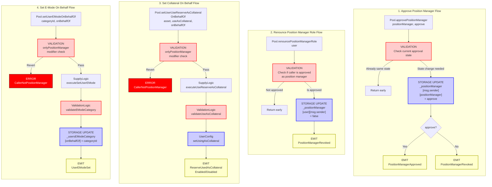

# Position Manager Flow

End-to-end execution flow for managing position manager approvals and performing actions on behalf of users in Aave V3.

## Quick Reference

| Aspect | Details |
|--------|---------|
| **Entry Points** | `Pool.approvePositionManager(positionManager, approve)`<br/>`Pool.renouncePositionManagerRole(user)`<br/>`Pool.setUserUseReserveAsCollateralOnBehalfOf(asset, useAsCollateral, onBehalfOf)`<br/>`Pool.setUserEModeOnBehalfOf(categoryId, onBehalfOf)` |
| **Key Transformations** | None - direct storage updates |
| **State Changes** | `_positionManager[user][positionManager] = approve` |
| **Events Emitted** | `PositionManagerApproved`, `PositionManagerRevoked` |

---

## Flow Diagram



---

## Step-by-Step Execution

### 1. Approve Position Manager

**File:** `contracts/protocol/pool/Pool.sol`

```solidity
function approvePositionManager(address positionManager, bool approve) external override {
    // Skip if already in desired state (gas optimization)
    if (_positionManager[_msgSender()][positionManager] == approve) return;
    
    // Update storage
    _positionManager[_msgSender()][positionManager] = approve;
    
    // Emit appropriate event
    if (approve) {
        emit PositionManagerApproved({user: _msgSender(), positionManager: positionManager});
    } else {
        emit PositionManagerRevoked({user: _msgSender(), positionManager: positionManager});
    }
}
```

**Key Points:**
- User (msg.sender) approves a position manager to act on their behalf
- State check prevents redundant storage writes
- Emits different events based on approval/revocation

---

### 2. Renounce Position Manager Role

**File:** `contracts/protocol/pool/Pool.sol`

```solidity
function renouncePositionManagerRole(address user) external override {
    // Only proceed if caller is actually an approved position manager
    if (_positionManager[user][_msgSender()] == false) return;
    
    // Revoke approval
    _positionManager[user][_msgSender()] = false;
    
    emit PositionManagerRevoked({user: user, positionManager: _msgSender()});
}
```

**Key Points:**
- Position manager can voluntarily renounce their role
- Returns early if caller is not actually approved
- Emits PositionManagerRevoked event

---

### 3. Access Control Modifier

**File:** `contracts/protocol/pool/Pool.sol`

```solidity
/**
 * @dev Only an approved position manager can call functions marked by this modifier.
 */
modifier onlyPositionManager(address onBehalfOf) {
    _onlyPositionManager(onBehalfOf);
    _;
}

function _onlyPositionManager(address onBehalfOf) internal view virtual {
    require(_positionManager[onBehalfOf][_msgSender()], Errors.CallerNotPositionManager());
}
```

**Key Points:**
- Checks if msg.sender is approved as position manager for `onBehalfOf` user
- Reverts with `CallerNotPositionManager` if not authorized
- Used by both `setUserUseReserveAsCollateralOnBehalfOf` and `setUserEModeOnBehalfOf`

---

### 4. Set Collateral On Behalf Of User

**File:** `contracts/protocol/pool/Pool.sol`

```solidity
function setUserUseReserveAsCollateralOnBehalfOf(
    address asset,
    bool useAsCollateral,
    address onBehalfOf
) external override onlyPositionManager(onBehalfOf) {
    SupplyLogic.executeUseReserveAsCollateral(
        _reserves,
        _reservesList,
        _eModeCategories,
        _usersConfig[onBehalfOf],
        onBehalfOf,
        asset,
        useAsCollateral,
        ADDRESSES_PROVIDER.getPriceOracle(),
        _usersEModeCategory[onBehalfOf]
    );
}
```

**File:** `contracts/protocol/libraries/logic/SupplyLogic.sol`

```solidity
function executeUseReserveAsCollateral(
    mapping(address => DataTypes.ReserveData) storage reserves,
    mapping(uint256 => address) storage reservesList,
    mapping(uint8 => DataTypes.EModeCategory) storage eModeCategories,
    DataTypes.UserConfigurationMap storage userConfig,
    address user,
    address asset,
    bool useAsCollateral,
    address priceOracle,
    uint8 userEModeCategory
) external {
    DataTypes.ReserveData storage reserve = reserves[asset];
    DataTypes.ReserveCache memory reserveCache = reserve.cache();
    
    // Update state
    reserve.updateState(reserveCache);
    
    // Validate
    ValidationLogic.validateUseAsCollateral(
        reserves,
        reservesList,
        reserveCache,
        userConfig,
        asset,
        user,
        useAsCollateral,
        priceOracle,
        userEModeCategory
    );
    
    // Update user configuration
    userConfig.setUsingAsCollateral(reserve.id, useAsCollateral);
    
    // Emit appropriate event
    if (useAsCollateral) {
        emit ReserveUsedAsCollateralEnabled(asset, user);
    } else {
        emit ReserveUsedAsCollateralDisabled(asset, user);
    }
}
```

**Key Points:**
- Position manager can enable/disable collateral usage for user
- Requires `onlyPositionManager` modifier - validates access control
- Performs same validations as direct user call
- Emits collateral events

---

### 5. Set E-Mode On Behalf Of User

**File:** `contracts/protocol/pool/Pool.sol`

```solidity
function setUserEModeOnBehalfOf(
    uint8 categoryId,
    address onBehalfOf
) external override onlyPositionManager(onBehalfOf) {
    SupplyLogic.executeSetUserEMode(
        _reserves,
        _reservesList,
        _eModeCategories,
        _usersEModeCategory,
        _usersConfig[onBehalfOf],
        onBehalfOf,
        ADDRESSES_PROVIDER.getPriceOracle(),
        categoryId
    );
}
```

**File:** `contracts/protocol/libraries/logic/SupplyLogic.sol`

```solidity
function executeSetUserEMode(
    mapping(address => DataTypes.ReserveData) storage reserves,
    mapping(uint256 => address) storage reservesList,
    mapping(uint8 => DataTypes.EModeCategory) storage eModeCategories,
    mapping(address => uint8) storage usersEModeCategory,
    DataTypes.UserConfigurationMap storage userConfig,
    address user,
    address priceOracle,
    uint8 categoryId
) external {
    // Validation
    ValidationLogic.validateEModeCategory(
        reserves,
        reservesList,
        userConfig,
        eModeCategories,
        categoryId,
        user,
        priceOracle
    );
    
    // Update user's eMode category
    usersEModeCategory[user] = categoryId;
    
    emit UserEModeSet(user, categoryId);
}
```

**Key Points:**
- Position manager can set user's eMode category
- Validates that user can enter specified eMode category
- Updates storage and emits UserEModeSet event

---

### 6. Check Approval Status

**File:** `contracts/protocol/pool/Pool.sol`

```solidity
function isApprovedPositionManager(
    address user,
    address positionManager
) external view override returns (bool) {
    return _positionManager[user][positionManager];
}
```

---

## Storage Layout

```solidity
// PoolStorage.sol
// Allowlisted permissionManagers can enable collaterals & switch eModes on behalf of a user
mapping(address user => mapping(address permittedPositionManager => bool))
    internal _positionManager;
```

**Key Points:**
- Double mapping: user → position manager → bool
- Position manager must be explicitly approved by user
- Approval is required before any "onBehalfOf" actions

---

## Event Details

### PositionManagerApproved Event

Emitted when a user approves a position manager.

```solidity
event PositionManagerApproved(
    address indexed user,           // User granting approval
    address indexed positionManager // Address being approved
);
```

### PositionManagerRevoked Event

Emitted when position manager approval is revoked (either by user or by renouncement).

```solidity
event PositionManagerRevoked(
    address indexed user,           // User whose approval is revoked
    address indexed positionManager // Address being revoked
);
```

### ReserveUsedAsCollateralEnabled Event

Emitted when position manager enables collateral for user.

```solidity
event ReserveUsedAsCollateralEnabled(
    address indexed reserve,
    address indexed user
);
```

### ReserveUsedAsCollateralDisabled Event

Emitted when position manager disables collateral for user.

```solidity
event ReserveUsedAsCollateralDisabled(
    address indexed reserve,
    address indexed user
);
```

### UserEModeSet Event

Emitted when position manager sets eMode category for user.

```solidity
event UserEModeSet(
    address indexed user,
    uint8 categoryId
);
```

---

## Error Conditions

| Error | Condition | File |
|-------|-----------|------|
| `CallerNotPositionManager` | `msg.sender` is not approved as position manager for `onBehalfOf` | Pool.sol |
| `HEALTH_FACTOR_LOWER_THAN_LIQUIDATION_THRESHOLD` | Disabling collateral would put user's health factor below liquidation threshold | ValidationLogic.sol |
| `EModeCategoryReserved` | Attempting to use category 0 (reserved) | Pool.sol |
| `InconsistentEModeCategory` | User has collateral that cannot be used in the requested eMode category | ValidationLogic.sol |

---

## Related Flows

- [Supply Flow](./supply.md) - Depositing assets
- [Borrow Flow](./borrow.md) - Borrowing against collateral
- [Collateral Management](./collateral_management.md) - Direct collateral configuration

---

## Source File Locations

```
contracts/protocol/pool/Pool.sol
contracts/protocol/pool/PoolStorage.sol
contracts/protocol/libraries/logic/SupplyLogic.sol
contracts/protocol/libraries/logic/ValidationLogic.sol
contracts/protocol/libraries/helpers/Errors.sol
```

---

## Security Considerations

1. **Approval Required**: Position managers must be explicitly approved before they can act on behalf of a user

2. **Revocation**: Users can revoke approval at any time via `approvePositionManager(manager, false)`

3. **Self-Renouncement**: Position managers can voluntarily renounce their role via `renouncePositionManagerRole(user)`

4. **Limited Actions**: Position managers can ONLY:
   - Enable/disable user's collateral (`setUserUseReserveAsCollateralOnBehalfOf`)
   - Set user's eMode category (`setUserEModeOnBehalfOf`)
   
   They CANNOT:
   - Supply on behalf of user
   - Withdraw on behalf of user
   - Borrow on behalf of user
   - Repay on behalf of user
   - Liquidate positions

5. **Validation Still Applied**: All actions performed by position managers go through the same validation logic as direct user actions

6. **Gas Optimization**: `approvePositionManager` returns early if state is already correct
