# Repay Flow

End-to-end execution flow for repaying debt in Aave V3.

## Quick Reference

| Aspect | Details |
|--------|---------|
| **Entry Point** | `Pool.repay(asset, amount, interestRateMode, onBehalfOf)` |
| **Key Transformations** | [Scaled Debt → Amount](../transformations/index.md#debt-token-transformations) |
| **State Changes** | `_scaledBalance[onBehalfOf] -= scaledAmount` |
| **Events Emitted** | `Repay`, `IsolationModeTotalDebtUpdated` (conditional) |

---

## Flow Diagram

```mermaid
flowchart TD
    %% Styling definitions
    classDef validation fill:#ffcccc,stroke:#ff0000,stroke-width:2px
    classDef transformation fill:#ccffcc,stroke:#00aa00,stroke-width:2px
    classDef storage fill:#ccccff,stroke:#0000ff,stroke-width:2px
    classDef event fill:#ffffcc,stroke:#aaaa00,stroke-width:2px
    classDef error fill:#ff0000,stroke:#000000,color:#fff
    classDef critical stroke:#ff0000,stroke-width:3px

    %% Entry point
    Entry["Pool.repay<br/>asset, amount,<br/>interestRateMode,<br/>onBehalfOf"] --> Execute["RepayLogic<br/>executeRepay"]
    
    subgraph StateUpdate ["1. State Updates"]
        direction TB
        UpdateState["ReserveLogic<br/>updateState"] --> GetDebt["Helpers<br/>getUserCurrentDebt<br/>Gets stable + variable debt"]
    end
    
    subgraph Validation ["2. Validation"]
        direction TB
        GetDebt --> Validate["ValidationLogic<br/>validateRepay<br/>Checks: amount > 0"]
        class Validate validation
    end
    
    subgraph Decision ["3. Repay Method Decision"]
        direction TB
        Validate --> ATokensCheck{"Use aTokens?"}
        
        ATokensCheck -->|Yes| CalcFromAToken["TRANSFORMATION<br/>paybackAmount =<br/>aToken.balanceOf"]
        class CalcFromAToken transformation
        
        ATokensCheck -->|No| UseProvided["Use provided amount<br/>or MAX_UINT for full"]
        
        CalcFromAToken --> ModeCheck{"Interest<br/>Rate Mode"}
        UseProvided --> ModeCheck
    end
    
    subgraph TokenBurn ["4. Debt Token Burn"]
        direction TB
        ModeCheck -->|STABLE| StableBurn["StableDebtToken<br/>burn"]
        
        ModeCheck -->|VARIABLE| VariableBurn["VariableDebtToken<br/>burn"]
        
        StableBurn --> StableTransform["TRANSFORMATION<br/>principal -= amount<br/>+ accrued interest"]
        class StableTransform transformation
        
        VariableBurn --> VariableTransform["TRANSFORMATION<br/>scaledAmountToBurn =<br/>amount.rayDiv(index)"]
        class VariableTransform transformation
        
        StableTransform --> StoreStable["STORAGE UPDATE<br/>_balances.principal -= amount"]
        class StoreStable storage
        
        VariableTransform --> StoreVariable["STORAGE UPDATE<br/>_scaledBalance -=<br/>scaledAmountToBurn"]
        class StoreVariable storage
    end
    
    Execute --> StateUpdate
    StateUpdate --> Validation
    Validation --> Decision
    
    StoreStable --> UpdateRates["ReserveLogic<br/>updateInterestRates"]
    
    StoreVariable --> UpdateRates
    
    subgraph CollateralMgmt ["5. Collateral Management"]
        direction TB
        UpdateRates --> IsoLogic["IsolationModeLogic<br/>updateIsolatedDebtIfIsolated"]
        class IsoLogic storage
        
        IsoLogic --> RepayTokenCheck{"Use aTokens?"}
        
        RepayTokenCheck -->|Yes| BurnAToken["AToken<br/>burn"]
        
        RepayTokenCheck -->|No| TransferUnderlying["IERC20<br/>safeTransferFrom"]
        class TransferUnderlying storage
    end
    
    BurnAToken --> FinalEvent["EMIT<br/>Repay"]
    class FinalEvent event
    
    TransferUnderlying --> FinalEvent
    
    %% Error annotations
    %% CRITICAL: Debt token burn is irreversible
    %% CRITICAL: Isolation mode debt ceiling must be respected
    %% CRITICAL: Repayment caps at current debt balance
    
    %% Link styles for critical paths
    linkStyle 18 stroke:#ff0000,stroke-width:3px
    linkStyle 22 stroke:#ff0000,stroke-width:3px
```



---

## Step-by-Step Execution

### 1. Entry Point

**File:** `contracts/protocol/pool/Pool.sol`

```solidity
function repay(
    address asset,
    uint256 amount,
    uint256 interestRateMode,
    address onBehalfOf
) external virtual override returns (uint256) {
    return BorrowLogic.executeRepay(
        _reserves,
        _reservesList,
        _usersConfig[onBehalfOf],
        DataTypes.ExecuteRepayParams({
            asset: asset,
            amount: amount,
            interestRateMode: DataTypes.InterestRateMode(interestRateMode),
            onBehalfOf: onBehalfOf,
            useATokens: false,
            user: msg.sender
        })
    );
}
```

### 2. Execute Repay

**File:** `contracts/protocol/libraries/logic/BorrowLogic.sol`

```solidity
function executeRepay(
    mapping(address => DataTypes.ReserveData) storage reserves,
    mapping(uint256 => address) storage reservesList,
    DataTypes.UserConfigurationMap storage userConfig,
    DataTypes.ExecuteRepayParams memory params
) external returns (uint256) {
    DataTypes.ReserveData storage reserve = reserves[params.asset];
    DataTypes.ReserveCache memory reserveCache = reserve.cache();
    
    // Update state
    reserve.updateState(reserveCache);
    
    // Get user's current debt
    (uint256 stableDebt, uint256 variableDebt) = Helpers.getUserCurrentDebt(
        params.onBehalfOf,
        reserveCache
    );
    
    // Determine payback amount
    uint256 paybackAmount = params.interestRateMode ==
        DataTypes.InterestRateMode.STABLE
        ? stableDebt
        : variableDebt;
    
    // If using aTokens, calculate from balance
    if (params.useATokens) {
        paybackAmount = IAToken(reserveCache.aTokenAddress)
            .balanceOf(msg.sender);
    }
    
    // Validate repayment
    ValidationLogic.validateRepay(
        reserveCache,
        params.amount,
        params.interestRateMode,
        params.onBehalfOf,
        stableDebt,
        variableDebt
    );
    
    // Burn debt tokens
    uint256 amountToRepay = params.amount;
    if (amountToRepay == type(uint256).max) {
        amountToRepay = paybackAmount;
    }
    
    if (params.interestRateMode == DataTypes.InterestRateMode.STABLE) {
        IStableDebtToken(reserveCache.stableDebtTokenAddress).burn(
            params.onBehalfOf,
            amountToRepay
        );
    } else {
        IVariableDebtToken(reserveCache.variableDebtTokenAddress).burn(
            params.onBehalfOf,
            amountToRepay,
            reserveCache.nextVariableBorrowIndex
        );
    }
    
    // Update interest rates
    reserve.updateInterestRates(
        reserveCache,
        params.asset,
        amountToRepay,  // liquidityAdded
        0               // liquidityTaken
    );
    
    // Update isolation mode debt if applicable
    IsolationModeLogic.updateIsolatedDebtIfIsolated(
        reserves,
        reservesList,
        userConfig,
        reserveCache,
        amountToRepay
    );
    
    // Transfer repayment
    if (params.useATokens) {
        IAToken(reserveCache.aTokenAddress).burn(
            msg.sender,
            reserveCache.aTokenAddress,
            amountToRepay,
            reserveCache.nextLiquidityIndex
        );
    } else {
        IERC20(params.asset).safeTransferFrom(
            msg.sender,
            reserveCache.aTokenAddress,
            amountToRepay
        );
    }
    
    emit Repay(
        params.asset,
        params.onBehalfOf,
        msg.sender,
        amountToRepay,
        params.useATokens
    );
    
    return amountToRepay;
}
```

### 3. Variable Debt Token Burn

**File:** `contracts/protocol/tokenization/VariableDebtToken.sol`

```solidity
function burn(
    address from,
    uint256 amount,
    uint256 index
) external override onlyPool {
    _burnScaled(from, amount, index);
}

function _burnScaled(address from, uint256 amount, uint256 index) internal {
    uint256 scaledAmount = amount.rayDiv(index);  // [TRANSFORMATION]
    uint256 scaledBalanceBefore = _scaledBalance[from];
    
    // Cap at balance
    if (scaledAmount > scaledBalanceBefore) {
        scaledAmount = scaledBalanceBefore;
        amount = scaledAmount.rayMul(index);
    }
    
    _scaledBalance[from] -= scaledAmount;
}
```

**[TRANSFORMATION]:** See [Debt Token Transformations](../transformations/index.md#debt-token-transformations) for details on `amount.rayDiv(index)`

### 4. Stable Debt Token Burn

**File:** `contracts/protocol/tokenization/StableDebtToken.sol`

```solidity
function burn(address from, uint256 amount) external override onlyPool {
    _burn(from, amount);
}

function _burn(address from, uint256 amount) internal {
    // Calculate current principal + interest
    uint256 accountBalance = _balances[from].principal;
    uint256 balanceIncrease = accountBalance.rayMul(
        MathUtils.calculateCompoundedInterest(
            _balances[from].stableRate,
            _balances[from].lastUpdateTimestamp
        )
    ) - accountBalance;
    
    uint256 amountToBurn = amount;
    if (amount > accountBalance + balanceIncrease) {
        amountToBurn = accountBalance + balanceIncrease;
    }
    
    _balances[from].principal = accountBalance + balanceIncrease - amountToBurn;
    _balances[from].lastUpdateTimestamp = block.timestamp;
    
    _totalSupply.principal -= amountToBurn;
    _totalSupply.lastUpdateTimestamp = block.timestamp;
}
```

**Note:** Stable debt calculates interest at burn time based on elapsed time.

### 5. Validation Checks

**File:** `contracts/protocol/libraries/logic/ValidationLogic.sol`

```solidity
function validateRepay(
    DataTypes.ReserveCache memory reserveCache,
    uint256 amount,
    DataTypes.InterestRateMode interestRateMode,
    address onBehalfOf,
    uint256 stableDebt,
    uint256 variableDebt
) internal pure {
    require(amount != 0, Errors.INVALID_AMOUNT);
    
    // Check user has debt in this mode
    if (interestRateMode == DataTypes.InterestRateMode.STABLE) {
        require(stableDebt > 0, Errors.NO_DEBT_OF_SELECTED_TYPE);
    } else {
        require(variableDebt > 0, Errors.NO_DEBT_OF_SELECTED_TYPE);
    }
}
```

### 6. Isolation Mode Debt Update

**File:** `contracts/protocol/libraries/logic/IsolationModeLogic.sol`

```solidity
function updateIsolatedDebtIfIsolated(
    mapping(address => DataTypes.ReserveData) storage reserves,
    mapping(uint256 => address) storage reservesList,
    DataTypes.UserConfigurationMap storage userConfig,
    DataTypes.ReserveCache memory reserveCache,
    uint256 repayAmount
) internal {
    // Check if reserve is in isolation mode
    if (reserveCache.reserveConfiguration.getDebtCeiling() != 0) {
        DataTypes.ReserveData storage reserve = reserves[
            reservesList[reserveCache.reserveConfiguration.getId()]
        ];
        
        // Reduce isolation mode total debt
        uint128 isolatedDebt = reserve.isolationModeTotalDebt;
        uint256 repayAmountUint = repayAmount / 10**
            (reserveCache.reserveConfiguration.getDecimals() -
            ReserveConfiguration.DEBT_CEILING_DECIMALS);
        
        if (repayAmountUint > isolatedDebt) {
            reserve.isolationModeTotalDebt = 0;
        } else {
            reserve.isolationModeTotalDebt -= uint128(repayAmountUint);
        }
        
        emit IsolationModeTotalDebtUpdated(
            reserveCache.aTokenAddress,
            reserve.isolationModeTotalDebt
        );
    }
}
```

---

## Amount Transformations

### Variable Rate Repay

```
_scaledBalance[onBehalfOf].rayMul(index) = currentDebt (WAD)
    ↓
Validation: currentDebt > 0
    ↓
Calculate payback = min(requested, currentDebt)
    ↓
scaledAmountToBurn = payback.rayDiv(index)  // v4+: uses rayDivFloor
    ↓
_scaledBalance[onBehalfOf] -= scaledAmountToBurn
```

### Stable Rate Repay

```
_principal = _balances[onBehalfOf].principal
_accruedInterest = _principal.rayMul(compoundedInterest) - _principal
currentDebt = _principal + _accruedInterest (WAD)
    ↓
Validation: currentDebt > 0
    ↓
payback = min(requested, currentDebt)
    ↓
_balances[onBehalfOf].principal = currentDebt - payback
_balances[onBehalfOf].lastUpdateTimestamp = block.timestamp
```

**Key Differences:**
- **Variable Rate:** Scaled balance approach, interest in index
- **Stable Rate:** Principal + timestamp, interest calculated on burn
- Repay can use underlying tokens OR aTokens
- Full debt repayment (amount=MAX) clears all debt in that mode

---

## Event Details

### Repay Event

```solidity
event Repay(
    address indexed reserve,    // Asset address
    address indexed user,       // Debt owner (onBehalfOf)
    address indexed repayer,    // msg.sender
    uint256 amount,             // Amount repaid
    bool useATokens             // True if repaid using aTokens
);
```

### IsolationModeTotalDebtUpdated Event

Emitted when repaying isolated debt.

```solidity
event IsolationModeTotalDebtUpdated(
    address indexed asset,
    uint256 totalDebt
);
```

---

## Error Conditions

| Error | Condition | File |
|-------|-----------|------|
| `INVALID_AMOUNT` | `amount == 0` | ValidationLogic.sol |
| `NO_DEBT_OF_SELECTED_TYPE` | Repaying stable but only has variable debt (or vice versa) | ValidationLogic.sol |

---

## Related Flows

- [Borrow Flow](./borrow.md) - Taking out debt
- [Liquidation Flow](./liquidation.md) - Debt repayment via liquidation

---

## Source File Locations

```
contracts/protocol/pool/Pool.sol
contracts/protocol/libraries/logic/BorrowLogic.sol
contracts/protocol/libraries/logic/ValidationLogic.sol
contracts/protocol/libraries/logic/IsolationModeLogic.sol
contracts/protocol/libraries/helpers/Helpers.sol
contracts/protocol/tokenization/VariableDebtToken.sol
contracts/protocol/tokenization/StableDebtToken.sol
contracts/protocol/tokenization/AToken.sol
contracts/protocol/libraries/logic/ReserveLogic.sol
```
