# Repay With aTokens Flow

End-to-end execution flow for repaying debt using aTokens instead of underlying assets in Aave V3.

## Quick Reference

| Aspect | Details |
|--------|---------|
| **Entry Point** | `Pool.repayWithATokens(asset, amount, interestRateMode)` |
| **Key Transformations** | [Scaled Debt → Amount](../transformations/index.md#debt-token-transformations), [aToken Balance → Payback Amount](../transformations/index.md#collateral-token-transformations) |
| **State Changes** | `_scaledBalance[msg.sender] -= scaledAmount`, burns aTokens from caller |
| **Events Emitted** | `Repay`, `IsolationModeTotalDebtUpdated` (conditional) |

---

## Flow Diagram

```mermaid
flowchart TD
    %% Styling definitions
    classDef validation fill:#ffcccc,stroke:#ff0000,stroke-width:2px
    classDef transformation fill:#ccffcc,stroke:#00aa00,stroke-width:2px
    classDef storage fill:#ccccff,stroke:#0000ff,stroke-width:2px
    classDef event fill:#ffffcc,stroke:#aaaa00,stroke-width:2px
    classDef error fill:#ff0000,stroke:#000000,color:#fff
    classDef critical stroke:#ff0000,stroke-width:3px

    %% Entry point
    Entry["Pool.repayWithATokens<br/>asset, amount,<br/>interestRateMode"] --> Execute["BorrowLogic<br/>executeRepay<br/>useATokens: true"]

    subgraph StateUpdate ["1. State Updates"]
        direction TB
        UpdateState["ReserveLogic<br/>updateState"] --> GetDebt["Helpers<br/>getUserCurrentDebt<br/>Gets stable + variable debt"]
    end

    subgraph Validation ["2. Validation"]
        direction TB
        GetDebt --> Validate["ValidationLogic<br/>validateRepay<br/>Checks: amount > 0, debt exists"]
        class Validate validation
    end

    subgraph AmountCalc ["3. Amount Calculation"]
        direction TB
        Validate --> MaxCheck{"amount ==<br/>MAX_UINT?"}

        MaxCheck -->|Yes| UseATokenBalance["TRANSFORMATION<br/>paybackAmount =<br/>aToken.balanceOf<br/>msg.sender"]
        class UseATokenBalance transformation

        MaxCheck -->|No| UseProvided["Use provided amount"]

        UseATokenBalance --> CapCheck["Cap at<br/>current debt"]
        UseProvided --> CapCheck
    end

    subgraph TokenBurn ["4. Debt Token Burn"]
        direction TB
        CapCheck --> ModeCheck{"Interest<br/>Rate Mode"}

        ModeCheck -->|STABLE| StableBurn["StableDebtToken<br/>burn"]

        ModeCheck -->|VARIABLE| VariableBurn["VariableDebtToken<br/>burn"]

        StableBurn --> StableTransform["TRANSFORMATION<br/>principal -= amount<br/>+ accrued interest"]
        class StableTransform transformation

        VariableBurn --> VariableTransform["TRANSFORMATION<br/>scaledAmountToBurn =<br/>amount.rayDiv(index)"]
        class VariableTransform transformation

        StableTransform --> StoreStable["STORAGE UPDATE<br/>_balances.principal -= amount"]
        class StoreStable storage

        VariableTransform --> StoreVariable["STORAGE UPDATE<br/>_scaledBalance -=<br/>scaledAmountToBurn"]
        class StoreVariable storage
    end

    Execute --> StateUpdate
    StateUpdate --> Validation
    Validation --> AmountCalc

    StoreStable --> UpdateRates["ReserveLogic<br/>updateInterestRates<br/>liquidityAdded: 0"]

    StoreVariable --> UpdateRates

    subgraph CollateralMgmt ["5. Collateral Management"]
        direction TB
        UpdateRates --> IsoLogic["IsolationModeLogic<br/>updateIsolatedDebtIfIsolated"]
        class IsoLogic storage

        IsoLogic --> BurnAToken["AToken<br/>burn<br/>from: msg.sender"]
        class BurnAToken storage
    end

    BurnAToken --> FinalEvent["EMIT<br/>Repay<br/>useATokens: true"]
    class FinalEvent event

    %% Error annotations
    %% CRITICAL: Debt token burn is irreversible
    %% CRITICAL: Isolation mode debt ceiling must be respected
    %% CRITICAL: Repayment caps at current debt balance

    %% Link styles for critical paths
    linkStyle 18 stroke:#ff0000,stroke-width:3px
    linkStyle 22 stroke:#ff0000,stroke-width:3px
```



---

## Step-by-Step Execution

### 1. Entry Point

**File:** `contracts/protocol/pool/Pool.sol`

```solidity
function repayWithATokens(
    address asset,
    uint256 amount,
    uint256 interestRateMode
) public virtual override returns (uint256) {
    return
        BorrowLogic.executeRepay(
            _reserves,
            _reservesList,
            _usersConfig[msg.sender],
            DataTypes.ExecuteRepayParams({
                asset: asset,
                amount: amount,
                interestRateMode: DataTypes.InterestRateMode(interestRateMode),
                onBehalfOf: msg.sender,
                useATokens: true
            })
        );
}
```

**Key Differences from `repay()`:**
- **onBehalfOf**: Always `msg.sender` (cannot repay on behalf of others)
- **useATokens**: Set to `true` (uses aTokens instead of underlying)

### 2. Execute Repay

**File:** `contracts/protocol/libraries/logic/BorrowLogic.sol`

```solidity
function executeRepay(
    mapping(address => DataTypes.ReserveData) storage reservesData,
    mapping(uint256 => address) storage reservesList,
    DataTypes.UserConfigurationMap storage userConfig,
    DataTypes.ExecuteRepayParams memory params
) external returns (uint256) {
    DataTypes.ReserveData storage reserve = reservesData[params.asset];
    DataTypes.ReserveCache memory reserveCache = reserve.cache();
    reserve.updateState(reserveCache);

    (uint256 stableDebt, uint256 variableDebt) = Helpers.getUserCurrentDebt(
        params.onBehalfOf,
        reserveCache
    );

    ValidationLogic.validateRepay(
        reserveCache,
        params.amount,
        params.interestRateMode,
        params.onBehalfOf,
        stableDebt,
        variableDebt
    );

    uint256 paybackAmount = params.interestRateMode == DataTypes.InterestRateMode.STABLE
        ? stableDebt
        : variableDebt;

    // Allows a user to repay with aTokens without leaving dust from interest.
    if (params.useATokens && params.amount == type(uint256).max) {
        params.amount = IAToken(reserveCache.aTokenAddress).balanceOf(msg.sender);
    }

    if (params.amount < paybackAmount) {
        paybackAmount = params.amount;
    }

    // Burn debt tokens
    if (params.interestRateMode == DataTypes.InterestRateMode.STABLE) {
        IStableDebtToken(reserveCache.stableDebtTokenAddress).burn(
            params.onBehalfOf,
            paybackAmount
        );
    } else {
        IVariableDebtToken(reserveCache.variableDebtTokenAddress).burn(
            params.onBehalfOf,
            paybackAmount,
            reserveCache.nextVariableBorrowIndex
        );
    }

    // Update interest rates - note: liquidityAdded is 0 when using aTokens
    reserve.updateInterestRates(
        reserveCache,
        params.asset,
        params.useATokens ? 0 : paybackAmount,
        0
    );

    // Clear borrowing flag if all debt repaid
    if (stableDebt + variableDebt - paybackAmount == 0) {
        userConfig.setBorrowing(reserve.id, false);
    }

    // Update isolation mode debt if applicable
    IsolationModeLogic.updateIsolatedDebtIfIsolated(
        reservesData,
        reservesList,
        userConfig,
        reserveCache,
        paybackAmount
    );

    // Burn aTokens from caller (instead of transferring underlying)
    if (params.useATokens) {
        IAToken(reserveCache.aTokenAddress).burn(
            msg.sender,
            reserveCache.aTokenAddress,
            paybackAmount,
            reserveCache.nextLiquidityIndex
        );
    } else {
        IERC20(params.asset).safeTransferFrom(
            msg.sender,
            reserveCache.aTokenAddress,
            paybackAmount
        );
        IAToken(reserveCache.aTokenAddress).handleRepayment(
            msg.sender,
            params.onBehalfOf,
            paybackAmount
        );
    }

    emit Repay(
        params.asset,
        params.onBehalfOf,
        msg.sender,
        paybackAmount,
        params.useATokens
    );

    return paybackAmount;
}
```

### 3. Variable Debt Token Burn

**File:** `contracts/protocol/tokenization/VariableDebtToken.sol`

```solidity
function burn(
    address from,
    uint256 amount,
    uint256 index
) external override onlyPool {
    _burnScaled(from, amount, index);
}

function _burnScaled(address from, uint256 amount, uint256 index) internal {
    uint256 scaledAmount = amount.rayDiv(index);
    uint256 scaledBalanceBefore = _scaledBalance[from];

    // Cap at balance
    if (scaledAmount > scaledBalanceBefore) {
        scaledAmount = scaledBalanceBefore;
        amount = scaledAmount.rayMul(index);
    }

    _scaledBalance[from] -= scaledAmount;
}
```

**[TRANSFORMATION]:** See [Debt Token Transformations](../transformations/index.md#debt-token-transformations) for details on `amount.rayDiv(index)`

### 4. Stable Debt Token Burn

**File:** `contracts/protocol/tokenization/StableDebtToken.sol`

```solidity
function burn(address from, uint256 amount) external override onlyPool {
    _burn(from, amount);
}

function _burn(address from, uint256 amount) internal {
    uint256 accountBalance = _balances[from].principal;
    uint256 balanceIncrease = accountBalance.rayMul(
        MathUtils.calculateCompoundedInterest(
            _balances[from].stableRate,
            _balances[from].lastUpdateTimestamp
        )
    ) - accountBalance;

    uint256 amountToBurn = amount;
    if (amount > accountBalance + balanceIncrease) {
        amountToBurn = accountBalance + balanceIncrease;
    }

    _balances[from].principal = accountBalance + balanceIncrease - amountToBurn;
    _balances[from].lastUpdateTimestamp = block.timestamp;

    _totalSupply.principal -= amountToBurn;
    _totalSupply.lastUpdateTimestamp = block.timestamp;
}
```

### 5. AToken Burn

**File:** `contracts/protocol/tokenization/AToken.sol`

```solidity
function burn(
    address from,
    address receiverOfUnderlying,
    uint256 amount,
    uint256 index
) external virtual override onlyPool {
    _burnScaled(from, receiverOfUnderlying, amount, index);
}

function _burnScaled(
    address from,
    address receiverOfUnderlying,
    uint256 amount,
    uint256 index
) internal {
    uint256 amountScaled = amount.rayDiv(index);
    require(amountScaled != 0, Errors.INVALID_BURN_AMOUNT);

    _scaledBalance[from] -= amountScaled;
}
```

**[TRANSFORMATION]:** See [Collateral Token Transformations](../transformations/index.md#collateral-token-transformations) for details on `amount.rayDiv(index)`

### 6. Validation Checks

**File:** `contracts/protocol/libraries/logic/ValidationLogic.sol`

```solidity
function validateRepay(
    DataTypes.ReserveCache memory reserveCache,
    uint256 amountSent,
    DataTypes.InterestRateMode interestRateMode,
    address onBehalfOf,
    uint256 stableDebt,
    uint256 variableDebt
) internal view {
    require(amountSent != 0, Errors.INVALID_AMOUNT);

    require(
        amountSent != type(uint256).max || msg.sender == onBehalfOf,
        Errors.NO_EXPLICIT_AMOUNT_TO_REPAY_ON_BEHALF
    );

    (bool isActive, , , , bool isPaused) = reserveCache.reserveConfiguration.getFlags();
    require(isActive, Errors.RESERVE_INACTIVE);
    require(!isPaused, Errors.RESERVE_PAUSED);

    require(
        (stableDebt != 0 && interestRateMode == DataTypes.InterestRateMode.STABLE) ||
            (variableDebt != 0 && interestRateMode == DataTypes.InterestRateMode.VARIABLE),
        Errors.NO_DEBT_OF_SELECTED_TYPE
    );
}
```

### 7. Isolation Mode Debt Update

**File:** `contracts/protocol/libraries/logic/IsolationModeLogic.sol`

```solidity
function updateIsolatedDebtIfIsolated(
    mapping(address => DataTypes.ReserveData) storage reservesData,
    mapping(uint256 => address) storage reservesList,
    DataTypes.UserConfigurationMap storage userConfig,
    DataTypes.ReserveCache memory reserveCache,
    uint256 repayAmount
) internal {
    (bool isolationModeActive, address isolationModeCollateralAddress, ) = userConfig
        .getIsolationModeState(reservesData, reservesList);

    if (isolationModeActive) {
        uint128 isolationModeTotalDebt = reservesData[isolationModeCollateralAddress]
            .isolationModeTotalDebt;

        uint128 isolatedDebtRepaid = (repayAmount /
            10 **
                (reserveCache.reserveConfiguration.getDecimals() -
                    ReserveConfiguration.DEBT_CEILING_DECIMALS)).toUint128();

        if (isolationModeTotalDebt <= isolatedDebtRepaid) {
            reservesData[isolationModeCollateralAddress].isolationModeTotalDebt = 0;
            emit IsolationModeTotalDebtUpdated(isolationModeCollateralAddress, 0);
        } else {
            uint256 nextIsolationModeTotalDebt = reservesData[isolationModeCollateralAddress]
                .isolationModeTotalDebt = isolationModeTotalDebt - isolatedDebtRepaid;
            emit IsolationModeTotalDebtUpdated(
                isolationModeCollateralAddress,
                nextIsolationModeTotalDebt
            );
        }
    }
}
```

---

## Amount Transformations

### Variable Rate Repay With aTokens

```
_scaledBalance[msg.sender].rayMul(index) = currentDebt (WAD)
    |
aTokenBalance = _scaledBalance[msg.sender].rayMul(liquidityIndex) (WAD)
    |
Validation: currentDebt > 0
    |
IF amount == MAX_UINT:
    paybackAmount = aTokenBalance
ELSE:
    paybackAmount = min(requested, currentDebt, aTokenBalance)
    |
scaledAmountToBurn = paybackAmount.rayDiv(index)
    |
aTokenScaledAmount = paybackAmount.rayDiv(liquidityIndex)
    |
_scaledBalanceDebt[msg.sender] -= scaledAmountToBurn
_scaledBalanceAToken[msg.sender] -= aTokenScaledAmount
```

### Stable Rate Repay With aTokens

```
_principal = _balances[msg.sender].principal
_accruedInterest = _principal.rayMul(compoundedInterest) - _principal
currentDebt = _principal + _accruedInterest (WAD)
    |
aTokenBalance = _scaledBalance[msg.sender].rayMul(liquidityIndex) (WAD)
    |
IF amount == MAX_UINT:
    paybackAmount = min(aTokenBalance, currentDebt)
ELSE:
    paybackAmount = min(requested, currentDebt, aTokenBalance)
    |
_balances[msg.sender].principal = currentDebt - paybackAmount
_balances[msg.sender].lastUpdateTimestamp = block.timestamp
_scaledBalanceAToken[msg.sender] -= paybackAmount.rayDiv(liquidityIndex)
```

**Key Differences from Regular Repay:**
- **No underlying token transfer** - aTokens are burned directly
- **Interest rate update** uses `liquidityAdded: 0` since no new liquidity enters
- **Self-only repayment** - can only repay own debt
- **MAX_UINT handling** - uses aToken balance instead of debt amount

---

## Event Details

### Repay Event

```solidity
event Repay(
    address indexed reserve,
    address indexed user,
    address indexed repayer,
    uint256 amount,
    bool useATokens
);
```

### IsolationModeTotalDebtUpdated Event

```solidity
event IsolationModeTotalDebtUpdated(
    address indexed asset,
    uint256 totalDebt
);
```

---

## Error Conditions

| Error | Condition | File |
|-------|-----------|------|
| `INVALID_AMOUNT` | `amount == 0` | ValidationLogic.sol |
| `NO_EXPLICIT_AMOUNT_TO_REPAY_ON_BEHALF` | `amount == MAX_UINT` when repaying on behalf of another user | ValidationLogic.sol |
| `RESERVE_INACTIVE` | Reserve is not active | ValidationLogic.sol |
| `RESERVE_PAUSED` | Reserve is paused | ValidationLogic.sol |
| `NO_DEBT_OF_SELECTED_TYPE` | Repaying stable but only has variable debt (or vice versa) | ValidationLogic.sol |

---

## Related Flows

- [Repay Flow](./repay.md) - Repaying with underlying tokens
- [Borrow Flow](./borrow.md) - Taking out debt
- [Liquidation Flow](./liquidation.md) - Debt repayment via liquidation
- [Supply Flow](./supply.md) - Acquiring aTokens to repay with

---

## Source File Locations

```
contracts/protocol/pool/Pool.sol
contracts/protocol/libraries/logic/BorrowLogic.sol
contracts/protocol/libraries/logic/ValidationLogic.sol
contracts/protocol/libraries/logic/IsolationModeLogic.sol
contracts/protocol/libraries/helpers/Helpers.sol
contracts/protocol/tokenization/VariableDebtToken.sol
contracts/protocol/tokenization/StableDebtToken.sol
contracts/protocol/tokenization/AToken.sol
contracts/protocol/libraries/logic/ReserveLogic.sol
```
