# Repay With Permit Flow

End-to-end execution flow for repaying debt in Aave V3 using EIP-2612 permit for gasless approvals.

## Quick Reference

| Aspect | Details |
|--------|---------|
| **Entry Point** | `Pool.repayWithPermit(asset, amount, interestRateMode, onBehalfOf, deadline, permitV, permitR, permitS)` |
| **Key Transformations** | [Scaled Debt → Amount](../transformations/index.md#debt-token-transformations) |
| **State Changes** | `_scaledBalance[onBehalfOf] -= scaledAmount` |
| **Events Emitted** | `Repay`, `IsolationModeTotalDebtUpdated` (conditional) |
| **Key Difference** | Executes `permit()` before repay for gasless token approval |

---

## Flow Diagram

```mermaid
flowchart TD
    %% Styling definitions
    classDef validation fill:#ffcccc,stroke:#ff0000,stroke-width:2px
    classDef transformation fill:#ccffcc,stroke:#00aa00,stroke-width:2px
    classDef storage fill:#ccccff,stroke:#0000ff,stroke-width:2px
    classDef event fill:#ffffcc,stroke:#aaaa00,stroke-width:2px
    classDef error fill:#ff0000,stroke:#000000,color:#fff
    classDef critical stroke:#ff0000,stroke-width:3px

    %% Entry point
    Entry["Pool.repayWithPermit<br/>asset, amount,<br/>interestRateMode,<br/>onBehalfOf,<br/>deadline, permitV,<br/>permitR, permitS"] --> Permit["Try-Catch<br/>IERC20.permit<br/>approve spending"]
    
    Permit --> Execute["RepayLogic<br/>executeRepay"]
    
    subgraph StateUpdate ["1. State Updates"]
        direction TB
        UpdateState["ReserveLogic<br/>updateState"] --> GetDebt["Helpers<br/>getUserCurrentDebt<br/>Gets variable debt"]
    end
    
    subgraph Validation ["2. Validation"]
        direction TB
        GetDebt --> Validate["ValidationLogic<br/>validateRepay<br/>Checks: amount > 0"]
        class Validate validation
    end
    
    subgraph Decision ["3. Repay Method Decision"]
        direction TB
        Validate --> ATokensCheck{"Use aTokens?"}
        
        ATokensCheck -->|Yes| CalcFromAToken["TRANSFORMATION<br/>paybackAmount =<br/>aToken.balanceOf"]
        class CalcFromAToken transformation
        
        ATokensCheck -->|No| UseProvided["Use provided amount<br/>or MAX_UINT for full"]
        
        CalcFromAToken --> ModeCheck{"Interest<br/>Rate Mode"}
        UseProvided --> ModeCheck
    end
    
    subgraph TokenBurn ["4. Debt Token Burn"]
        direction TB
        ModeCheck -->|VARIABLE| VariableBurn["VariableDebtToken<br/>burn"]
        
        VariableBurn --> VariableTransform["TRANSFORMATION<br/>scaledAmountToBurn =<br/>amount.rayDiv(index)"]
        class VariableTransform transformation
        
        VariableTransform --> StoreVariable["STORAGE UPDATE<br/>_scaledBalance -=<br/>scaledAmountToBurn"]
        class StoreVariable storage
    end
    
    Execute --> StateUpdate
    StateUpdate --> Validation
    Validation --> Decision
    
    StoreVariable --> UpdateRates["ReserveLogic<br/>updateInterestRates"]
    
    subgraph CollateralMgmt ["5. Collateral Management"]
        direction TB
        UpdateRates --> IsoLogic["IsolationModeLogic<br/>updateIsolatedDebtIfIsolated"]
        class IsoLogic storage
        
        IsoLogic --> RepayTokenCheck{"Use aTokens?"}
        
        RepayTokenCheck -->|Yes| BurnAToken["AToken<br/>burn"]
        
        RepayTokenCheck -->|No| TransferUnderlying["IERC20<br/>safeTransferFrom"]
        class TransferUnderlying storage
    end
    
    BurnAToken --> FinalEvent["EMIT<br/>Repay"]
    class FinalEvent event
    
    TransferUnderlying --> FinalEvent
    
    %% Error annotations
    %% CRITICAL: Permit failure is silently caught (try-catch)
    %% CRITICAL: Debt token burn is irreversible
    %% CRITICAL: Isolation mode debt ceiling must be respected
    
    %% Link styles for critical paths
    linkStyle 18 stroke:#ff0000,stroke-width:3px
```



---

## Step-by-Step Execution

### 1. Entry Point

**File:** `contracts/protocol/pool/Pool.sol`

```solidity
function repayWithPermit(
    address asset,
    uint256 amount,
    uint256 interestRateMode,
    address onBehalfOf,
    uint256 deadline,
    uint8 permitV,
    bytes32 permitR,
    bytes32 permitS
) external virtual override returns (uint256) {
    try
      IERC20WithPermit(asset).permit(
        _msgSender(),
        address(this),
        amount,
        deadline,
        permitV,
        permitR,
        permitS
      )
    {} catch {}

    {
      DataTypes.ExecuteRepayParams memory params = DataTypes.ExecuteRepayParams({
        asset: asset,
        user: _msgSender(),
        interestRateStrategyAddress: RESERVE_INTEREST_RATE_STRATEGY,
        amount: amount,
        interestRateMode: DataTypes.InterestRateMode(interestRateMode),
        onBehalfOf: onBehalfOf,
        useATokens: false,
        oracle: ADDRESSES_PROVIDER.getPriceOracle(),
        userEModeCategory: _usersEModeCategory[onBehalfOf]
      });
      return
        BorrowLogic.executeRepay(
          _reserves,
          _reservesList,
          _eModeCategories,
          _usersConfig[onBehalfOf],
          params
        );
    }
}
```

**Key Differences from `repay()`:**
- **Additional Parameters:** `deadline`, `permitV`, `permitR`, `permitS` for EIP-2612 permit signature
- **Permit Call:** Executes `IERC20WithPermit(asset).permit()` to approve token spending via signature
- **Try-Catch:** The permit is wrapped in try-catch to handle cases where permit might fail (e.g., if approval already exists)
- **Same Execution:** After permit, delegates to `BorrowLogic.executeRepay` identical to regular `repay()`

### 2. Permit Execution

**File:** `contracts/protocol/pool/Pool.sol`

```solidity
try
  IERC20WithPermit(asset).permit(
    _msgSender(),
    address(this),
    amount,
    deadline,
    permitV,
    permitR,
    permitS
  )
{} catch {}
```

The permit function:
- Approves the Pool contract to spend `amount` of `asset` tokens on behalf of `msg.sender`
- Uses EIP-2612 signature validation (`v`, `r`, `s` components)
- Validates the `deadline` timestamp has not expired
- Wrapped in try-catch to prevent revert if:
  - The permit has already been executed (replay protection)
  - The user already has sufficient allowance
  - The token doesn't support permit (fallback behavior)

### 3. Execute Repay

**File:** `contracts/protocol/libraries/logic/BorrowLogic.sol`

```solidity
function executeRepay(
    mapping(address => DataTypes.ReserveData) storage reservesData,
    mapping(uint256 => address) storage reservesList,
    mapping(uint8 => DataTypes.EModeCategory) storage eModeCategories,
    DataTypes.UserConfigurationMap storage onBehalfOfConfig,
    DataTypes.ExecuteRepayParams memory params
) external returns (uint256) {
    DataTypes.ReserveData storage reserve = reservesData[params.asset];
    DataTypes.ReserveCache memory reserveCache = reserve.cache();
    reserve.updateState(reserveCache);

    uint256 userDebtScaled = IVariableDebtToken(reserveCache.variableDebtTokenAddress)
      .scaledBalanceOf(params.onBehalfOf);
    uint256 userDebt = userDebtScaled.getVTokenBalance(reserveCache.nextVariableBorrowIndex);

    ValidationLogic.validateRepay(
      params.user,
      reserveCache,
      params.amount,
      params.interestRateMode,
      params.onBehalfOf,
      userDebtScaled
    );

    uint256 paybackAmount = params.amount;
    if (params.useATokens && params.amount == type(uint256).max) {
      // Allows a user to repay with aTokens without leaving dust from interest.
      paybackAmount = IAToken(reserveCache.aTokenAddress)
        .scaledBalanceOf(params.user)
        .getATokenBalance(reserveCache.nextLiquidityIndex);
    }

    if (paybackAmount > userDebt) {
      paybackAmount = userDebt;
    }

    bool noMoreDebt;
    (noMoreDebt, reserveCache.nextScaledVariableDebt) = IVariableDebtToken(
      reserveCache.variableDebtTokenAddress
    ).burn({
        from: params.onBehalfOf,
        scaledAmount: paybackAmount.getVTokenBurnScaledAmount(reserveCache.nextVariableBorrowIndex),
        index: reserveCache.nextVariableBorrowIndex
      });

    reserve.updateInterestRatesAndVirtualBalance(
      reserveCache,
      params.asset,
      params.useATokens ? 0 : paybackAmount,
      0,
      params.interestRateStrategyAddress
    );

    if (noMoreDebt) {
      onBehalfOfConfig.setBorrowing(reserve.id, false);
    }

    IsolationModeLogic.reduceIsolatedDebtIfIsolated(
      reservesData,
      reservesList,
      onBehalfOfConfig,
      reserveCache,
      paybackAmount
    );

    // Transfer repayment (underlying tokens)
    IERC20(params.asset).safeTransferFrom(params.user, reserveCache.aTokenAddress, paybackAmount);

    emit IPool.Repay(
      params.asset,
      params.onBehalfOf,
      params.user,
      paybackAmount,
      params.useATokens
    );

    return paybackAmount;
}
```

### 4. Variable Debt Token Burn

**File:** `contracts/protocol/tokenization/VariableDebtToken.sol`

```solidity
function burn(
    address from,
    uint256 amount,
    uint256 index
) external override onlyPool {
    _burnScaled(from, amount, index);
}

function _burnScaled(address from, uint256 amount, uint256 index) internal {
    uint256 scaledAmount = amount.rayDiv(index);  // [TRANSFORMATION]
    uint256 scaledBalanceBefore = _scaledBalance[from];
    
    // Cap at balance
    if (scaledAmount > scaledBalanceBefore) {
        scaledAmount = scaledBalanceBefore;
        amount = scaledAmount.rayMul(index);
    }
    
    _scaledBalance[from] -= scaledAmount;
}
```

**[TRANSFORMATION]:** See [Debt Token Transformations](../transformations/index.md#debt-token-transformations) for details on `amount.rayDiv(index)`

### 5. Validation Checks

**File:** `contracts/protocol/libraries/logic/ValidationLogic.sol`

```solidity
function validateRepay(
    address user,
    DataTypes.ReserveCache memory reserveCache,
    uint256 amountSent,
    DataTypes.InterestRateMode interestRateMode,
    address onBehalfOf,
    uint256 debtScaled
) internal pure {
    require(amountSent != 0, Errors.InvalidAmount());
    require(
      interestRateMode == DataTypes.InterestRateMode.VARIABLE,
      Errors.InvalidInterestRateModeSelected()
    );
    require(
      amountSent != type(uint256).max || user == onBehalfOf,
      Errors.NoExplicitAmountToRepayOnBehalf()
    );

    (bool isActive, , , bool isPaused) = reserveCache.reserveConfiguration.getFlags();
    require(isActive, Errors.ReserveInactive());
    require(!isPaused, Errors.ReservePaused());

    require(debtScaled != 0, Errors.NoDebtOfSelectedType());
}
```

### 6. Isolation Mode Debt Update

**File:** `contracts/protocol/libraries/logic/IsolationModeLogic.sol`

```solidity
function reduceIsolatedDebtIfIsolated(
    mapping(address => DataTypes.ReserveData) storage reservesData,
    mapping(uint256 => address) storage reservesList,
    DataTypes.UserConfigurationMap storage userConfig,
    DataTypes.ReserveCache memory reserveCache,
    uint256 repayAmount
) internal {
    // Check if reserve is in isolation mode
    if (reserveCache.reserveConfiguration.getDebtCeiling() != 0) {
      DataTypes.ReserveData storage reserve = reserves[
        reservesList[reserveCache.reserveConfiguration.getId()]
      ];
      
      // Reduce isolation mode total debt
      uint128 isolatedDebt = reserve.isolationModeTotalDebt;
      uint256 repayAmountUint = repayAmount / 10**
        (reserveCache.reserveConfiguration.getDecimals() -
        ReserveConfiguration.DEBT_CEILING_DECIMALS);
      
      if (repayAmountUint > isolatedDebt) {
        reserve.isolationModeTotalDebt = 0;
      } else {
        reserve.isolationModeTotalDebt -= uint128(repayAmountUint);
      }
      
      emit IsolationModeTotalDebtUpdated(
        reserveCache.aTokenAddress,
        reserve.isolationModeTotalDebt
      );
    }
}
```

---

## Amount Transformations

### Variable Rate Repay

```
_scaledBalance[onBehalfOf].rayMul(index) = currentDebt (WAD)
    ↓
Validation: currentDebt > 0
    ↓
Calculate payback = min(requested, currentDebt)
    ↓
scaledAmountToBurn = payback.rayDiv(index)  // v4+: uses rayDivFloor
    ↓
_scaledBalance[onBehalfOf] -= scaledAmountToBurn
```

### Permit Integration

```
User signs permit message (off-chain)
    ↓
Signature parameters: v, r, s, deadline
    ↓
Contract calls: token.permit(owner, spender, amount, deadline, v, r, s)
    ↓
Token contract validates:
  - Signature is valid
  - Deadline not expired
  - Nonce not reused
    ↓
Allowance[owner][spender] += amount
    ↓
Repay proceeds with transferFrom
```

**Key Differences:**
- **Variable Rate:** Scaled balance approach, interest in index
- **Gasless Approval:** Permit allows approval without separate transaction
- **Same Repay Logic:** After permit, execution is identical to regular `repay()`
- **Stable Rate Deprecated:** v3.2.0+ only supports variable rate borrowing
- **Permit Failure Safe:** Try-catch ensures repay continues even if permit fails

---

## Event Details

### Repay Event

```solidity
event Repay(
    address indexed reserve,    // Asset address
    address indexed user,       // Debt owner (onBehalfOf)
    address indexed repayer,    // msg.sender
    uint256 amount,             // Amount repaid
    bool useATokens             // True if repaid using aTokens (false for permit)
);
```

### IsolationModeTotalDebtUpdated Event

Emitted when repaying isolated debt.

```solidity
event IsolationModeTotalDebtUpdated(
    address indexed asset,
    uint256 totalDebt
);
```

---

## Error Conditions

| Error | Condition | File |
|-------|-----------|------|
| `INVALID_AMOUNT` | `amount == 0` | ValidationLogic.sol |
| `NO_DEBT_OF_SELECTED_TYPE` | User has no variable debt | ValidationLogic.sol |
| `INVALID_INTEREST_RATE_MODE_SELECTED` | Interest rate mode != VARIABLE | ValidationLogic.sol |
| `NO_EXPLICIT_AMOUNT_TO_REPAY_ON_BEHALF` | amount=MAX but user != onBehalfOf | ValidationLogic.sol |
| `RESERVE_INACTIVE` | Reserve is not active | ValidationLogic.sol |
| `RESERVE_PAUSED` | Reserve is paused | ValidationLogic.sol |

**Permit-Specific Considerations:**
- **Invalid Signature:** If `permitV/R/S` don't form a valid signature, the try-catch silently ignores it
- **Expired Deadline:** If `block.timestamp > deadline`, permit reverts (caught by try-catch)
- **Replay:** If nonce already used, permit reverts (caught by try-catch)
- **Insufficient Allowance:** Will revert during `safeTransferFrom` if permit didn't grant enough allowance

---

## Related Flows

- [Repay Flow](./repay.md) - Standard repay without permit
- [Borrow Flow](./borrow.md) - Taking out debt
- [Liquidation Flow](./liquidation.md) - Debt repayment via liquidation

---

## Source File Locations

```
contracts/protocol/pool/Pool.sol
contracts/protocol/libraries/logic/BorrowLogic.sol
contracts/protocol/libraries/logic/ValidationLogic.sol
contracts/protocol/libraries/logic/IsolationModeLogic.sol
contracts/protocol/libraries/helpers/Helpers.sol
contracts/protocol/tokenization/VariableDebtToken.sol
contracts/protocol/tokenization/AToken.sol
contracts/protocol/libraries/logic/ReserveLogic.sol
```
