# Rewards Claiming Flow

End-to-end execution flow for claiming rewards from Aave V3 RewardsController.

## Quick Reference

| Aspect | Details |
|--------|---------|
| **Entry Points** | `claimRewards`, `claimRewardsOnBehalf`, `claimRewardsToSelf`, `claimAllRewards`, `claimAllRewardsOnBehalf`, `claimAllRewardsToSelf` |
| **Key Transformations** | [Reward Index Updates](../transformations/index.md#reward-index-calculation) |
| **State Changes** | `_assets[asset].rewards[reward].usersData[user].accrued -= amount` |
| **Events Emitted** | `RewardsClaimed` |

---

## Flow Diagram

```mermaid
flowchart TD
    %% Styling definitions
    classDef validation fill:#ffcccc,stroke:#ff0000,stroke-width:2px
    classDef transformation fill:#ccffcc,stroke:#00aa00,stroke-width:2px
    classDef storage fill:#ccccff,stroke:#0000ff,stroke-width:2px
    classDef event fill:#ffffcc,stroke:#aaaa00,stroke-width:2px
    classDef error fill:#ff0000,stroke:#000000,color:#fff
    classDef critical stroke:#ff0000,stroke-width:3px

    %% Entry points
    Entry1["claimRewards / claimRewardsToSelf"] --> ValidateTo1["VALIDATION<br/>to != address"]
    Entry2["claimRewardsOnBehalf"] --> ValidateUser["VALIDATION<br/>claimer authorized<br/>user != address"]
    Entry3["claimAllRewards / claimAllRewardsToSelf"] --> ValidateTo2["VALIDATION<br/>to != address"]
    Entry4["claimAllRewardsOnBehalf"] --> ValidateUser2["VALIDATION<br/>claimer authorized<br/>user != address"]
    
    class ValidateTo1 validation
    class ValidateUser validation
    class ValidateTo2 validation
    class ValidateUser2 validation
    
    ValidateTo1 --> GetBalances["_getUserAssetBalances<br/>Get scaled balances<br/>for all assets"]
    ValidateUser --> GetBalances
    ValidateTo2 --> GetBalances
    ValidateUser2 --> GetBalances
    
    subgraph DataUpdate ["1. Data Update Phase"]
        direction TB
        UpdateData["_updateDataMultiple<br/>Iterate all assets"] --> UpdateAsset["For each asset:<br/>_updateData"]
        
        UpdateAsset --> UpdateReward["TRANSFORMATION<br/>_updateRewardData<br/>Calculate new index<br/>based on time delta"]
        class UpdateReward transformation
        
        UpdateReward --> UpdateUser["TRANSFORMATION<br/>_updateUserData<br/>Calculate accrued rewards"]
        class UpdateUser transformation
        
        UpdateUser --> StoreAccrued["STORAGE UPDATE<br/>usersData[user].accrued +=<br/>rewardsAccrued"]
        class StoreAccrued storage
        
        StoreAccrued --> EmitAccrued["EMIT<br/>Accrued"]
        class EmitAccrued event
    end
    
    GetBalances --> DataUpdate
    
    subgraph ClaimCalc ["2. Claim Calculation Phase"]
        direction TB
        
        SingleReward{"Single or<br/>All Rewards?"}
        
        SingleReward -->|Single| SumAccrued["Sum accrued rewards<br/>across all assets<br/>for specific reward"]
        SingleReward -->|All| IterateRewards["Iterate all rewards<br/>across all assets"]
        
        SumAccrued --> AmountCheck{"amount == 0?"}
        class AmountCheck validation
        
        AmountCheck -->|Yes| ReturnZero["Return 0"]
        AmountCheck -->|No| CheckLimit{"totalRewards ><br/>requested amount?"}
        
        CheckLimit -->|total <= amount| ClearAll["STORAGE UPDATE<br/>accrued = 0<br/>for all assets"]
        class ClearAll storage
        
        CheckLimit -->|total > amount| PartialClaim["Calculate difference<br/>STORAGE UPDATE<br/>accrued = difference"]
        class PartialClaim storage
        
        IterateRewards --> AccumulateAll["Accumulate all<br/>reward amounts<br/>per reward token"]
        AccumulateAll --> ClearAllMulti["STORAGE UPDATE<br/>accrued = 0<br/>for claimed amounts"]
        class ClearAllMulti storage
    end
    
    DataUpdate --> SingleReward
    
    subgraph TransferPhase ["3. Reward Transfer Phase"]
        direction TB
        
        CheckZero{"totalRewards<br/>== 0?"}
        class CheckZero validation
        
        CheckZero -->|Yes| ReturnZero2["Return 0"]
        CheckZero -->|No| GetStrategy["Get TransferStrategy<br/>for reward token"]
        
        GetStrategy --> PerformTransfer["_transferRewards<br/>delegatecall to<br/>TransferStrategy"]
        
        PerformTransfer --> TransferSuccess{"Transfer<br/>successful?"}
        class TransferSuccess validation
        
        TransferSuccess -->|No| RevertError["REVERT<br/>TRANSFER_ERROR"]
        class RevertError error
        
        TransferSuccess -->|Yes| EmitClaimed["EMIT<br/>RewardsClaimed"]
        class EmitClaimed event
    end
    
    ClearAll --> CheckZero
    PartialClaim --> CheckZero
    ClearAllMulti --> CheckZero
    
    %% Single reward transfer vs All rewards transfer
    SingleReward -.->|All| MultiTransfer["Loop through<br/>all reward tokens<br/>_transferRewards each"]
    MultiTransfer --> EmitClaimed
    
    EmitClaimed --> ReturnAmount["Return<br/>claimed amount(s)"]
```



---

## Step-by-Step Execution

### 1. Entry Points

**File:** `contracts/rewards/RewardsController.sol`

```solidity
function claimRewards(
    address[] calldata assets,
    uint256 amount,
    address to,
    address reward
) external override returns (uint256) {
    require(to != address(0), 'INVALID_TO_ADDRESS');
    return _claimRewards(assets, amount, msg.sender, msg.sender, to, reward);
}

function claimRewardsOnBehalf(
    address[] calldata assets,
    uint256 amount,
    address user,
    address to,
    address reward
) external override onlyAuthorizedClaimers(msg.sender, user) returns (uint256) {
    require(user != address(0), 'INVALID_USER_ADDRESS');
    require(to != address(0), 'INVALID_TO_ADDRESS');
    return _claimRewards(assets, amount, msg.sender, user, to, reward);
}

function claimRewardsToSelf(
    address[] calldata assets,
    uint256 amount,
    address reward
) external override returns (uint256) {
    return _claimRewards(assets, amount, msg.sender, msg.sender, msg.sender, reward);
}

function claimAllRewards(address[] calldata assets, address to)
    external
    override
    returns (address[] memory rewardsList, uint256[] memory claimedAmounts)
{
    require(to != address(0), 'INVALID_TO_ADDRESS');
    return _claimAllRewards(assets, msg.sender, msg.sender, to);
}

function claimAllRewardsOnBehalf(
    address[] calldata assets,
    address user,
    address to
)
    external
    override
    onlyAuthorizedClaimers(msg.sender, user)
    returns (address[] memory rewardsList, uint256[] memory claimedAmounts)
{
    require(user != address(0), 'INVALID_USER_ADDRESS');
    require(to != address(0), 'INVALID_TO_ADDRESS');
    return _claimAllRewards(assets, msg.sender, user, to);
}

function claimAllRewardsToSelf(address[] calldata assets)
    external
    override
    returns (address[] memory rewardsList, uint256[] memory claimedAmounts)
{
    return _claimAllRewards(assets, msg.sender, msg.sender, msg.sender);
}
```

### 2. Get User Asset Balances

**File:** `contracts/rewards/RewardsController.sol`

```solidity
function _getUserAssetBalances(address[] calldata assets, address user)
    internal
    view
    override
    returns (RewardsDataTypes.UserAssetBalance[] memory userAssetBalances)
{
    userAssetBalances = new RewardsDataTypes.UserAssetBalance[](assets.length);
    for (uint256 i = 0; i < assets.length; i++) {
        userAssetBalances[i].asset = assets[i];
        (userAssetBalances[i].userBalance, userAssetBalances[i].totalSupply) = IScaledBalanceToken(
            assets[i]
        ).getScaledUserBalanceAndSupply(user);
    }
    return userAssetBalances;
}
```

### 3. Update Data Multiple

**File:** `contracts/rewards/RewardsDistributor.sol`

```solidity
function _updateDataMultiple(
    address user,
    RewardsDataTypes.UserAssetBalance[] memory userAssetBalances
) internal {
    for (uint256 i = 0; i < userAssetBalances.length; i++) {
        _updateData(
            userAssetBalances[i].asset,
            user,
            userAssetBalances[i].userBalance,
            userAssetBalances[i].totalSupply
        );
    }
}
```

### 4. Update Data (Per Asset)

**File:** `contracts/rewards/RewardsDistributor.sol`

```solidity
function _updateData(
    address asset,
    address user,
    uint256 userBalance,
    uint256 totalSupply
) internal {
    uint256 assetUnit;
    uint256 numAvailableRewards = _assets[asset].availableRewardsCount;
    unchecked {
        assetUnit = 10**_assets[asset].decimals;
    }

    if (numAvailableRewards == 0) {
        return;
    }
    unchecked {
        for (uint128 r = 0; r < numAvailableRewards; r++) {
            address reward = _assets[asset].availableRewards[r];
            RewardsDataTypes.RewardData storage rewardData = _assets[asset].rewards[reward];

            (uint256 newAssetIndex, bool rewardDataUpdated) = _updateRewardData(
                rewardData,
                totalSupply,
                assetUnit
            );

            (uint256 rewardsAccrued, bool userDataUpdated) = _updateUserData(
                rewardData,
                user,
                userBalance,
                newAssetIndex,
                assetUnit
            );

            if (rewardDataUpdated || userDataUpdated) {
                emit Accrued(asset, reward, user, newAssetIndex, newAssetIndex, rewardsAccrued);
            }
        }
    }
}
```

### 5. Update Reward Data (Index Calculation)

**File:** `contracts/rewards/RewardsDistributor.sol`

```solidity
function _updateRewardData(
    RewardsDataTypes.RewardData storage rewardData,
    uint256 totalSupply,
    uint256 assetUnit
) internal returns (uint256, bool) {
    (uint256 oldIndex, uint256 newIndex) = _getAssetIndex(rewardData, totalSupply, assetUnit);
    bool indexUpdated;
    if (newIndex != oldIndex) {
        require(newIndex <= type(uint104).max, 'INDEX_OVERFLOW');
        indexUpdated = true;

        //optimization: storing one after another saves one SSTORE
        rewardData.index = uint104(newIndex);
        rewardData.lastUpdateTimestamp = block.timestamp.toUint32();
    } else {
        rewardData.lastUpdateTimestamp = block.timestamp.toUint32();
    }

    return (newIndex, indexUpdated);
}
```

### 6. Get Asset Index

**File:** `contracts/rewards/RewardsDistributor.sol`

```solidity
function _getAssetIndex(
    RewardsDataTypes.RewardData storage rewardData,
    uint256 totalSupply,
    uint256 assetUnit
) internal view returns (uint256, uint256) {
    uint256 oldIndex = rewardData.index;
    uint256 distributionEnd = rewardData.distributionEnd;
    uint256 emissionPerSecond = rewardData.emissionPerSecond;
    uint256 lastUpdateTimestamp = rewardData.lastUpdateTimestamp;

    if (
        emissionPerSecond == 0 ||
        totalSupply == 0 ||
        lastUpdateTimestamp == block.timestamp ||
        lastUpdateTimestamp >= distributionEnd
    ) {
        return (oldIndex, oldIndex);
    }

    uint256 currentTimestamp = block.timestamp > distributionEnd
        ? distributionEnd
        : block.timestamp;
    uint256 timeDelta = currentTimestamp - lastUpdateTimestamp;
    uint256 firstTerm = emissionPerSecond * timeDelta * assetUnit;
    assembly {
        firstTerm := div(firstTerm, totalSupply)
    }
    return (oldIndex, (firstTerm + oldIndex));
}
```

### 7. Update User Data

**File:** `contracts/rewards/RewardsDistributor.sol`

```solidity
function _updateUserData(
    RewardsDataTypes.RewardData storage rewardData,
    address user,
    uint256 userBalance,
    uint256 newAssetIndex,
    uint256 assetUnit
) internal returns (uint256, bool) {
    uint256 userIndex = rewardData.usersData[user].index;
    uint256 rewardsAccrued;
    bool dataUpdated;
    if ((dataUpdated = userIndex != newAssetIndex)) {
        // already checked for overflow in _updateRewardData
        rewardData.usersData[user].index = uint104(newAssetIndex);
        if (userBalance != 0) {
            rewardsAccrued = _getRewards(userBalance, newAssetIndex, userIndex, assetUnit);

            rewardData.usersData[user].accrued += rewardsAccrued.toUint128();
        }
    }
    return (rewardsAccrued, dataUpdated);
}
```

### 8. Get Rewards Calculation

**File:** `contracts/rewards/RewardsDistributor.sol`

```solidity
function _getRewards(
    uint256 userBalance,
    uint256 reserveIndex,
    uint256 userIndex,
    uint256 assetUnit
) internal pure returns (uint256) {
    uint256 result = userBalance * (reserveIndex - userIndex);
    assembly {
        result := div(result, assetUnit)
    }
    return result;
}
```

### 9. Claim Rewards (Single Reward)

**File:** `contracts/rewards/RewardsController.sol`

```solidity
function _claimRewards(
    address[] calldata assets,
    uint256 amount,
    address claimer,
    address user,
    address to,
    address reward
) internal returns (uint256) {
    if (amount == 0) {
        return 0;
    }
    uint256 totalRewards;

    _updateDataMultiple(user, _getUserAssetBalances(assets, user));
    for (uint256 i = 0; i < assets.length; i++) {
        address asset = assets[i];
        totalRewards += _assets[asset].rewards[reward].usersData[user].accrued;

        if (totalRewards <= amount) {
            _assets[asset].rewards[reward].usersData[user].accrued = 0;
        } else {
            uint256 difference = totalRewards - amount;
            totalRewards -= difference;
            _assets[asset].rewards[reward].usersData[user].accrued = difference.toUint128();
            break;
        }
    }

    if (totalRewards == 0) {
        return 0;
    }

    _transferRewards(to, reward, totalRewards);
    emit RewardsClaimed(user, reward, to, claimer, totalRewards);

    return totalRewards;
}
```

### 10. Claim All Rewards

**File:** `contracts/rewards/RewardsController.sol`

```solidity
function _claimAllRewards(
    address[] calldata assets,
    address claimer,
    address user,
    address to
) internal returns (address[] memory rewardsList, uint256[] memory claimedAmounts) {
    uint256 rewardsListLength = _rewardsList.length;
    rewardsList = new address[](rewardsListLength);
    claimedAmounts = new uint256[](rewardsListLength);

    _updateDataMultiple(user, _getUserAssetBalances(assets, user));

    for (uint256 i = 0; i < assets.length; i++) {
        address asset = assets[i];
        for (uint256 j = 0; j < rewardsListLength; j++) {
            if (rewardsList[j] == address(0)) {
                rewardsList[j] = _rewardsList[j];
            }
            uint256 rewardAmount = _assets[asset].rewards[rewardsList[j]].usersData[user].accrued;
            if (rewardAmount != 0) {
                claimedAmounts[j] += rewardAmount;
                _assets[asset].rewards[rewardsList[j]].usersData[user].accrued = 0;
            }
        }
    }
    for (uint256 i = 0; i < rewardsListLength; i++) {
        _transferRewards(to, rewardsList[i], claimedAmounts[i]);
        emit RewardsClaimed(user, rewardsList[i], to, claimer, claimedAmounts[i]);
    }
    return (rewardsList, claimedAmounts);
}
```

### 11. Transfer Rewards

**File:** `contracts/rewards/RewardsController.sol`

```solidity
function _transferRewards(
    address to,
    address reward,
    uint256 amount
) internal {
    ITransferStrategyBase transferStrategy = _transferStrategy[reward];

    bool success = transferStrategy.performTransfer(to, reward, amount);

    require(success == true, 'TRANSFER_ERROR');
}
```

---

## Amount Transformations

### Reward Index Calculation

```
oldIndex = rewardData.index
emissionPerSecond = rewardData.emissionPerSecond
lastUpdateTimestamp = rewardData.lastUpdateTimestamp
distributionEnd = rewardData.distributionEnd
totalSupply = IScaledBalanceToken(asset).scaledTotalSupply()
assetUnit = 10^decimals

    ↓

if (emissionPerSecond == 0 || totalSupply == 0 || 
    lastUpdateTimestamp == block.timestamp || 
    lastUpdateTimestamp >= distributionEnd):
    newIndex = oldIndex

    ↓

currentTimestamp = min(block.timestamp, distributionEnd)
timeDelta = currentTimestamp - lastUpdateTimestamp
firstTerm = (emissionPerSecond * timeDelta * assetUnit) / totalSupply
newIndex = firstTerm + oldIndex

    ↓

rewardData.index = newIndex (uint104)
rewardData.lastUpdateTimestamp = block.timestamp (uint32)
```

### User Rewards Accrual

```
userIndex = rewardData.usersData[user].index (stored user index)
newAssetIndex = calculated above
userBalance = user's scaled balance

    ↓

if (userIndex != newAssetIndex):
    rewardsAccrued = (userBalance * (newAssetIndex - userIndex)) / assetUnit
    
    rewardData.usersData[user].index = newAssetIndex (uint104)
    rewardData.usersData[user].accrued += rewardsAccrued (uint128)
```

### Claim Amount Calculation

```
Single Reward Claim:
    totalRewards = sum of accrued across all assets for specific reward
    if (totalRewards <= amount):
        claimed = totalRewards
        accrued = 0 for all assets
    else:
        claimed = amount
        difference = totalRewards - amount
        accrued = difference (partial claim)

All Rewards Claim:
    For each reward in _rewardsList:
        claimedAmounts[j] = sum of accrued across all assets
        accrued = 0 for claimed amounts
```

**Key Points:**
- Reward index is stored as `uint104` (max ~2.02e31)
- Accrued rewards stored as `uint128` (max ~3.4e38)
- Timestamps stored as `uint32` (valid until year 2106)
- Emission per second stored as `uint88` (max ~3.1e26)
- Index calculation uses assembly for division to save gas

---

## Event Details

### RewardsClaimed Event

```solidity
event RewardsClaimed(
    address indexed user,      // User whose rewards were claimed
    address indexed reward,    // Reward token address
    address indexed to,        // Recipient of the rewards
    address claimer,           // Address that initiated the claim
    uint256 amount             // Amount of rewards claimed
);
```

### Accrued Event

Emitted during the data update phase when rewards are accrued for a user.

```solidity
event Accrued(
    address indexed asset,       // Asset being incentivized
    address indexed reward,      // Reward token address
    address indexed user,        // User address
    uint256 assetIndex,          // New asset index
    uint256 userIndex,           // New user index
    uint256 rewardsAccrued       // Amount of rewards accrued
);
```

### ClaimerSet Event

Emitted when an authorized claimer is set for a user.

```solidity
event ClaimerSet(
    address indexed user,        // User address
    address indexed claimer      // Authorized claimer address
);
```

### TransferStrategyInstalled Event

Emitted when a transfer strategy is configured for a reward token.

```solidity
event TransferStrategyInstalled(
    address indexed reward,           // Reward token address
    address indexed transferStrategy  // Transfer strategy contract
);
```

### RewardOracleUpdated Event

Emitted when a price oracle is set for a reward token.

```solidity
event RewardOracleUpdated(
    address indexed reward,       // Reward token address
    address indexed rewardOracle  // Oracle contract address
);
```

---

## Error Conditions

| Error | Condition | File |
|-------|-----------|------|
| `INVALID_TO_ADDRESS` | `to == address(0)` | RewardsController.sol |
| `INVALID_USER_ADDRESS` | `user == address(0)` | RewardsController.sol |
| `CLAIMER_UNAUTHORIZED` | `msg.sender != _authorizedClaimers[user]` | RewardsController.sol |
| `TRANSFER_ERROR` | Transfer strategy returns `false` | RewardsController.sol |
| `INDEX_OVERFLOW` | `newIndex > type(uint104).max` | RewardsDistributor.sol |
| `ONLY_EMISSION_MANAGER` | `msg.sender != EMISSION_MANAGER` | RewardsDistributor.sol |
| `INVALID_INPUT` | Array length mismatch in `setEmissionPerSecond` | RewardsDistributor.sol |
| `DISTRIBUTION_DOES_NOT_EXIST` | Asset not configured | RewardsDistributor.sol |
| `STRATEGY_CAN_NOT_BE_ZERO` | Transfer strategy is zero address | RewardsController.sol |
| `STRATEGY_MUST_BE_CONTRACT` | Transfer strategy is not a contract | RewardsController.sol |
| `ORACLE_MUST_RETURN_PRICE` | Oracle returns zero or negative price | RewardsController.sol |

---

## Related Flows

- [Supply Flow](./supply.md) - Users accrue rewards by supplying assets
- [Borrow Flow](./borrow.md) - Users may accrue rewards by borrowing (if configured)
- [Withdraw Flow](./withdraw.md) - Rewards update when user balance changes
- [Repay Flow](./repay.md) - Rewards update when debt balance changes

---

## Source File Locations

```
contracts/rewards/RewardsController.sol
contracts/rewards/RewardsDistributor.sol
contracts/rewards/interfaces/IRewardsController.sol
contracts/rewards/interfaces/IRewardsDistributor.sol
contracts/rewards/interfaces/ITransferStrategyBase.sol
contracts/rewards/libraries/RewardsDataTypes.sol
contracts/misc/interfaces/IEACAggregatorProxy.sol
```

---

## Data Structures

### RewardData

```solidity
struct RewardData {
    uint104 index;              // Liquidity index of the reward distribution
    uint88 emissionPerSecond;   // Amount of reward tokens distributed per second
    uint32 lastUpdateTimestamp; // Timestamp of the last reward index update
    uint32 distributionEnd;     // The end of the distribution of rewards (in seconds)
    mapping(address => UserData) usersData;
}
```

### UserData

```solidity
struct UserData {
    uint104 index;   // Liquidity index of the reward distribution for the user
    uint128 accrued; // Amount of accrued rewards for the user since last update
}
```

### UserAssetBalance

```solidity
struct UserAssetBalance {
    address asset;       // Asset address
    uint256 userBalance; // User's scaled balance
    uint256 totalSupply; // Total scaled supply
}
```
