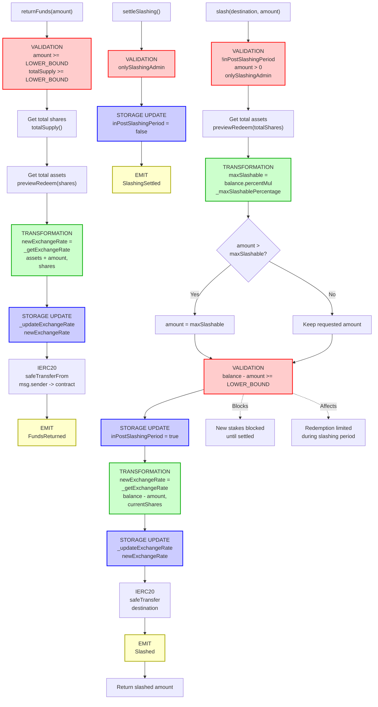

# stkAAVE Slashing Flow

End-to-end execution flow for the stkAAVE emergency slashing mechanism. Slashing is a security feature that allows the slashing admin to seize a percentage of staked funds in case of protocol insolvency or emergency scenarios.

## Quick Reference

| Aspect | Details |
|--------|---------|
| **Entry Points** | `slash(destination, amount)`, `settleSlashing()`, `returnFunds(amount)` |
| **Key Transformations** | [Slashing Amount Calculation](#amount-transformations), [Exchange Rate Adjustment](#amount-transformations) |
| **State Changes** | `inPostSlashingPeriod = true`, `_currentExchangeRate` decreased, `_totalSupply` unchanged |
| **Events Emitted** | `Slashed`, `SlashingSettled`, `ExchangeRateChanged`, `FundsReturned` |

---

## Flow Diagram



---

## Step-by-Step Execution

### 1. Slashing Execution

**File:** `StakedTokenV3.sol`

```solidity
function slash(
    address destination,
    uint256 amount
) external override onlySlashingAdmin returns (uint256) {
    // [VALIDATION] Cannot slash while another slashing event is ongoing
    require(!inPostSlashingPeriod, 'PREVIOUS_SLASHING_NOT_SETTLED');
    require(amount > 0, 'ZERO_AMOUNT');
    
    // Get current shares and underlying assets
    uint256 currentShares = totalSupply();
    uint256 balance = previewRedeem(currentShares);
    
    // [TRANSFORMATION] Calculate maximum slashable amount based on percentage cap
    uint256 maxSlashable = balance.percentMul(_maxSlashablePercentage);
    
    // Cap amount to max slashable if exceeded
    if (amount > maxSlashable) {
        amount = maxSlashable;
    }
    
    // [VALIDATION] Ensure remaining balance stays above minimum threshold
    require(balance - amount >= LOWER_BOUND, 'REMAINING_LT_MINIMUM');
    
    // [STORAGE UPDATE] Mark slashing period as active
    inPostSlashingPeriod = true;
    
    // [TRANSFORMATION] Calculate new exchange rate after slashing
    _updateExchangeRate(_getExchangeRate(balance - amount, currentShares));
    
    // Transfer slashed funds to destination
    STAKED_TOKEN.safeTransfer(destination, amount);
    
    // [EVENT] Emit slashing event
    emit Slashed(destination, amount);
    return amount;
}
```

### 2. Settling Slashing

**File:** `StakedTokenV3.sol`

```solidity
function settleSlashing() external override onlySlashingAdmin {
    // [STORAGE UPDATE] Clear the slashing period flag
    inPostSlashingPeriod = false;
    
    // [EVENT] Emit settlement event
    emit SlashingSettled();
}
```

### 3. Returning Funds

**File:** `StakedTokenV3.sol`

```solidity
function returnFunds(uint256 amount) external override {
    // [VALIDATION] Minimum amount to prevent spam and exchange rate manipulation
    require(amount >= LOWER_BOUND, 'AMOUNT_LT_MINIMUM');
    
    uint256 currentShares = totalSupply();
    require(currentShares >= LOWER_BOUND, 'SHARES_LT_MINIMUM');
    
    // Get current total assets
    uint256 assets = previewRedeem(currentShares);
    
    // [TRANSFORMATION] Calculate new exchange rate with returned funds
    _updateExchangeRate(_getExchangeRate(assets + amount, currentShares));
    
    // Pull funds from caller to contract
    STAKED_TOKEN.safeTransferFrom(msg.sender, address(this), amount);
    
    // [EVENT] Emit funds returned event
    emit FundsReturned(amount);
}
```

### 4. Exchange Rate Calculation

**File:** `StakedTokenV3.sol`

```solidity
function _getExchangeRate(uint256 totalAssets, uint256 totalShares) 
    internal pure returns (uint216) 
{
    // Rounds UP to ensure 100% backing of shares
    return (((totalShares * EXCHANGE_RATE_UNIT) + totalAssets - 1) / totalAssets);
}

function _updateExchangeRate(uint216 newExchangeRate) internal {
    _currentExchangeRate = newExchangeRate;
    emit ExchangeRateChanged(newExchangeRate);
}
```

### 5. Max Slashable Percentage Management

**File:** `StakedTokenV3.sol`

```solidity
function setMaxSlashablePercentage(uint256 percentage) 
    external override onlySlashingAdmin 
{
    _setMaxSlashablePercentage(percentage);
}

function _setMaxSlashablePercentage(uint256 percentage) internal {
    // [VALIDATION] Must be strictly less than 100% to avoid division by zero
    require(
        percentage < PercentageMath.PERCENTAGE_FACTOR,
        'INVALID_SLASHING_PERCENTAGE'
    );
    
    _maxSlashablePercentage = percentage;
    emit MaxSlashablePercentageChanged(percentage);
}
```

---

## Amount Transformations

### Slashing Amount Calculation

```
User Request
    ↓
amount = requested slashing amount
    ↓
currentShares = totalSupply()
balance = previewRedeem(currentShares) = (EXCHANGE_RATE_UNIT * shares) / _currentExchangeRate
    ↓
_maxSlashablePercentage = governance controlled (e.g., 3000 = 30%)
    ↓
maxSlashable = balance.percentMul(_maxSlashablePercentage)
             = (balance * _maxSlashablePercentage) / PERCENTAGE_FACTOR (10000)
    ↓
if (amount > maxSlashable):
    amount = maxSlashable
    ↓
require(balance - amount >= LOWER_BOUND)  // Typically 10^18 (1 token)
    ↓
Return: actual amount to be slashed
```

### Exchange Rate Adjustment During Slashing

```
Before Slashing:
    totalAssets = balance
    totalShares = currentShares
    _currentExchangeRate = (totalShares * 1e18 + totalAssets - 1) / totalAssets
    
After Slashing:
    remainingAssets = balance - amount
    totalShares = unchanged (no shares burned)
    
    newExchangeRate = (totalShares * 1e18 + remainingAssets - 1) / remainingAssets
    
Example:
    - totalShares = 1000e18
    - balance = 1100e18 (1000 assets + 100 rewards)
    - currentRate = (1000e18 * 1e18 + 1100e18 - 1) / 1100e18 ≈ 0.909e18
    - Slash 100e18 → remainingAssets = 1000e18
    - newRate = (1000e18 * 1e18 + 1000e18 - 1) / 1000e18 = 1e18
    
Impact: Share value decreases proportionally
    Before: 1 share = 1.1 assets
    After: 1 share = 1.0 assets
```

### Exchange Rate Adjustment During Fund Return

```
Return Scenario (recovering from slashing):
    totalShares = currentShares (unchanged)
    currentAssets = previewRedeem(totalShares)
    
    newAssets = currentAssets + amount
    
    newExchangeRate = (totalShares * 1e18 + newAssets - 1) / newAssets
    
Example:
    - totalShares = 1000e18
    - currentAssets = 1000e18 (after slashing)
    - currentRate = 1e18
    - Return 50e18 → newAssets = 1050e18
    - newRate = (1000e18 * 1e18 + 1050e18 - 1) / 1050e18 ≈ 0.952e18
    
Impact: Share value increases
    Before: 1 share = 1.0 assets
    After: 1 share = 1.05 assets
```

**Key Points:**
- `EXCHANGE_RATE_UNIT` = 10^18 (18 decimal precision)
- `PERCENTAGE_FACTOR` = 10^4 (2 decimal percentage precision)
- Exchange rate rounds **up** to ensure 100% backing of shares (favors the contract)
- Slashing decreases exchange rate (dilutes all stakers proportionally)
- Returning funds increases exchange rate (restores value to all stakers)
- No shares are burned during slashing - all stakers share the loss proportionally

---

## Event Details

### Slashed Event

Emitted when funds are successfully slashed and transferred to the destination.

```solidity
event Slashed(
    address indexed destination,  // Address receiving the slashed funds
    uint256 amount                // Amount of tokens slashed
);
```

### SlashingSettled Event

Emitted when the slashing admin settles an ongoing slashing event, re-enabling staking.

```solidity
event SlashingSettled();
```

### ExchangeRateChanged Event

Emitted whenever the exchange rate is updated (during slashing or fund returns).

```solidity
event ExchangeRateChanged(
    uint216 exchangeRate  // New exchange rate (18 decimal precision)
);
```

### FundsReturned Event

Emitted when funds are returned to the contract after a slashing event.

```solidity
event FundsReturned(
    uint256 amount  // Amount of tokens returned
);
```

### MaxSlashablePercentageChanged Event

Emitted when the governance changes the maximum slashable percentage.

```solidity
event MaxSlashablePercentageChanged(
    uint256 newPercentage  // New maximum slashable percentage (2 decimal precision)
);
```

---

## Error Conditions

| Error | Condition | File |
|-------|-----------|------|
| `PREVIOUS_SLASHING_NOT_SETTLED` | `inPostSlashingPeriod == true` when calling slash | StakedTokenV3.sol |
| `ZERO_AMOUNT` | `amount == 0` in slash | StakedTokenV3.sol |
| `REMAINING_LT_MINIMUM` | `balance - amount < LOWER_BOUND` after slash | StakedTokenV3.sol |
| `AMOUNT_LT_MINIMUM` | `amount < LOWER_BOUND` in returnFunds | StakedTokenV3.sol |
| `SHARES_LT_MINIMUM` | `totalSupply() < LOWER_BOUND` in returnFunds | StakedTokenV3.sol |
| `CALLER_NOT_SLASHING_ADMIN` | `msg.sender != getAdmin(SLASH_ADMIN_ROLE)` | StakedTokenV3.sol |
| `CALLER_NOT_COOLDOWN_ADMIN` | `msg.sender != getAdmin(COOLDOWN_ADMIN_ROLE)` | StakedTokenV3.sol |
| `INVALID_SLASHING_PERCENTAGE` | `percentage >= PERCENTAGE_FACTOR (100%)` | StakedTokenV3.sol |
| `SLASHING_ONGOING` | `inPostSlashingPeriod == true` when attempting to stake | StakedTokenV3.sol |

---

## Permission Requirements

### Roles

The slashing mechanism uses a role-based access control system:

| Role | ID | Permissions |
|------|-----|-------------|
| `SLASH_ADMIN_ROLE` | 0 | `slash()`, `settleSlashing()`, `setMaxSlashablePercentage()` |
| `COOLDOWN_ADMIN_ROLE` | 1 | `setCooldownSeconds()` |
| `CLAIM_HELPER_ROLE` | 2 | `claimRewardsOnBehalf()`, `claimRewardsAndRedeemOnBehalf()` |

### Slashing Admin

- Set during contract initialization via `_initialize()`
- Can be changed using the RoleManager pattern:
  1. Current admin calls `setPendingAdmin(SLASH_ADMIN_ROLE, newAdmin)`
  2. New admin calls `claimRoleAdmin(SLASH_ADMIN_ROLE)` to accept

---

## Related Flows

- [Staking Flow](./stk_aave_staking.md) - Staking AAVE to receive stkAAVE (blocked during slashing)
- [Redeem Flow](./stk_aave_redeem.md) - Unstaking stkAAVE to receive AAVE
- [Cooldown Flow](./stk_aave_cooldown.md) - Initiating the unstaking cooldown period
- [Rewards Claim Flow](./stk_aave_claim_rewards.md) - Claiming staking rewards

---

## Source File Locations

```
contract_reference/aave/stkAAVE/rev_6.sol (StakedTokenV3 - slashing implementation)
├── slash(destination, amount)
├── settleSlashing()
├── returnFunds(amount)
├── setMaxSlashablePercentage(percentage)
├── getMaxSlashablePercentage()
└── inPostSlashingPeriod (state variable)

Inherited from RoleManager:
├── getAdmin(role)
├── setPendingAdmin(role, newPendingAdmin)
├── claimRoleAdmin(role)
└── SLASH_ADMIN_ROLE constant
```

---

## Security Considerations

### Slashing as Emergency Mechanism

1. **Purpose**: Slashing is designed as an emergency security mechanism to protect the protocol in case of insolvency or critical security issues.

2. **Impact on Stakers**: All stakers share the loss proportionally since no shares are burned - the exchange rate simply decreases.

3. **Governance Control**: 
   - The maximum slashable percentage is capped by `_maxSlashablePercentage` (e.g., 30%)
   - Only the slashing admin can execute slashing
   - Slashing admin is typically the Aave governance executor or a security council

4. **Post-Slashing Period**:
   - New stakes are blocked until `settleSlashing()` is called
   - Redemptions may be limited during the slashing period
   - The slashing period flag prevents multiple simultaneous slashing events

5. **Fund Recovery**:
   - `returnFunds()` is permissionless - anyone can return funds to restore value
   - Returns increase the exchange rate, benefiting all remaining stakers
   - Minimum amounts prevent spam attacks on the exchange rate

---

## State Variables

```solidity
// Flag indicating active slashing period
bool public inPostSlashingPeriod;

// Maximum percentage of staked funds that can be slashed (2 decimal precision)
uint256 internal _maxSlashablePercentage;

// Current exchange rate (18 decimal precision)
uint216 internal _currentExchangeRate;

// Minimum token amount to prevent spam (10^decimals)
uint256 public immutable LOWER_BOUND;

// Exchange rate precision unit
uint216 public constant EXCHANGE_RATE_UNIT = 1e18;

// Slashing admin role identifier
uint256 public constant SLASH_ADMIN_ROLE = 0;
```

---

## Example Scenarios

### Scenario 1: Normal Slashing

```
Initial State:
- Total shares: 1,000,000 stkAAVE
- Total assets: 1,100,000 AAVE (includes rewards)
- Exchange rate: 1.1e18
- Max slashable: 30% (3000 basis points)

Slashing Execution:
- Request: slash(treasury, 500,000 AAVE)
- Max allowed: 1,100,000 * 0.30 = 330,000 AAVE
- Actual slashed: 330,000 AAVE (capped to max)
- Remaining assets: 770,000 AAVE
- New exchange rate: (1,000,000 * 1e18 + 770,000 - 1) / 770,000 ≈ 1.299e18

Result:
- Each share was worth 1.1 AAVE, now worth ~0.77 AAVE
- All stakers lost ~30% of their staked value proportionally
```

### Scenario 2: Fund Recovery

```
Post-Slashing State:
- Total shares: 1,000,000 stkAAVE
- Total assets: 770,000 AAVE
- Exchange rate: ~1.299e18

Recovery Execution:
- Treasury returns: returnFunds(100,000 AAVE)
- New total assets: 870,000 AAVE
- New exchange rate: (1,000,000 * 1e18 + 870,000 - 1) / 870,000 ≈ 1.149e18

Result:
- Each share value increases from ~0.77 to ~0.87 AAVE
- Value restored proportionally to all stakers
```
