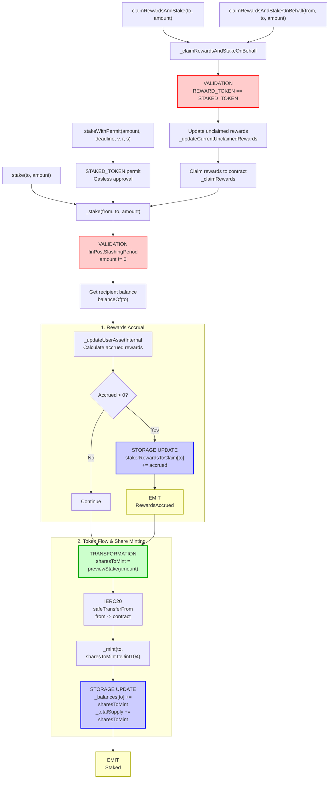

# stkAAVE Staking Flow

End-to-end execution flow for staking AAVE tokens to receive stkAAVE shares.

## Quick Reference

| Aspect | Details |
|--------|---------|
| **Entry Points** | `stake(to, amount)`, `stakeWithPermit(amount, deadline, v, r, s)`, `claimRewardsAndStake(to, amount)`, `claimRewardsAndStakeOnBehalf(from, to, amount)` |
| **Key Transformations** | [Assets → Shares via Exchange Rate](#amount-transformations) |
| **State Changes** | `_balances[to] += sharesToMint`, `_totalSupply += sharesToMint` |
| **Events Emitted** | `Staked`, `RewardsAccrued` (if applicable) |

---

## Flow Diagram



---

## Step-by-Step Execution

### 1. Entry Points

#### 1a. Direct Stake

**File:** `StakedTokenV3.sol`

```solidity
function stake(address to, uint256 amount) external {
    _stake(msg.sender, to, amount);
}
```

#### 1b. Stake with Permit (Gasless Approval)

**File:** `StakedTokenV3.sol`

```solidity
function stakeWithPermit(
    uint256 amount,
    uint256 deadline,
    uint8 v,
    bytes32 r,
    bytes32 s
) external {
    try
        IERC20WithPermit(address(STAKED_TOKEN)).permit(
            msg.sender,
            address(this),
            amount,
            deadline,
            v,
            r,
            s
        )
    {
        // do nothing
    } catch (bytes memory) {
        // do nothing - permit failure is silently ignored
    }
    _stake(msg.sender, msg.sender, amount);
}
```

**Note:** The permit call is wrapped in a try/catch block. If the permit fails (e.g., already used), the stake proceeds assuming existing approval.

#### 1c. Claim Rewards and Stake

**File:** `StakedAaveV3.sol`

```solidity
function claimRewardsAndStake(address to, uint256 amount) external returns (uint256) {
    return _claimRewardsAndStakeOnBehalf(msg.sender, to, amount);
}

function claimRewardsAndStakeOnBehalf(
    address from,
    address to,
    uint256 amount
) external onlyClaimHelper returns (uint256) {
    return _claimRewardsAndStakeOnBehalf(from, to, amount);
}
```

### 2. Internal Staking Implementation

**File:** `StakedTokenV3.sol`

```solidity
function _stake(address from, address to, uint256 amount) internal {
    // [VALIDATION] Prevent staking during slashing period
    require(!inPostSlashingPeriod, 'SLASHING_ONGOING');
    require(amount != 0, 'INVALID_ZERO_AMOUNT');
    
    uint256 balanceOfTo = balanceOf(to);
    
    // Update rewards for the recipient before stake
    uint256 accruedRewards = _updateUserAssetInternal(
        to,
        address(this),
        balanceOfTo,
        totalSupply()
    );
    
    // Accumulate any accrued rewards to claimable balance
    if (accruedRewards != 0) {
        stakerRewardsToClaim[to] = stakerRewardsToClaim[to] + accruedRewards;
        emit RewardsAccrued(to, accruedRewards);
    }
    
    // [TRANSFORMATION] Calculate shares to mint based on exchange rate
    uint256 sharesToMint = previewStake(amount);
    
    // Transfer staked tokens from user to contract
    STAKED_TOKEN.safeTransferFrom(from, address(this), amount);
    
    // Mint shares to recipient
    _mint(to, sharesToMint.toUint104());
    
    // [EVENT] Emit staking event
    emit Staked(from, to, amount, sharesToMint);
}
```

### 3. Claim and Stake Implementation

**File:** `StakedAaveV3.sol`

```solidity
function _claimRewardsAndStakeOnBehalf(
    address from,
    address to,
    uint256 amount
) internal returns (uint256) {
    // [VALIDATION] Only works when reward token is same as staked token (AAVE)
    require(REWARD_TOKEN == STAKED_TOKEN, 'REWARD_TOKEN_IS_NOT_STAKED_TOKEN');
    
    // Update rewards calculation for the user
    uint256 userUpdatedRewards = _updateCurrentUnclaimedRewards(
        from,
        balanceOf(from),
        true
    );
    
    // Determine amount to claim (capped at available rewards)
    uint256 amountToClaim = (amount > userUpdatedRewards)
        ? userUpdatedRewards
        : amount;
    
    if (amountToClaim != 0) {
        // Claim rewards to this contract first
        _claimRewards(from, address(this), amountToClaim);
        // Stake the claimed rewards
        _stake(address(this), to, amountToClaim);
    }
    
    return amountToClaim;
}
```

### 4. Preview and Exchange Rate Functions

**File:** `StakedTokenV3.sol`

```solidity
function previewStake(uint256 assets) public view returns (uint256) {
    return (assets * _currentExchangeRate) / EXCHANGE_RATE_UNIT;
}

function getExchangeRate() public view returns (uint216) {
    return _currentExchangeRate;
}

function previewRedeem(uint256 shares) public view returns (uint256) {
    return (EXCHANGE_RATE_UNIT * shares) / _currentExchangeRate;
}
```

---

## Amount Transformations

### Assets → Shares Calculation

```
User Input (18 decimals)
    ↓
amount = 1000 * 10^18  // 1000 AAVE tokens
    ↓
_currentExchangeRate = 1.1 * 10^18  // Current exchange rate (18 decimals)
    ↓
sharesToMint = (amount * _currentExchangeRate) / EXCHANGE_RATE_UNIT
             = (1000 * 10^18 * 1.1 * 10^18) / 10^18
             = 1100 * 10^18
    ↓
_mint(to, sharesToMint)
```

### Exchange Rate Mechanics

The exchange rate represents the ratio of shares to underlying assets:

**Initial Rate:** 1:1 (1 share = 1 asset)  
**After Rewards:** Rate increases as rewards are distributed to stakers  
**After Slashing:** Rate decreases to reflect loss of underlying assets

**Exchange Rate Formula:**
```solidity
function _getExchangeRate(uint256 totalAssets, uint256 totalShares) 
    internal pure returns (uint216) 
{
    return (((totalShares * EXCHANGE_RATE_UNIT) + totalAssets - 1) / totalAssets);
}
```

**Key Points:**
- `EXCHANGE_RATE_UNIT` = 10^18 (18 decimal precision)
- Rounds **up** to ensure 100% backing of shares (favors the contract)
- Exchange rate increases when rewards are added to the pool
- Exchange rate decreases during slashing events

### Share-to-Asset Conversion

When redeeming, shares convert back to assets:

```
shares = 1100 * 10^18
    ↓
_currentExchangeRate = 1.1 * 10^18
    ↓
assets = (EXCHANGE_RATE_UNIT * shares) / _currentExchangeRate
       = (10^18 * 1100 * 10^18) / (1.1 * 10^18)
       = 1000 * 10^18
```

---

## Event Details

### Staked Event

Emitted whenever AAVE tokens are successfully staked.

```solidity
event Staked(
    address indexed from,      // Address providing the AAVE tokens
    address indexed to,        // Address receiving the stkAAVE shares
    uint256 assets,            // Amount of AAVE tokens staked
    uint256 shares             // Amount of stkAAVE shares minted
);
```

### RewardsAccrued Event

Emitted when pending rewards are calculated and stored during the staking process.

```solidity
event RewardsAccrued(
    address indexed user,      // User whose rewards accrued
    uint256 amount             // Amount of rewards accrued
);
```

### ExchangeRateChanged Event

Emitted when the exchange rate is updated (during slashing or return of funds).

```solidity
event ExchangeRateChanged(
    uint216 exchangeRate       // New exchange rate (18 decimal precision)
);
```

---

## Error Conditions

| Error | Condition | File |
|-------|-----------|------|
| `SLASHING_ONGOING` | `inPostSlashingPeriod == true` | StakedTokenV3.sol |
| `INVALID_ZERO_AMOUNT` | `amount == 0` | StakedTokenV3.sol |
| `REWARD_TOKEN_IS_NOT_STAKED_TOKEN` | `REWARD_TOKEN != STAKED_TOKEN` | StakedAaveV3.sol |
| `INVALID_BALANCE_ON_COOLDOWN` | User has no balance when calling cooldown | StakedTokenV3.sol |
| `INSUFFICIENT_COOLDOWN` | Cooldown period not yet complete | StakedTokenV3.sol |
| `UNSTAKE_WINDOW_FINISHED` | Redemption window has passed | StakedTokenV3.sol |
| `INVALID_ZERO_MAX_REDEEMABLE` | No redeemable balance available | StakedTokenV3.sol |

---

## Related Flows

- [Redeem Flow](./stk_aave_redeem.md) - Unstaking stkAAVE to receive AAVE
- [Cooldown Flow](./stk_aave_cooldown.md) - Initiating the unstaking cooldown period
- [Rewards Claim Flow](./stk_aave_claim_rewards.md) - Claiming staking rewards
- [Slashing Flow](./stk_aave_slashing.md) - Emergency slashing mechanism

---

## Source File Locations

```
contract_reference/aave/stkAAVE/rev_6.sol (StakedAaveV3 - main implementation)
├── stake(to, amount)
├── stakeWithPermit(amount, deadline, v, r, s)
├── claimRewardsAndStake(to, amount)
├── claimRewardsAndStakeOnBehalf(from, to, amount)
└── _claimRewardsAndStakeOnBehalf(from, to, amount)

StakedTokenV3 (inherited)
├── _stake(from, to, amount)
├── previewStake(assets)
├── previewRedeem(shares)
├── getExchangeRate()
└── _getExchangeRate(totalAssets, totalShares)
```
