# stkAAVE Unstaking Flow

End-to-end execution flow for unstaking stkAAVE shares to receive AAVE tokens via the two-step cooldown and redeem process.

## Quick Reference

| Aspect | Details |
|--------|---------|
| **Entry Points** | `cooldown()`, `cooldownOnBehalfOf(from)`, `redeem(to, amount)`, `redeemOnBehalf(from, to, amount)` |
| **Key Transformations** | [Shares → Assets via Exchange Rate](#amount-transformations) |
| **State Changes** | `stakersCooldowns[from] = CooldownSnapshot`, `_balances[from] -= shares`, `_totalSupply -= shares` |
| **Events Emitted** | `Cooldown`, `Redeem` |

---

## Flow Diagram

```mermaid
flowchart TD
    %% Styling definitions
    classDef validation fill:#ffcccc,stroke:#ff0000,stroke-width:2px
    classDef transformation fill:#ccffcc,stroke:#00aa00,stroke-width:2px
    classDef storage fill:#ccccff,stroke:#0000ff,stroke-width:2px
    classDef event fill:#ffffcc,stroke:#aaaa00,stroke-width:2px
    classDef error fill:#ff0000,stroke:#000000,color:#fff
    
    %% Entry points - Cooldown
    Entry1["cooldown()"] --> CooldownInternal["_cooldown(from)"]
    Entry2["cooldownOnBehalfOf(from)"] --> CooldownInternal
    
    %% Cooldown flow
    CooldownInternal --> ValidateBalance["VALIDATION<br/>balanceOf(from) != 0"]
    class ValidateBalance validation
    
    ValidateBalance --> StoreCooldown["STORAGE UPDATE<br/>stakersCooldowns[from]<br/>= CooldownSnapshot<br/>timestamp: block.timestamp<br/>amount: balanceOf(from)"]
    class StoreCooldown storage
    
    StoreCooldown --> EventCooldown["EMIT<br/>Cooldown"]
    class EventCooldown event
    
    %% Entry points - Redeem
    Entry3["redeem(to, amount)"] --> RedeemInternal["_redeem(from, to, amount)"]
    Entry4["redeemOnBehalf(from, to, amount)"] --> RedeemInternal
    
    %% Redeem flow
    RedeemInternal --> ValidateAmount["VALIDATION<br/>amount != 0"]
    class ValidateAmount validation
    
    ValidateAmount --> CheckCooldown["VALIDATION<br/>Cooldown Period Checks"]
    class CheckCooldown validation
    
    CheckCooldown --> GetCooldown["Get CooldownSnapshot<br/>stakersCooldowns[from]"]
    
    GetCooldown --> CheckNotSlashing{"inPostSlashingPeriod?"}
    
    CheckNotSlashing -->|No| ValidateCooldownTime["VALIDATION<br/>block.timestamp >=<br/>cooldownSnapshot.timestamp +<br/>_cooldownSeconds"]
    class ValidateCooldownTime validation
    
    ValidateCooldownTime --> ValidateWindow["VALIDATION<br/>block.timestamp -<br/>(cooldownSnapshot.timestamp +<br/>_cooldownSeconds) <=<br/>UNSTAKE_WINDOW"]
    class ValidateWindow validation
    
    CheckNotSlashing -->|Yes| SkipCooldown[Skip cooldown checks]
    
    ValidateWindow --> GetMaxRedeemable
    SkipCooldown --> GetMaxRedeemable["Get maxRedeemable<br/>inPostSlashingPeriod ?<br/>balanceOf(from) :<br/>cooldownSnapshot.amount"]
    
    GetMaxRedeemable --> ValidateMaxRedeemable["VALIDATION<br/>maxRedeemable != 0"]
    class ValidateMaxRedeemable validation
    
    ValidateMaxRedeemable --> CalcRedeem["TRANSFORMATION<br/>amountToRedeem =<br/>min(amount, maxRedeemable)"]
    class CalcRedeem transformation
    
    CalcRedeem --> UpdateRewards["Update unclaimed rewards<br/>_updateCurrentUnclaimedRewards"]
    
    subgraph TokenFlow ["Token Flow & Share Burning"]
        direction TB
        CalcAssets["TRANSFORMATION<br/>underlyingToRedeem =<br/>previewRedeem(amountToRedeem)"]
        class CalcAssets transformation
        
        CalcAssets --> Burn["_burn(from,<br/>amountToRedeem)"]
        
        Burn --> UpdateSupply["STORAGE UPDATE<br/>_balances[from] -=<br/>amountToRedeem<br/>_totalSupply -=<br/>amountToRedeem"]
        class UpdateSupply storage
    end
    
    UpdateRewards --> TokenFlow
    
    %% Cooldown state update
    UpdateSupply --> CheckCooldownUpdate{"cooldownSnapshot<br/>.timestamp != 0?"}
    
    CheckCooldownUpdate -->|Yes| CheckFullRedeem{"cooldownSnapshot.amount -<br/>amountToRedeem == 0?"}
    
    CheckFullRedeem -->|Yes| DeleteCooldown["STORAGE UPDATE<br/>delete stakersCooldowns[from]"]
    class DeleteCooldown storage
    
    CheckFullRedeem -->|No| UpdateCooldownAmount["STORAGE UPDATE<br/>stakersCooldowns[from].amount<br/>-= amountToRedeem"]
    class UpdateCooldownAmount storage
    
    CheckCooldownUpdate -->|No| SkipCooldownUpdate[Continue]
    DeleteCooldown --> Transfer
    UpdateCooldownAmount --> Transfer
    SkipCooldownUpdate --> Transfer
    
    %% Final transfer and event
    Transfer["IERC20<br/>safeTransfer<br/>to -> underlyingToRedeem"] --> FinalEvent["EMIT<br/>Redeem"]
    class FinalEvent event
    
    %% Error annotations
    %% CRITICAL: Cooldown must be completed before redeeming
    %% CRITICAL: Redemption must happen within UNSTAKE_WINDOW after cooldown
    %% CRITICAL: During post-slashing period, cooldown checks are bypassed
```



---

## Step-by-Step Execution

### 1. Cooldown Entry Points

#### 1a. Direct Cooldown

**File:** `StakedTokenV3.sol`

```solidity
function cooldown() external override(IStakedTokenV2, StakedTokenV2) {
    _cooldown(msg.sender);
}
```

#### 1b. Cooldown On Behalf

**File:** `StakedTokenV3.sol`

```solidity
function cooldownOnBehalfOf(address from) external override onlyClaimHelper {
    _cooldown(from);
}
```

**Note:** Only the claim helper contract can call `cooldownOnBehalfOf`.

### 2. Internal Cooldown Implementation

**File:** `StakedTokenV3.sol`

```solidity
function _cooldown(address from) internal {
    // [VALIDATION] User must have a balance to cooldown
    uint256 amount = balanceOf(from);
    require(amount != 0, 'INVALID_BALANCE_ON_COOLDOWN');
    
    // [STORAGE UPDATE] Store cooldown snapshot with current timestamp and full balance
    stakersCooldowns[from] = CooldownSnapshot({
        timestamp: uint40(block.timestamp),
        amount: uint216(amount)
    });
    
    // [EVENT] Emit cooldown started event
    emit Cooldown(from, amount);
}
```

### 3. Redeem Entry Points

#### 3a. Direct Redeem

**File:** `StakedTokenV3.sol`

```solidity
function redeem(
    address to,
    uint256 amount
) external override(IStakedTokenV2, StakedTokenV2) {
    _redeem(msg.sender, to, amount.toUint104());
}
```

#### 3b. Redeem On Behalf

**File:** `StakedTokenV3.sol`

```solidity
function redeemOnBehalf(
    address from,
    address to,
    uint256 amount
) external override onlyClaimHelper {
    _redeem(from, to, amount.toUint104());
}
```

### 4. Internal Redeem Implementation

**File:** `StakedTokenV3.sol`

```solidity
function _redeem(address from, address to, uint104 amount) internal {
    // [VALIDATION] Amount must be non-zero
    require(amount != 0, 'INVALID_ZERO_AMOUNT');
    
    CooldownSnapshot memory cooldownSnapshot = stakersCooldowns[from];
    
    // [VALIDATION] Cooldown period and window checks (skip if in post-slashing period)
    if (!inPostSlashingPeriod) {
        require(
            (block.timestamp >= cooldownSnapshot.timestamp + _cooldownSeconds),
            'INSUFFICIENT_COOLDOWN'
        );
        require(
            (block.timestamp - (cooldownSnapshot.timestamp + _cooldownSeconds) <=
                UNSTAKE_WINDOW),
            'UNSTAKE_WINDOW_FINISHED'
        );
    }
    
    uint256 balanceOfFrom = balanceOf(from);
    
    // Determine max redeemable amount
    uint256 maxRedeemable = inPostSlashingPeriod
        ? balanceOfFrom
        : cooldownSnapshot.amount;
    require(maxRedeemable != 0, 'INVALID_ZERO_MAX_REDEEMABLE');
    
    // Cap redemption to max redeemable
    uint256 amountToRedeem = (amount > maxRedeemable) ? maxRedeemable : amount;
    
    // Update rewards before burning
    _updateCurrentUnclaimedRewards(from, balanceOfFrom, true);
    
    // [TRANSFORMATION] Calculate underlying assets from shares
    uint256 underlyingToRedeem = previewRedeem(amountToRedeem);
    
    // Burn shares
    _burn(from, amountToRedeem.toUint104());
    
    // Update or delete cooldown state
    if (cooldownSnapshot.timestamp != 0) {
        if (cooldownSnapshot.amount - amountToRedeem == 0) {
            delete stakersCooldowns[from];
        } else {
            stakersCooldowns[from].amount =
                stakersCooldowns[from].amount -
                amountToRedeem.toUint184();
        }
    }
    
    // Transfer underlying assets to recipient
    IERC20(STAKED_TOKEN).safeTransfer(to, underlyingToRedeem);
    
    // [EVENT] Emit redeem event
    emit Redeem(from, to, underlyingToRedeem, amountToRedeem);
}
```

### 5. Preview and Exchange Rate Functions

**File:** `StakedTokenV3.sol`

```solidity
function previewRedeem(uint256 shares) public view returns (uint256) {
    return (EXCHANGE_RATE_UNIT * shares) / _currentExchangeRate;
}

function getExchangeRate() public view returns (uint216) {
    return _currentExchangeRate;
}
```

---

## Amount Transformations

### Shares → Assets Calculation

```
User Input
    ↓
shares = 1100 * 10^18  // Amount of stkAAVE to redeem
    ↓
_currentExchangeRate = 1.1 * 10^18  // Current exchange rate (18 decimals)
    ↓
underlyingToRedeem = (EXCHANGE_RATE_UNIT * shares) / _currentExchangeRate
                   = (10^18 * 1100 * 10^18) / (1.1 * 10^18)
                   = 1000 * 10^18
    ↓
safeTransfer(to, underlyingToRedeem)
```

### Exchange Rate Mechanics

The exchange rate represents the ratio of shares to underlying assets:

**Exchange Rate Formula:**
```solidity
function previewRedeem(uint256 shares) public view returns (uint256) {
    return (EXCHANGE_RATE_UNIT * shares) / _currentExchangeRate;
}
```

**Key Points:**
- `EXCHANGE_RATE_UNIT` = 10^18 (18 decimal precision)
- Higher exchange rate = more assets per share (rewards distributed)
- Lower exchange rate = fewer assets per share (slashing event)

### Cooldown Window Mechanics

```
Cooldown Started at T0
    ↓
Wait _cooldownSeconds (e.g., 10 days)
    ↓
Redemption Window Opens at T0 + _cooldownSeconds
    ↓
Redemption Window Closes at T0 + _cooldownSeconds + UNSTAKE_WINDOW
    ↓
Must redeem within UNSTAKE_WINDOW (e.g., 2 days) or restart cooldown
```

---

## Event Details

### Cooldown Event

Emitted when a user initiates the cooldown period for unstaking.

```solidity
event Cooldown(
    address indexed user,      // User who started the cooldown
    uint256 amount             // Amount of shares under cooldown (full balance)
);
```

### Redeem Event

Emitted when shares are successfully redeemed for underlying assets.

```solidity
event Redeem(
    address indexed from,      // Address redeeming shares
    address indexed to,        // Address receiving the underlying assets
    uint256 assets,            // Amount of AAVE tokens transferred
    uint256 shares             // Amount of stkAAVE shares burned
);
```

---

## Error Conditions

| Error | Condition | File |
|-------|-----------|------|
| `INVALID_BALANCE_ON_COOLDOWN` | `balanceOf(from) == 0` when calling cooldown | StakedTokenV3.sol |
| `INVALID_ZERO_AMOUNT` | `amount == 0` when redeeming | StakedTokenV3.sol |
| `INSUFFICIENT_COOLDOWN` | `block.timestamp < cooldownSnapshot.timestamp + _cooldownSeconds` | StakedTokenV3.sol |
| `UNSTAKE_WINDOW_FINISHED` | Redemption attempted after cooldown window expired | StakedTokenV3.sol |
| `INVALID_ZERO_MAX_REDEEMABLE` | No redeemable balance available (cooldown amount is 0) | StakedTokenV3.sol |

---

## Related Flows

- [stkAAVE Staking Flow](./stk_aave_staking.md) - Staking AAVE to receive stkAAVE
- [Rewards Claim Flow](./stk_aave_claim_rewards.md) - Claiming staking rewards
- [Slashing Flow](./stk_aave_slashing.md) - Emergency slashing mechanism

---

## Source File Locations

```
contract_reference/aave/stkAAVE/rev_6.sol (StakedTokenV3 - main implementation)
├── cooldown()
├── cooldownOnBehalfOf(from)
├── redeem(to, amount)
├── redeemOnBehalf(from, to, amount)
├── _cooldown(from)
├── _redeem(from, to, amount)
├── previewRedeem(shares)
└── getExchangeRate()
```
