# Supply With Permit Flow

End-to-end execution flow for depositing assets into Aave V3 using ERC-2612 permit for gasless approvals.

## Quick Reference

| Aspect | Details |
|--------|---------|
| **Entry Point** | `Pool.supplyWithPermit(asset, amount, onBehalfOf, referralCode, deadline, permitV, permitR, permitS)` |
| **Key Transformations** | [Amount → Scaled Balance](../transformations/index.md#collateral-token-transformations) |
| **State Changes** | `_scaledBalance[onBehalfOf] += scaledAmount` |
| **Events Emitted** | `Supply`, `ReserveUsedAsCollateralEnabled` (conditional) |

---

## Flow Diagram

```mermaid
flowchart TD
    %% Styling definitions
    classDef validation fill:#ffcccc,stroke:#ff0000,stroke-width:2px
    classDef transformation fill:#ccffcc,stroke:#00aa00,stroke-width:2px
    classDef storage fill:#ccccff,stroke:#0000ff,stroke-width:2px
    classDef event fill:#ffffcc,stroke:#aaaa00,stroke-width:2px
    classDef error fill:#ff0000,stroke:#000000,color:#fff
    classDef bridge fill:#ffccff,stroke:#aa00aa,stroke-width:2px

    %% Entry point
    Entry["Pool.supplyWithPermit<br/>asset, amount,<br/>onBehalfOf, referralCode,<br/>deadline, permitV,<br/>permitR, permitS"] --> Permit["IERC20WithPermit<br/>permit<br/>Approves Pool to<br/>spend tokens"]
    class Permit validation

    Permit --> MainPath["SupplyLogic<br/>executeSupply"]

    subgraph StateUpdate ["1. State Updates"]
        direction TB
        UpdateState["ReserveLogic<br/>updateState<br/>Updates indexes,<br/>accrues treasury"] --> Validate["ValidationLogic<br/>validateSupply"]
        class Validate validation

        Validate --> UpdateRates["ReserveLogic<br/>updateInterestRates"]
    end

    MainPath --> StateUpdate

    subgraph TokenFlow ["2. Token Flow"]
        direction TB
        Transfer["IERC20<br/>safeTransferFrom<br/>msg.sender -> aToken"] --> Mint["AToken<br/>mint"]

        Mint --> Transform["TRANSFORMATION<br/>scaledAmount =<br/>amount.rayDiv<br/>(liquidityIndex)"]
        class Transform transformation

        Transform --> Store["STORAGE UPDATE<br/>_scaledBalance<br/>[onBehalfOf] +=<br/>scaledAmount"]
        class Store storage
    end

    UpdateRates --> TokenFlow

    subgraph CollateralCheck ["3. Collateral Configuration"]
        direction TB
        FirstCheck{"First Supply?"} -->|Yes| ValidateCollat["ValidationLogic<br/>validateUseAsCollateral"]
        class ValidateCollat validation

        ValidateCollat --> CanCollat{"Can Use as<br/>Collateral?"}

        CanCollat -->|Yes| SetCollat["UserConfig<br/>setUsingAsCollateral<br/>(reserve.id, true)"]
        class SetCollat storage

        SetCollat --> CollatEvent["EMIT<br/>ReserveUsedAsCollateralEnabled"]
        class CollatEvent event

        CanCollat -->|No| Skip1[Continue]
        FirstCheck -->|No| Skip1
    end

    Store --> FirstCheck

    Skip1 --> FinalEvent["EMIT<br/>Supply"]
    class FinalEvent event

    %% Error annotations
    %% CRITICAL: Permit signature must be valid or transaction reverts
    %% CRITICAL: All validations must pass or transaction reverts
    %% CRITICAL: Supply cap check prevents overflow attacks

    %% Link styles for critical paths
    linkStyle 0 stroke:#ff0000,stroke-width:3px
    linkStyle 8 stroke:#ff0000,stroke-width:3px
    linkStyle 16 stroke:#ff0000,stroke-width:3px
```



---

## Step-by-Step Execution

### 1. Entry Point

**File:** `contracts/protocol/pool/Pool.sol`

```solidity
function supplyWithPermit(
    address asset,
    uint256 amount,
    address onBehalfOf,
    uint16 referralCode,
    uint256 deadline,
    uint8 permitV,
    bytes32 permitR,
    bytes32 permitS
) public virtual override {
    try
        IERC20WithPermit(asset).permit(
            _msgSender(),
            address(this),
            amount,
            deadline,
            permitV,
            permitR,
            permitS
        )
    {} catch {}
    SupplyLogic.executeSupply(
        _reserves,
        _reservesList,
        _eModeCategories,
        _usersConfig[onBehalfOf],
        DataTypes.ExecuteSupplyParams({
            user: _msgSender(),
            asset: asset,
            interestRateStrategyAddress: RESERVE_INTEREST_RATE_STRATEGY,
            amount: amount,
            onBehalfOf: onBehalfOf,
            referralCode: referralCode,
            supplierEModeCategory: _usersEModeCategory[onBehalfOf]
        })
    );
}
```

**Key Differences from `supply()`:**
- Additional permit parameters: `deadline`, `permitV`, `permitR`, `permitS`
- Calls `IERC20WithPermit.permit()` before executing supply
- Permit is wrapped in try/catch to handle cases where permit was already consumed
- Same `executeSupply` call as regular supply after permit approval

### 2. Permit Approval

**File:** `contracts/interfaces/IERC20WithPermit.sol`

```solidity
interface IERC20WithPermit is IERC20 {
    function permit(
        address owner,
        address spender,
        uint256 value,
        uint256 deadline,
        uint8 v,
        bytes32 r,
        bytes32 s
    ) external;
}
```

**Purpose:**
- Implements EIP-2612 gasless approval
- User signs a message off-chain authorizing the Pool to spend tokens
- Eliminates need for separate `approve()` transaction
- Signature parameters (`v`, `r`, `s`) are verified against the deadline

### 3. Execute Supply

**File:** `contracts/protocol/libraries/logic/SupplyLogic.sol`

```solidity
function executeSupply(
    mapping(address => DataTypes.ReserveData) storage reserves,
    mapping(uint256 => address) storage reservesList,
    mapping(uint8 => DataTypes.EModeCategory) storage eModeCategories,
    DataTypes.UserConfigurationMap storage userConfig,
    DataTypes.ExecuteSupplyParams memory params
) external {
    DataTypes.ReserveData storage reserve = reserves[params.asset];
    DataTypes.ReserveCache memory reserveCache = reserve.cache();

    // Update state (indexes, timestamp)
    reserve.updateState(reserveCache);

    // Validate supply
    ValidationLogic.validateSupply(
        reserves,
        reserveCache,
        params.amount,
        params.onBehalfOf
    );

    // Update interest rates
    reserve.updateInterestRates(
        reserveCache,
        params.asset,
        0,  // liquidityAdded
        0   // liquidityTaken
    );

    // Transfer from user
    IERC20(params.asset).safeTransferFrom(
        params.user,
        reserveCache.aTokenAddress,
        params.amount
    );

    // Mint aTokens
    bool isFirstSupply = IAToken(reserveCache.aTokenAddress).mint(
        params.user,
        params.onBehalfOf,
        params.amount,
        reserveCache.nextLiquidityIndex
    );

    // Handle collateral configuration
    if (isFirstSupply) {
        bool canUseAsCollateral = ValidationLogic.validateUseAsCollateral(
            reserves,
            reservesList,
            eModeCategories,
            reserveCache,
            userConfig,
            params.supplierEModeCategory
        );

        if (canUseAsCollateral) {
            userConfig.setUsingAsCollateral(reserve.id, true);
            emit ReserveUsedAsCollateralEnabled(
                params.asset,
                params.onBehalfOf
            );
        }
    }

    emit Supply(
        params.asset,
        params.user,
        params.onBehalfOf,
        params.amount,
        params.referralCode
    );
}
```

### 4. AToken Mint

**File:** `contracts/protocol/tokenization/AToken.sol`

```solidity
function mint(
    address caller,
    address onBehalfOf,
    uint256 amount,
    uint256 index
) external override onlyPool returns (bool) {
    return _mintScaled(caller, onBehalfOf, amount, index);
}

function _mintScaled(
    address caller,
    address onBehalfOf,
    uint256 amount,
    uint256 index
) internal returns (bool) {
    uint256 scaledAmount = amount.rayDiv(index);  // [TRANSFORMATION]
    _scaledBalance[onBehalfOf] += scaledAmount;

    // Return true if first supply
    return (scaledAmount != 0 && _scaledBalance[onBehalfOf] == scaledAmount);
}
```

**[TRANSFORMATION]:** See [Collateral Token Transformations](../transformations/index.md#collateral-token-transformations) for details on `amount.rayDiv(index)`

### 5. Validation Checks

**File:** `contracts/protocol/libraries/logic/ValidationLogic.sol`

```solidity
function validateSupply(
    mapping(address => DataTypes.ReserveData) storage reserves,
    DataTypes.ReserveCache memory reserveCache,
    uint256 amount,
    address onBehalfOf
) internal view {
    require(amount != 0, Errors.INVALID_AMOUNT);

    // Check reserve is active and not frozen
    require(
        reserveCache.reserveConfiguration.getActive(),
        Errors.RESERVE_INACTIVE
    );
    require(
        !reserveCache.reserveConfiguration.getFrozen(),
        Errors.RESERVE_FROZEN
    );

    // Check supply cap
    uint256 supplyCap = reserveCache.reserveConfiguration.getSupplyCap();
    if (supplyCap != 0) {
        uint256 totalSupply = IERC20(reserveCache.aTokenAddress)
            .scaledTotalSupply()
            .rayMul(reserveCache.nextLiquidityIndex);

        uint256 scaledCap = supplyCap * 10**reserveCache.reserveConfiguration.getDecimals();
        require(totalSupply + amount <= scaledCap, Errors.SUPPLY_CAP_EXCEEDED);
    }

    // Validate onBehalfOf can receive aTokens
    _validateERC20Getter(onBehalfOf);
}
```

---

## Amount Transformations

### Input → Storage

```
User Input (WAD decimals)
    ↓
amount = 1000 * 10^18  // 1000 tokens
    ↓
liquidityIndex = 1.0001 * 10^27  // Current index
    ↓
scaledAmount = amount.rayDiv(liquidityIndex)
             = (1000 * 10^18 * 10^27) / (1.0001 * 10^27)
             = 999.9 * 10^18  (approximate)
    ↓
_scaledBalance[onBehalfOf] += scaledAmount
```

**Key Points:**
- User provides WAD-decimal amount (18 decimals)
- Scaled balance uses RAY precision (27 decimals)
- Index accrues interest over time
- Later withdrawal: `scaledAmount.rayMul(currentIndex)` gives amount + interest

---

## Event Details

### Supply Event

```solidity
event Supply(
    address indexed reserve,      // Asset address
    address indexed user,         // msg.sender
    address indexed onBehalfOf,   // Recipient of aTokens
    uint256 amount,               // Amount supplied
    uint16 referralCode          // Referral code (0 if none)
);
```

### ReserveUsedAsCollateralEnabled Event

Emitted only on first supply if asset can be used as collateral.

```solidity
event ReserveUsedAsCollateralEnabled(
    address indexed reserve,
    address indexed user
);
```

---

## Error Conditions

| Error | Condition | File |
|-------|-----------|------|
| `INVALID_AMOUNT` | `amount == 0` | ValidationLogic.sol |
| `RESERVE_INACTIVE` | Reserve is not active | ValidationLogic.sol |
| `RESERVE_FROZEN` | Reserve is frozen | ValidationLogic.sol |
| `SUPPLY_CAP_EXCEEDED` | `totalSupply + amount > supplyCap` | ValidationLogic.sol |

**Note:** Permit signature failures are silently caught via try/catch. The actual token transfer will revert if approval is insufficient.

---

## Related Flows

- [Supply Flow](./supply.md) - Standard supply without permit
- [Withdraw Flow](./withdraw.md) - Reverse operation
- [Collateral Management](./collateral_management.md) - Enabling/disabling collateral
- [Liquidation Flow](./liquidation.md) - When collateral is seized

---

## Source File Locations

```
contracts/protocol/pool/Pool.sol
contracts/interfaces/IERC20WithPermit.sol
contracts/protocol/libraries/logic/SupplyLogic.sol
contracts/protocol/libraries/logic/ValidationLogic.sol
contracts/protocol/tokenization/AToken.sol
contracts/protocol/libraries/logic/ReserveLogic.sol
```

---

## EIP-2612 Permit Standard

The `supplyWithPermit` function implements the [EIP-2612](https://eips.ethereum.org/EIPS/eip-2612) standard for gasless approvals.

### Benefits

1. **Gasless Approvals**: Users sign a message off-chain instead of submitting an approval transaction
2. **Better UX**: Single transaction for approval + supply
3. **Meta-Transactions**: Can be integrated with relayers for gasless transactions

### Permit Parameters

| Parameter | Description |
|-----------|-------------|
| `deadline` | Timestamp after which the permit is invalid |
| `permitV` | ECDSA signature component (recovery id) |
| `permitR` | ECDSA signature component (first 32 bytes) |
| `permitS` | ECDSA signature component (second 32 bytes) |

### Security Considerations

- The permit is wrapped in try/catch to handle race conditions where the permit has already been used
- Users must still have sufficient token balance for the transfer to succeed
- The deadline protects against replay attacks with expired signatures
