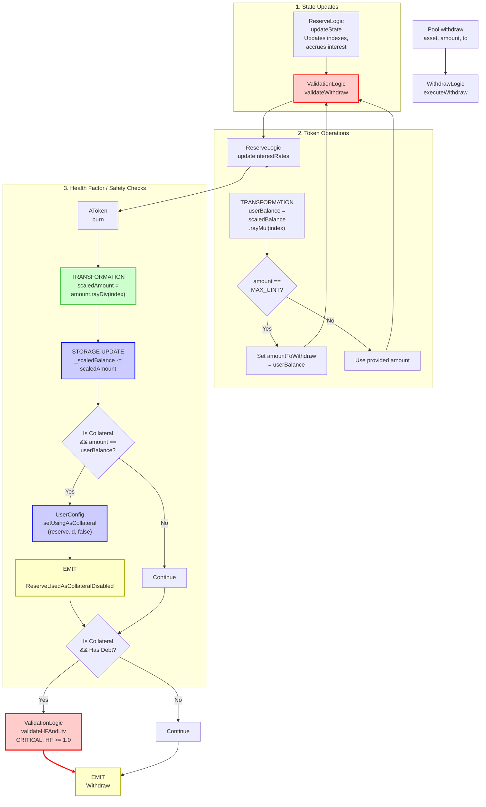

# Withdraw Flow

End-to-end execution flow for withdrawing assets from Aave V3.

## Quick Reference

| Aspect | Details |
|--------|---------|
| **Entry Point** | `Pool.withdraw(asset, amount, to)` |
| **Key Transformations** | [Scaled Balance → Amount](../transformations/index.md#collateral-token-transformations) |
| **State Changes** | `_scaledBalance[msg.sender] -= scaledAmount` |
| **Events Emitted** | `Withdraw`, `ReserveUsedAsCollateralDisabled` (conditional) |

---

## Flow Diagram



---

## Step-by-Step Execution

### 1. Entry Point

**File:** `contracts/protocol/pool/Pool.sol`

```solidity
function withdraw(
    address asset,
    uint256 amount,
    address to
) external virtual override returns (uint256) {
    return SupplyLogic.executeWithdraw(
        _reserves,
        _reservesList,
        _usersConfig[msg.sender],
        DataTypes.ExecuteWithdrawParams({
            asset: asset,
            amount: amount,
            to: to,
            reservesCount: _reservesCount,
            oracle: ADDRESSES_PROVIDER.getPriceOracle(),
            userEModeCategory: _usersEModeCategory[msg.sender]
        })
    );
}
```

### 2. Execute Withdraw

**File:** `contracts/protocol/libraries/logic/SupplyLogic.sol`

```solidity
function executeWithdraw(
    mapping(address => DataTypes.ReserveData) storage reserves,
    mapping(uint256 => address) storage reservesList,
    DataTypes.UserConfigurationMap storage userConfig,
    DataTypes.ExecuteWithdrawParams memory params
) external returns (uint256) {
    DataTypes.ReserveData storage reserve = reserves[params.asset];
    DataTypes.ReserveCache memory reserveCache = reserve.cache();
    
    // Update state
    reserve.updateState(reserveCache);
    
    // Get user's balance
    uint256 userBalance = IAToken(reserveCache.aTokenAddress)
        .scaledBalanceOf(msg.sender)
        .rayMul(reserveCache.nextLiquidityIndex);  // [TRANSFORMATION]
    
    // Handle max withdrawal
    uint256 amountToWithdraw = params.amount;
    if (params.amount == type(uint256).max) {
        amountToWithdraw = userBalance;
    }
    
    // Validate withdrawal
    ValidationLogic.validateWithdraw(
        reserves,
        reservesList,
        reserveCache,
        amountToWithdraw,
        userConfig
    );
    
    // Update interest rates
    reserve.updateInterestRates(
        reserveCache,
        params.asset,
        0,              // liquidityAdded
        amountToWithdraw  // liquidityTaken
    );
    
    // Burn aTokens
    IAToken(reserveCache.aTokenAddress).burn(
        msg.sender,
        params.to,
        amountToWithdraw,
        reserveCache.nextLiquidityIndex
    );
    
    // Check if collateral should be disabled
    if (userConfig.isUsingAsCollateral(reserve.id)) {
        if (amountToWithdraw == userBalance) {
            userConfig.setUsingAsCollateral(reserve.id, false);
            emit ReserveUsedAsCollateralDisabled(params.asset, msg.sender);
        }
        
        // Validate health factor if user has debt
        if (userConfig.isBorrowingAny()) {
            ValidationLogic.validateHFAndLtv(
                reserves,
                reservesList,
                userConfig,
                params.asset,
                params.userEModeCategory,
                params.reservesCount,
                params.oracle
            );
        }
    }
    
    emit Withdraw(
        params.asset,
        msg.sender,
        params.to,
        amountToWithdraw
    );
    
    return amountToWithdraw;
}
```

### 3. AToken Burn

**File:** `contracts/protocol/tokenization/AToken.sol`

```solidity
function burn(
    address from,
    address receiverOfUnderlying,
    uint256 amount,
    uint256 index
) external override onlyPool {
    _burnScaled(from, receiverOfUnderlying, amount, index);
}

function _burnScaled(
    address from,
    address receiverOfUnderlying,
    uint256 amount,
    uint256 index
) internal {
    uint256 scaledAmount = amount.rayDiv(index);  // [TRANSFORMATION]
    _scaledBalance[from] -= scaledAmount;
    
    IERC20(_underlyingAsset).safeTransfer(receiverOfUnderlying, amount);
}
```

**[TRANSFORMATION]:** See [Collateral Token Transformations](../transformations/index.md#collateral-token-transformations) for details on `amount.rayDiv(index)`

### 4. Validation Checks

**File:** `contracts/protocol/libraries/logic/ValidationLogic.sol`

```solidity
function validateWithdraw(
    mapping(address => DataTypes.ReserveData) storage reserves,
    mapping(uint256 => address) storage reservesList,
    DataTypes.ReserveCache memory reserveCache,
    uint256 amount,
    DataTypes.UserConfigurationMap storage userConfig
) internal view {
    require(amount != 0, Errors.INVALID_AMOUNT);
    
    // Check reserve is active
    require(
        reserveCache.reserveConfiguration.getActive(),
        Errors.RESERVE_INACTIVE
    );
    
    // Check user has sufficient balance
    uint256 userBalance = IAToken(reserveCache.aTokenAddress)
        .scaledBalanceOf(msg.sender)
        .rayMul(reserveCache.nextLiquidityIndex);
    require(userBalance >= amount, Errors.INVALID_AMOUNT);
}
```

### 5. Health Factor Check

**File:** `contracts/protocol/libraries/logic/ValidationLogic.sol`

```solidity
function validateHFAndLtv(
    mapping(address => DataTypes.ReserveData) storage reserves,
    mapping(uint256 => address) storage reservesList,
    DataTypes.UserConfigurationMap storage userConfig,
    address asset,
    uint8 userEModeCategory,
    uint256 reservesCount,
    address oracle
) internal view {
    // Calculate user account data
    (
        uint256 totalCollateralInBaseCurrency,
        uint256 totalDebtInBaseCurrency,
        uint256 avgLtv,
        uint256 avgLiquidationThreshold,
        uint256 healthFactor,
        bool hasZeroLtvCollateral
    ) = GenericLogic.calculateUserAccountData(
        reserves,
        reservesList,
        _eModeCategories,
        DataTypes.CalculateUserAccountDataParams({
            userConfig: userConfig,
            reservesCount: reservesCount,
            user: msg.sender,
            oracle: oracle,
            userEModeCategory: userEModeCategory
        })
    );
    
    // Check health factor
    require(
        healthFactor >= HEALTH_FACTOR_LIQUIDATION_THRESHOLD,
        Errors.HEALTH_FACTOR_LOWER_THAN_LIQUIDATION_THRESHOLD
    );
    
    // Check LTV if withdrawing 0 LTV collateral
    if (hasZeroLtvCollateral && totalDebtInBaseCurrency > 0) {
        DataTypes.ReserveData storage collateralReserve = reserves[asset];
        DataTypes.ReserveCache memory collateralReserveCache = collateralReserve.cache();
        
        require(
            collateralReserveCache.reserveConfiguration.getLtv() != 0 ||  // Not withdrawing 0-LTV asset
            avgLtv > 0,  // Or user has other collateral with LTV > 0
            Errors.LTV_VALIDATION_FAILED
        );
    }
}
```

---

## Amount Transformations

### Storage → Output

```
_scaledBalance[msg.sender] (stored scaled)
    ↓
liquidityIndex = 1.0002 * 10^27  // Current index
    ↓
userBalance = _scaledBalance[msg.sender].rayMul(liquidityIndex)
            = 1000 * 10^18  // 1000 tokens + accrued interest
    ↓
Validation: amount <= userBalance
    ↓
scaledAmountToBurn = amount.rayDiv(liquidityIndex)
                   = (1000 * 10^18 * 10^27) / (1.0002 * 10^27)
    ↓
_scaledBalance[msg.sender] -= scaledAmountToBurn
    ↓
Transfer amount to user
```

**Key Points:**
- User receives WAD-decimal amount (18 decimals)
- Withdrawn amount includes accrued interest from scaled balance
- Health factor must remain above liquidation threshold
- If withdrawing all collateral and user has debt, HF check is strict

---

## Event Details

### Withdraw Event

```solidity
event Withdraw(
    address indexed reserve,    // Asset address
    address indexed user,       // msg.sender
    address indexed to,         // Recipient of underlying
    uint256 amount              // Amount withdrawn
);
```

### ReserveUsedAsCollateralDisabled Event

Emitted when withdrawing all of a collateral asset.

```solidity
event ReserveUsedAsCollateralDisabled(
    address indexed reserve,
    address indexed user
);
```

---

## Error Conditions

| Error | Condition | File |
|-------|-----------|------|
| `INVALID_AMOUNT` | `amount == 0` or `amount > balance` | ValidationLogic.sol |
| `RESERVE_INACTIVE` | Reserve is not active | ValidationLogic.sol |
| `HEALTH_FACTOR_LOWER_THAN_LIQUIDATION_THRESHOLD` | HF < 1.0 after withdrawal | ValidationLogic.sol |
| `LTV_VALIDATION_FAILED` | Withdrawing 0-LTV collateral while having debt | ValidationLogic.sol |

---

## Related Flows

- [Supply Flow](./supply.md) - Deposit operation
- [Liquidation Flow](./liquidation.md) - When health factor drops too low

---

## Source File Locations

```
contracts/protocol/pool/Pool.sol
contracts/protocol/libraries/logic/SupplyLogic.sol
contracts/protocol/libraries/logic/ValidationLogic.sol
contracts/protocol/libraries/logic/GenericLogic.sol
contracts/protocol/tokenization/AToken.sol
contracts/protocol/libraries/logic/ReserveLogic.sol
```
