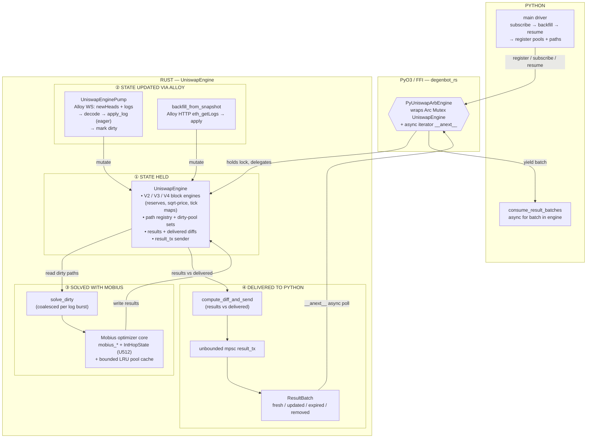

# Rust Solver Engine — Three-Layer Architecture

Four concerns, three layers. Implementation details (log decoders, `tick_bitmap.rs`,
event buffers, `SnapshotStore`, shared infra, on-chain verification, dual-orientation
registration) are encapsulated inside the boxes they belong to rather than drawn
separately. See `rust/CONTEXT.md` for term definitions.



## The four concerns

| # | Concern | Where it lives | Key types |
|---|---------|----------------|-----------|
| ① | **State held** | `UniswapEngine` (Rust), guarded by `parking_lot::Mutex` | `V2/V3/V4BlockEngine`, `path_pools`, `dirty_v2/v3/v4`, `results`, `delivered`, `result_tx` |
| ② | **State updated via Alloy** | `UniswapEnginePump` (WS) + `backfill_from_snapshot` (HTTP) | `AlloyProvider`, `apply_log`, `process_backfill_logs` |
| ③ | **Solved with Mobius** | `solve_dirty` → Mobius math core | `mobius_*`, `IntHopState` (U512), `PyPoolCache` LRU |
| ④ | **Delivered to Python** | mpsc channel → async iterator | `compute_diff_and_send`, `ResultBatch`, `__anext__` |

## Steady-state data flow

```
Alloy WS logs ─► apply_log ─► mark pool dirty ─► solve_dirty ─► Mobius ─► results
                                                                         │
                           compute_diff_and_send ◄────────────────────────┘
                                         │
                          ResultBatch (fresh/updated/expired/removed)
                                         │  unbounded mpsc
                                         ▼
                          PyUniswapArbEngine.__anext__  ─►  Python consumer
```

`UniswapEngine` is the hub: the Alloy pump/backfill **write** to it, the Mobius
solver **reads** dirty paths and **writes** results, and `compute_diff_and_send`
**reads** `results` vs `delivered` to produce the incremental batch that crosses
the FFI boundary back to Python.
