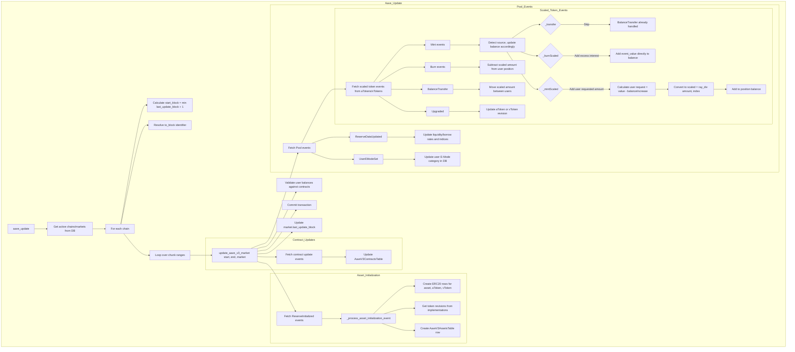

# Aave CLI Commands

## Overview

The Aave CLI provides commands for managing Aave V3 markets and updating position data. The main command `aave_update` fetches blockchain events, processes them, and synchronizes the database with current user positions (collateral and debt).

## Background: Aave V3 Architecture

Aave V3 uses **scaled balances** for tracking user positions:

- **aTokens** represent collateral deposits, scaled by a liquidity index
- **vTokens** (variable debt tokens) represent borrowed amounts, scaled by a borrow index
- Scaling indexes grow over time as interest accrues, ensuring users earn/pay proportional interest

When events occur (supply, withdraw, borrow, repay, transfer), the database stores scaled balances. The actual balance at any point is calculated as:

```
actual_balance = scaled_balance * index
```

The system tracks events from:
- **Pool contract**: Reserve configuration, E-Mode changes
- **aToken contracts**: Collateral operations (Mint/Burn/Transfer)
- **vToken contracts**: Borrow/repay operations (Mint/Burn)

## Offline Position Calculation

The `aave_update` command is designed to rebuild a complete database of collateral and debt positions by retrieving chronological events from several Aave contracts and decoding the underlying amounts that are stored in smart contract storage. This event-driven approach allows for fast offline calculation of positions without making any RPC calls to query live contract state. Once the database is synchronized, all position calculations can be performed locally using the stored scaled balances and index values.

## Commands

All CLI commands are implemented in [`src/degenbot/cli/aave.py`](../../src/degenbot/cli/aave.py).

### `degenbot aave update`

Update positions for all active Aave V3 markets by processing blockchain events.

```bash
degenbot aave update [--chunk SIZE] [--to-block BLOCK]
```

#### Parameters

| Parameter | Default | Description |
|-----------|---------|-------------|
| `--chunk` | 10,000 | Maximum number of blocks to process per database commit |
| `--to-block` | `latest:-64` | Last block in update range. Format: `TAG[:OFFSET]` |

#### Block Identifiers

Valid block tags: `earliest`, `finalized`, `safe`, `latest`, `pending`

Examples:
- `latest` - Latest block
- `latest:-64` - 64 blocks before chain tip (default, ensures finality)
- `safe:128` - 128 blocks after last safe block
- `12345678` - Specific block number

#### Behavior

1. **Identify active markets**: Queries database for active Aave V3 markets on all chains
2. **Determine update range**: Starts from `last_update_block + 1` for each market
3. **Process in chunks**: Iteratively processes blocks up to `chunk_size`, committing after each chunk
4. **Track progress**: Displays progress bar showing blocks processed
5. **Skip up-to-date chains**: If no new blocks exist since last update, skips that chain

#### Example Usage

```bash
# Update all active markets to 128 blocks before latest
degenbot aave update --to-block "latest:-128"

# Update using smaller chunks for slower machines
degenbot aave update --chunk 5000

# Update to a specific block for historical analysis
degenbot aave update --to-block "18900000"
```

### `degenbot aave activate`

Activate an Aave market for tracking.

```bash
degenbot aave activate ethereum_aave_v3
```

Only activated markets are included in `aave_update` runs.

### `degenbot aave deactivate`

Deactivate an Aave market (positions not updated).

```bash
degenbot aave deactivate ethereum_aave_v3
```

## Data Flow



## Event Processing Details

### Reserve Initialization (`ReserveInitialized`)

Tracked from PoolConfigurator contract. Creates new asset entry with:
- Underlying ERC20 token address
- aToken and vToken addresses
- Token implementation revisions (for encoding compatibility)

**Data models updated**: `Erc20TokenTable`, `AaveV3AssetsTable`

### Reserve Data Update (`ReserveDataUpdated`)

Emitted from Pool when interest rates change. Updates:
- `liquidity_rate`: Current supply rate (RAY precision)
- `borrow_rate`: Current variable borrow rate (RAY precision)
- `liquidity_index`: Index for converting collateral scaled balances
- `borrow_index`: Index for converting debt scaled balances
- `last_update_block`: Block of last rate update

**Data model updated**: `AaveV3AssetsTable`

### User E-Mode Set (`UserEModeSet`)

Emitted when user changes their efficiency mode category.

**Data model updated**: `AaveV3UsersTable.e_mode`

### Scaled Token Mint (`Mint`)

**Important**: Mint events can originate from three sources, identified by comparing `value` and `balanceIncrease` event parameters:

**Identification Algorithm:**

```
if value == balanceIncrease:
    source = "_transfer" (collateral transfer)
elif balanceIncrease > value:
    source = "_burnScaled" (interest earned/accrued)
elif value > balanceIncrease:
    source = "_mintScaled" (user supply/borrow action)
```

**Source Details:**

1. **`_transfer`**: aToken transfers between users (side effect of transfer operation)
2. **`_burnScaled`**: Withdrawal where accrued interest exceeds withdrawal amount
3. **`_mintScaled`**: User supplies collateral or borrows debt

**Storage Effects:**
- `_mintScaled`: Storage increased by `_mint(amountScaled)`
- `_burnScaled`: Storage decreased by `_burn(amountScaled)`, interest portion emitted as Mint
- `_transfer`: No storage change (BalanceTransfer event already handled)

**Processing Rules:**

- `_transfer` events: Skip (BalanceTransfer handled balance movement)
- `_burnScaled` events: Add `event_value` directly as interest (no conversion)
- `_mintScaled` events: Calculate user request `amount = value - balanceIncrease`, convert to scaled: `amountScaled = ray_div(amount, index)`

**aTokens** (collateral):
- `_transfer`: Skip processing
- `_burnScaled`: Add `event_value` to `AaveV3CollateralPositionsTable.balance`
- `_mintScaled`: Add `amountScaled` to `AaveV3CollateralPositionsTable.balance`

**vTokens** (debt):
- `_burnScaled`: Add `event_value` to `AaveV3DebtPositionsTable.balance`
- `_mintScaled`: Add `amountScaled` to `AaveV3DebtPositionsTable.balance`

All sources create user entry and position if not exists.

**Data models updated**: `AaveV3UsersTable`, `AaveV3CollateralPositionsTable` or `AaveV3DebtPositionsTable`

### Scaled Token Burn (`Burn`)

Burn events always originate from `_burnScaled` after the storage is reduced by `_burn(amountScaled)`.

**aTokens** (collateral withdraw):
- `_burn()` already subtracted `amountScaled` from storage
- Event `value` = `amount - balanceIncrease` (net after interest)
- To reconstruct the `amount` passed to `_burn()`: `amount = event_value + balance_increase`
- Convert to scaled: `amountScaled = ray_div(amount, liquidity_index)`
- Subtract from `AaveV3CollateralPositionsTable.balance` (matches `_burn()` call)
- Deletes position if balance reaches zero

**vTokens** (debt repay):
- `_burn()` already subtracted `amountScaled` from storage
- Event `value` = `amount - balanceIncrease` (net after interest)
- To reconstruct the `amount` passed to `_burn()`: `amount = event_value + balance_increase`
- Convert to scaled: `amountScaled = ray_div(amount, liquidity_index)`
- Subtract from `AaveV3DebtPositionsTable.balance` (matches `_burn()` call)
- Deletes position if balance reaches zero

**Data models updated**: `AaveV3CollateralPositionsTable` or `AaveV3DebtPositionsTable`

### Balance Transfer (`BalanceTransfer`)

Only occurs for aTokens (collateral). Transfers scaled amount directly:
- Decrements sender's collateral balance
- Increments recipient's collateral balance (creates user/position if needed)
- Deletes sender's position if balance reaches zero

**Data models updated**: `AaveV3UsersTable`, `AaveV3CollateralPositionsTable`

### Token Upgrade (`Upgraded`)

When aToken or vToken implementation changes:
- Detects which token type (aToken or vToken)
- Queries new implementation for revision number
- Updates revision in `AaveV3AssetsTable`

**Data model updated**: `AaveV3AssetsTable.a_token_revision` or `AaveV3AssetsTable.v_token_revision`

## Data Model Updates

All database models are defined in [`src/degenbot/database/models/aave.py`](../../src/degenbot/database/models/aave.py):

| Table | Fields Updated | Notes |
|-------|----------------|-------|
| `AaveV3MarketTable` | `last_update_block` | After each chunk completes |
| `AaveV3ContractsTable` | `address`, `revision` | New proxy contracts or implementation changes |
| `AaveV3AssetsTable` | `liquidity_rate`, `borrow_rate`, `liquidity_index`, `borrow_index`, `last_update_block` | From ReserveDataUpdated events |
| `AaveV3AssetsTable` | `a_token_revision`, `v_token_revision` | From Upgraded events |
| `AaveV3UsersTable` | `e_mode` | From UserEModeSet events |
| `AaveV3CollateralPositionsTable` | `balance` | From Mint (3 sources), Burn, BalanceTransfer events |
| `AaveV3DebtPositionsTable` | `balance` | From Mint (2 sources), Burn events |
| `Erc20TokenTable` | New rows created | For underlying assets, aTokens, vTokens |

## Error Handling & Validation

### Pre-update Checks

1. **Invalid block tag**: Raises `ValueError` if `to_block` tag not in valid set
2. **Future block**: Raises `ValueError` if `to_block` ahead of current chain tip
3. **No new blocks**: Logs message and skips chain if `start_block >= end_block`

### Event Processing Validation

1. **Asset existence**: Asserts asset exists in DB before processing events
2. **User existence**: Creates user entry if not found (for collateral operations)
3. **Position tracking**: Maintains invariant that position exists when processing operations
4. **Non-negative balances**: Asserts balances never go negative
5. **Revision compatibility**: Raises `ValueError` for unsupported aToken/vToken revisions

### Balance Verification

After each block, performs **balance checks** on modified users:
- Calls `scaledBalanceOf(address)` on contract
- Compares against stored `balance` value
- Raises assertion error on mismatch with detailed context

## Algorithm Details

### Chunk Processing

The update processes blocks in chunks to limit memory usage and enable incremental commits:

```python
while working_start_block <= last_block:
    # Calculate end of current chunk (minimum of constraints)
    working_end_block = min(
        last_block,
        working_start_block + chunk_size - 1,
        market.last_update_block for each market (if ahead)
    )

    # Update all markets ready for this chunk
    for market in markets_needing_update(start == market.last_update_block + 1):
        update_aave_v3_market(start, end, market)

    # Commit changes
    for market in updated_markets:
        market.last_update_block = working_end_block
    session.commit()

    # Advance to next chunk
    working_start_block = working_end_block + 1
```

### Market Selection Logic

A market is updated in a chunk if:
- `market.last_update_block is None` (never updated), OR
- `market.last_update_block + 1 == working_start_block` (ready for next segment)

This allows markets at different block heights to be synchronized gradually.

### Event Ordering

Events are processed in block number, then log index order:
```python
sorted(all_events, key=operator.itemgetter("blockNumber", "logIndex"))
```

This ensures chronological processing within each block.

## Related Functions

### `update_aave_v3_market(w3, start_block, end_block, market, session)`

Core update logic for a single market. Fetches and processes all events in the block range.

**Location**: [`src/degenbot/cli/aave.py:1239`](../../src/degenbot/cli/aave.py#L1239)

### Event Processors

All event processors are located in [`src/degenbot/cli/aave.py`](../../src/degenbot/cli/aave.py):

- `_process_asset_initialization_event()` - New reserve assets
- `_process_reserve_data_update_event()` - Rate/index updates
- `_process_user_e_mode_set_event()` - User E-Mode changes
- `_process_scaled_token_mint_event()` - Collateral supply/borrow, interest accrual, or transfer (detects source)
- `_process_scaled_token_burn_event()` - Collateral withdraw or debt repay
- `_process_a_token_balance_transfer_event()` - Collateral transfers
- `_process_scaled_token_upgrade_event()` - Token implementation changes

### Helper Functions

- `get_aave_v3_contract_update_events()` - Fetch contract configuration events
- `get_aave_v3_reserve_initialized_events()` - Fetch new asset events

## Configuration

The command uses Web3 connections from the degenbot config file. Each active chain must have an RPC endpoint configured.

### Required Config

```yaml
rpc:
  1: https://mainnet.example.com  # Ethereum mainnet
  # ... other chain IDs
```

## Dependencies

- **Database**: SQLAlchemy ORM (see [`src/degenbot/database/models/aave.py`](../../src/degenbot/database/models/aave.py))
- **Blockchain**: Web3.py for RPC calls
- **Math**: Aave ray_div for scaled balance calculations
- **Logging**: Click for CLI output, tqdm for progress bars

## Solidity Smart Contract Source Code

The Aave CLI references and interacts with Solidity smart contract source code located in [`src/degenbot/aave/libraries/`](../../src/degenbot/aave/libraries/). These libraries contain the original Aave V3 smart contract implementations for token management and mathematical operations.

### Library Structure

#### `v3_1/` - Aave V3 v3.1 Implementation

Contains the initial Aave V3 token implementations:

- **[WadRayMath.sol](../../src/degenbot/aave/libraries/v3_1/WadRayMath.sol)**: Core mathematical library for fixed-point arithmetic
  - `wadMul/wadDiv`: Operations on WAD values (18 decimal places)
  - `rayMul/rayDiv`: Operations on RAY values (27 decimal places)
  - `rayToWad/wadToRay`: Conversions between precision levels
  - Used for calculating scaled balances and interest indices

- **[AToken.sol](../../src/degenbot/aave/libraries/v3_1/AToken.sol)**: Interest-bearing token implementation for collateral deposits
  - `mint()`: Called when users supply collateral
  - `burn()`: Called when users withdraw collateral
  - `balanceOf()`: Returns actual balance = scaled_balance * liquidity_index
  - `transferOnLiquidation()`: Handles token transfers during liquidations

- **[IScaledBalanceToken.sol](../../src/degenbot/aave/libraries/v3_1/IScaledBalanceToken.sol)**: Interface defining scaled balance token behavior
  - `Mint` event: Emitted on token mint (includes balanceIncrease)
  - `Burn` event: Emitted on token burn
  - `scaledBalanceOf()`: Returns scaled balance without index applied

- **[ScaledBalanceTokenBase.sol](../../src/degenbot/aave/libraries/v3_1/ScaledBalanceTokenBase.sol)**: Base implementation for scaled tokens
  - `_mintScaled()`: Core logic for minting with index adjustment
  - `_burnScaled()`: Core logic for burning with index adjustment
  - `_transfer()`: Handles transfers with index updates for both parties

- **[MintableIncentivizedERC20.sol](../../src/degenbot/aave/libraries/v3_1/MintableIncentivizedERC20.sol)**: Incentives-aware ERC20 base
  - Integrates with Aave incentives controller for reward distribution
  - **Note**: File exists as `ncentivizedERC20.sol` (missing leading "I" due to filesystem issue)

#### `v3_4/` - Aave V3 v3.4 Implementation

- **[WadRayMath.sol](../../src/degenbot/aave/libraries/v3_4/WadRayMath.sol)**: Enhanced version with expanded math operations
- **[WadRayMath.t.sol](../../src/degenbot/aave/libraries/v3_4/WadRayMath.t.sol)**: Unit tests for the WadRayMath library

#### `v3_5/` - Aave V3 v3.5 Implementation

- **[WadRayMath.sol](../../src/degenbot/aave/libraries/v3_5/WadRayMath.sol)**: Latest version with additional rounding options
  - `rayMulCeil/rayMulFloor`: Explicit ceiling/floor operations
  - `rayDivCeil/rayDivFloor`: Explicit division rounding control
- **[WadRayMath.t.sol](../../src/degenbot/aave/libraries/v3_5/WadRayMath.t.sol)**: Updated test suite
- **[wad_ray_math.py](../../src/degenbot/aave/libraries/v3_5/wad_ray_math.py)**: Python port with explicit rounding control
  - `@overload` decorators for optional `Rounding` parameter
  - Matches Solidity rounding behavior exactly
- **[rounding.py](../../src/degenbot/aave/libraries/v3_5/rounding.py)**: Python enum defining `Rounding` type (CEILING, FLOOR, NONE)
- **[types.py](../../src/degenbot/aave/libraries/v3_5/types.py)**: Python type aliases for Ray/Wad values

### Key Concepts in Solidity Implementation

#### Events vs Storage Modifications

**Important distinction**: Events are **read-only notifications** that do not modify contract storage. All actual balance changes occur in the `_mint()` and `_burn()` function calls.

```solidity
// From [ScaledBalanceTokenBase.sol](../../src/degenbot/aave/libraries/v3_1/ScaledBalanceTokenBase.sol)

// Mint operations: _mint() adds to storage
function _mintScaled(...) internal returns (bool) {
  uint256 amountScaled = amount.rayDiv(index);
  _mint(onBehalfOf, amountScaled.toUint128());  // <-- STORAGE CHANGE HERE
  emit Mint(caller, onBehalfOf, amount + balanceIncrease, balanceIncrease, index);
}

// Burn operations: _burn() subtracts from storage
function _burnScaled(...) internal {
  uint256 amountScaled = amount.rayDiv(index);
  _burn(user, amountScaled.toUint128());  // <-- STORAGE CHANGE HERE
  
  if (balanceIncrease > amount) {
    emit Mint(user, user, balanceIncrease - amount, balanceIncrease, index);
  } else {
    emit Burn(user, target, amount - balanceIncrease, balanceIncrease, index);
  }
}
```

**Key insight**: The CLI's `position.balance` field tracks the **scaled balance** that is modified by `_mint()` and `_burn()`. To synchronize correctly, event processing must calculate the exact `amountScaled` that was passed to these storage-modifying functions.

- `_mint(amountScaled)` → position.balance += amountScaled
- `_burn(amountScaled)` → position.balance -= amountScaled

Where `amountScaled = ray_div(user_requested_amount, index)`.

#### Scaled Balances

The Solidity contracts use the same scaled balance pattern tracked by the CLI:

```solidity
// From [AToken.sol:129](../../src/degenbot/aave/libraries/v3_1/AToken.sol#L129)
function balanceOf(address user) public view returns (uint256) {
  return super.balanceOf(user).rayMul(POOL.getReserveNormalizedIncome(_underlyingAsset));
}
```

This matches the CLI calculation (see **Background** section above).

#### Event Signatures

The Solidity contracts emit the same events tracked by the CLI:

```solidity
// From [IScaledBalanceToken.sol:18](../../src/degenbot/aave/libraries/v3_1/IScaledBalanceToken.sol#L18)
event Mint(
  address indexed caller,
  address indexed onBehalfOf,
  uint256 value,              // Emitted amount (not directly used for storage)
  uint256 balanceIncrease,    // Interest accrued since last action
  uint256 index               // New liquidity index
);

event Burn(
  address indexed from,
  address indexed target,
  uint256 value,              // Emitted amount (not directly used for storage)
  uint256 balanceIncrease,    // Interest accrued since last action
  uint256 index               // New liquidity index
);
```

**Critical**: Event `value` is a notification parameter, **not the amount that was changed in storage**. The actual storage change uses `amountScaled = ray_div(amount, index)` where `amount` is the user's requested action amount.

See the **Scaled Token Mint** and **Scaled Token Burn** sections above for the CLI-level calculations that derive `amount` from event parameters and convert to scaled values.

### Rounding Behavior

Solidity implementations use **half-up rounding** by default:

```solidity
// From [WadRayMath.sol:72](../../src/degenbot/aave/libraries/v3_1/WadRayMath.sol#L72)
c := div(add(mul(a, b), HALF_RAY), RAY)  // Add 0.5 before division
```

The CLI's Python port uses `ray_div()` which must match this behavior exactly.

### Reference Implementation

When working with Aave CLI commands, consult these Solidity files to understand:
1. **Event structure**: What data each event contains
2. **Index calculation**: How liquidity/borrow indices are applied
3. **Balance semantics**: When Mint vs Burn events occur
4. **Transfer logic**: How `BalanceTransfer` events differ from standard transfers

## Development Notes

### Verbose Logging

For debugging, the code includes verbose logging controls:
- `VERBOSE_USERS`: Set of addresses to trace individually
- `VERBOSE_ALL`: Global flag for logging all operations

### Verification
On each new block, the code will perform a verification that asserts the database matches the scaled balance lookup at the Pool contract.

### Position Lifecycle Edge Cases

When processing events that modify positions (Mint, Burn, BalanceTransfer), careful attention must be paid to the order in which events occur within the same block/transaction:

- **BalanceTransfer + Mint sequence**: A BalanceTransfer event may reduce a sender's balance to zero, causing position deletion. If a subsequent Mint event (e.g., interest accrual) in the same block affects that user, the position must be recreated.
- **Zero balance handling**: Positions with zero balance are deleted to reduce database size. However, any subsequent event affecting that user must recreate the position before applying the balance change.
- **Event ordering**: All events are sorted by `(blockNumber, logIndex)` to ensure chronological processing within blocks. The Solidity contract event emission order must match this ordering for correct synchronization.

**Current implementation**: The Mint event processor detects `_transfer` source events and skips them (since BalanceTransfer already handled the balance movement), relying on BalanceTransfer to have created or maintained the necessary positions.

### Future Enhancements

TODO comments in source indicate planned features:
- Scraper for collateral usage enabled events
