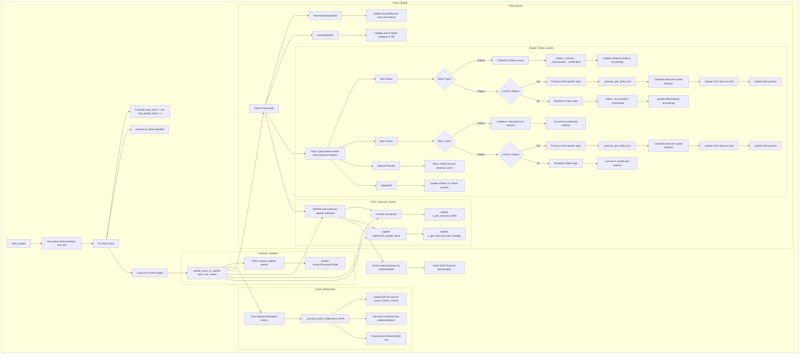

# Aave CLI Commands

## Overview

The Aave CLI provides commands for managing Aave V3 markets and updating position data. The main command `aave_update` fetches blockchain events, processes them, and synchronizes the database with current user positions (collateral and debt).

## Background: Aave V3 Architecture

Aave V3 uses **scaled balances** for tracking user positions:

- **aTokens** represent collateral deposits, scaled by a liquidity index
- **vTokens** (variable debt tokens) represent borrowed amounts, scaled by a borrow index
- Scaling indexes grow over time as interest accrues, ensuring users earn/pay proportional interest

When events occur (supply, withdraw, borrow, repay, transfer), the database stores scaled balances. The actual balance at any point is calculated as:

```
actual_balance = scaled_balance * index
```

The system tracks events from:
- **Pool contract**: Reserve configuration, E-Mode changes
- **aToken contracts**: Collateral operations (Mint/Burn/Transfer)
- **vToken contracts**: Borrow/repay operations (Mint/Burn)
- **GHO vToken**: Special debt token with discount mechanism for GHO borrowing

## GHO Token Support

GHO is Aave's stablecoin with discounted borrowing based on stkAAVE holdings. The CLI tracks GHO positions with revision-specific logic:

### GHO Tables

- **`AaveGhoTokenTable`**: Discount token address and rate strategy
- **`AaveV3UsersTable.gho_discount`**: User's discount percentage

### Revision Differences

- **Revision 1**: Uses `_accrueDebtOnAction()` for discount accounting
- **Revision 2**: Uses `_get_discounted_balance()` with enhanced balance calculation

### GHO Processing

Dedicated processors handle GHO Mint/Burn events:
- Calculate discount-scaled balances
- Update user discount rates based on position changes
- Verify against contract after each block

## Offline Position Calculation

The `aave_update` command is designed to rebuild a complete database of collateral and debt positions by retrieving chronological events from several Aave contracts and decoding the underlying amounts that are stored in smart contract storage. This event-driven approach allows for fast offline calculation of positions without making any RPC calls to query live contract state. Once the database is synchronized, all position calculations can be performed locally using the stored scaled balances and index values.

## Commands

All CLI commands are implemented in [`src/degenbot/cli/aave.py`](../../src/degenbot/cli/aave.py).

### `degenbot aave update`

Update positions for all active Aave V3 markets by processing blockchain events.

```bash
degenbot aave update [--chunk SIZE] [--to-block BLOCK]
```

#### Parameters

| Parameter | Default | Description |
|-----------|---------|-------------|
| `--chunk` | 10,000 | Maximum number of blocks to process per database commit |
| `--to-block` | `latest:-64` | Last block in update range. Format: `TAG[:OFFSET]` |

#### Block Identifiers

Valid block tags: `earliest`, `finalized`, `safe`, `latest`, `pending`

Examples:
- `latest` - Latest block
- `latest:-64` - 64 blocks before chain tip (default, ensures finality)
- `safe:128` - 128 blocks after last safe block
- `12345678` - Specific block number

#### Behavior

1. **Identify active markets**: Queries database for active Aave V3 markets on all chains
2. **Determine update range**: Starts from `last_update_block + 1` for each market
3. **Process in chunks**: Iteratively processes blocks up to `chunk_size`, committing after each chunk
4. **Track progress**: Displays progress bar showing blocks processed
5. **Skip up-to-date chains**: If no new blocks exist since last update, skips that chain

#### Example Usage

```bash
# Update all active markets to 128 blocks before latest
degenbot aave update --to-block "latest:-128"

# Update using smaller chunks for slower machines
degenbot aave update --chunk 5000

# Update to a specific block for historical analysis
degenbot aave update --to-block "18900000"
```

### `degenbot aave activate`

Activate an Aave market for tracking.

```bash
degenbot aave activate ethereum_aave_v3
```

Only activated markets are included in `aave_update` runs.

### `degenbot aave deactivate`

Deactivate an Aave market (positions not updated).

```bash
degenbot aave deactivate ethereum_aave_v3
```

## Data Flow



## Event Processing Details

### Reserve Initialization (`ReserveInitialized`)

Tracked from PoolConfigurator contract. Creates new asset entry with:
- Underlying ERC20 token address
- aToken and vToken addresses
- Token implementation revisions (for encoding compatibility)

**Data models updated**: `Erc20TokenTable`, `AaveV3AssetsTable`

### Reserve Data Update (`ReserveDataUpdated`)

Emitted from Pool when interest rates change. Updates:
- `liquidity_rate`: Current supply rate (RAY precision)
- `borrow_rate`: Current variable borrow rate (RAY precision)
- `liquidity_index`: Index for converting collateral scaled balances
- `borrow_index`: Index for converting debt scaled balances
- `last_update_block`: Block of last rate update

**Data model updated**: `AaveV3AssetsTable`

### User E-Mode Set (`UserEModeSet`)

Emitted when user changes their efficiency mode category.

**Data model updated**: `AaveV3UsersTable.e_mode`

### Scaled Token Mint (`Mint`)

Mint events originate from three sources, identified by comparing `value` and `balanceIncrease`:

```
if value == balanceIncrease:     # _transfer - skip (BalanceTransfer handles this)
elif balanceIncrease > value:    # _burnScaled - interest accrual
else:                             # _mintScaled - user action (supply/borrow)
```

**User Operations:**

| Operation | Trigger |
|-----------|---------|
| `DEPOSIT` | aToken _mintScaled |
| `WITHDRAW` | aToken _burnScaled (interest > withdrawal) |
| `BORROW` | vToken _mintScaled |
| `REPAY` | vToken _burnScaled (interest > repayment) |
| `GHO BORROW` | GHO vToken mint |
| `GHO REPAY` | GHO vToken burn |

**Processing:**
- `_mintScaled`: `amount = value - balanceIncrease`, `amountScaled = ray_div(amount, index)`
- `_burnScaled`: Add `event_value` directly as interest
- All sources create user/position if needed

**Data models**: `AaveV3UsersTable`, position tables, `AaveGhoTokenTable` for GHO

### Scaled Token Burn (`Burn`)

Burn events always follow `_burn(amountScaled)` storage reduction.

**Processing:**
- Event `value` = `amount - balanceIncrease` (net after interest)
- Reconstruct: `amount = event_value + balance_increase`
- Convert: `amountScaled = ray_div(amount, index)`
- Subtract `amountScaled` from position balance
- Delete position if balance reaches zero

**GHO vToken**: Uses `_process_gho_debt_burn()` with revision-specific logic (1 or 2).

### Balance Transfer (`BalanceTransfer`)

Only occurs for aTokens (collateral). Transfers scaled amount directly:
- Decrements sender's collateral balance
- Increments recipient's collateral balance (creates user/position if needed)
- Deletes sender's position if balance reaches zero

**Data models updated**: `AaveV3UsersTable`, `AaveV3CollateralPositionsTable`

### Token Upgrade (`Upgraded`)

When aToken or vToken implementation changes:
- Detects which token type (aToken or vToken)
- Queries new implementation for revision number
- Updates revision in `AaveV3AssetsTable`

**Data model updated**: `AaveV3AssetsTable.a_token_revision` or `AaveV3AssetsTable.v_token_revision`

### GHO Discount Token Updated (`DiscountTokenUpdated`)

Emitted when the discount token for GHO vToken changes.

**Data model updated**: `AaveGhoTokenTable.v_gho_discount_token`

### GHO Discount Rate Strategy Updated (`DiscountRateStrategyUpdated`)

Emitted when the discount rate strategy for GHO vToken changes. The strategy calculates discount percentages based on user's GHO debt and discount token balances.

**Data model updated**: `AaveGhoTokenTable.v_gho_discount_rate_strategy`

## Error Handling & Validation

### Pre-update Checks

1. **Invalid block tag**: Raises `ValueError` if `to_block` tag not in valid set
2. **Future block**: Raises `ValueError` if `to_block` ahead of current chain tip
3. **No new blocks**: Logs message and skips chain if `start_block >= end_block`

### Event Processing Validation

1. **Asset existence**: Asserts asset exists in DB before processing events
2. **User existence**: Creates user entry if not found (for collateral operations)
3. **Position tracking**: Maintains invariant that position exists when processing operations
4. **Non-negative balances**: Asserts balances never go negative
5. **Revision compatibility**: Raises `ValueError` for unsupported aToken/vToken revisions

### Balance Verification

After each block, performs **balance checks** on modified users:
- Calls `scaledBalanceOf(address)` on contract
- Compares against stored `balance` value
- Raises assertion error on mismatch with detailed context

**GHO Discount Verification**:
- Calls `getDiscountPercent(address)` on GHO vToken contract
- Compares against stored `gho_discount` value in `AaveV3UsersTable`
- Raises assertion error on mismatch with detailed context

## Algorithm Details

### Chunk Processing

The update processes blocks in chunks to limit memory usage and enable incremental commits:

```python
while working_start_block <= last_block:
    # Calculate end of current chunk (minimum of constraints)
    working_end_block = min(
        last_block,
        working_start_block + chunk_size - 1,
        market.last_update_block for each market (if ahead)
    )

    # Update all markets ready for this chunk
    for market in markets_needing_update(start == market.last_update_block + 1):
        update_aave_v3_market(start, end, market)

    # Commit changes
    for market in updated_markets:
        market.last_update_block = working_end_block
    session.commit()

    # Advance to next chunk
    working_start_block = working_end_block + 1
```

### Market Selection Logic

A market is updated in a chunk if:
- `market.last_update_block is None` (never updated), OR
- `market.last_update_block + 1 == working_start_block` (ready for next segment)

This allows markets at different block heights to be synchronized gradually.

### Event Ordering

Events are processed in block number, then log index order:
```python
sorted(all_events, key=operator.itemgetter("blockNumber", "logIndex"))
```

This ensures chronological processing within each block.

## Token Revision Libraries

The code supports multiple Aave V3 token revisions through the `SCALED_TOKEN_REVISION_LIBRARIES` dictionary. Each revision provides specific math libraries for calculating scaled balances:

| Revision | Library Path | WadRayMath Features |
|----------|--------------|---------------------|
| 1 | `v3_1/wad_ray_math.py` | Initial implementation |
| 2 | `v3_2/wad_ray_math.py` | Enhanced operations |
| 3 | `v3_3/wad_ray_math.py` | Enhanced operations |
| 4 | `v3_4/wad_ray_math.py` | Enhanced operations |

Revision-specific functions:
- `_get_math_libraries(token_revision)` - Returns WadRayMath and PercentageMath libraries for a given revision
- Used in `_process_scaled_token_operation()`, `_accrue_debt_on_action()`, and GHO-specific functions

**Note**: The `v3_5` directory contains Python ports with explicit rounding control but is not currently mapped in the revision libraries.

## Related Functions

### `update_aave_market(w3, start_block, end_block, market, session)`

Core update logic for a single market. Fetches and processes all events in the block range.

**Location**: [`src/degenbot/cli/aave.py:2090`](../../src/degenbot/cli/aave.py#L2090)

### Event Processors

All event processors are located in [`src/degenbot/cli/aave.py`](../../src/degenbot/cli/aave.py):

- `_process_asset_initialization_event()` - New reserve assets
- `_process_reserve_data_update_event()` - Rate/index updates
- `_process_user_e_mode_set_event()` - User E-Mode changes
- `_process_scaled_token_mint_event()` - Collateral supply/borrow, interest accrual, or transfer (detects source)
- `_process_scaled_token_burn_event()` - Collateral withdraw or debt repay
- `_process_scaled_token_balance_transfer_event()` - Collateral transfers
- `_process_scaled_token_upgrade_event()` - Token implementation changes
- `_process_discount_token_updated_event()` - GHO discount token updates
- `_process_discount_rate_strategy_updated_event()` - GHO discount rate strategy updates

### GHO-Specific Functions

- `_process_gho_debt_mint()` - GHO debt mint events (borrow/repay with discount)
- `_process_gho_debt_burn()` - GHO debt burn events (repay with discount)
- `_accrue_debt_on_action()` - Calculate balance increase and discount for GHO debt
- `_get_discount_rate()` - Retrieve discount percentage from strategy contract
- `_verify_gho_discount_amounts()` - Verify GHO discount values match contract

### Helper Functions

- `_get_contract_update_events()` - Fetch contract configuration events
- `_get_reserve_initialized_events()` - Fetch new asset events
- `_get_all_scaled_token_addresses()` - Get all aToken and vToken addresses for a chain
- `_get_scaled_token_asset_by_address()` - Get collateral and debt assets by token address
- `_update_contract_revision()` - Update contract revision in database
- `_get_or_create_user()` - Get existing user or create new one
- `_get_or_create_erc20_token()` - Get existing ERC20 token or create new one
- `_get_or_create_collateral_position()` - Get existing collateral position or create new one
- `_get_or_create_debt_position()` - Get existing debt position or create new one
- `_process_scaled_token_operation()` - Determine balance delta and user operation for scaled token events

## Configuration

The command uses Web3 connections from the degenbot config file. Each active chain must have an RPC endpoint configured.

### Required Config

```yaml
rpc:
  1: https://mainnet.example.com  # Ethereum mainnet
  # ... other chain IDs
```

## Environment Variables

### Aave Verbose Logging

The Aave CLI also supports selective verbose logging:

| Variable | Values | Description |
|----------|--------|-------------|
| `DEGENBOT_VERBOSE_ALL` | `1`, `true`, `yes` | Enable all verbose logging for Aave events |
| `DEGENBOT_VERBOSE_USERS` | Comma-separated addresses | Enable verbose logging for specific user addresses |
| `DEGENBOT_VERBOSE_TX` | Comma-separated hashes | Enable verbose logging for specific transaction hashes |

## Dependencies

- **Database**: SQLAlchemy ORM (see [`src/degenbot/database/models/aave.py`](../../src/degenbot/database/models/aave.py))
- **Blockchain**: Web3.py for RPC calls
- **Math**: Aave WadRayMath libraries for scaled balance calculations (v3_1 through v3_4)
- **Logging**: Click for CLI output, tqdm for progress bars
- **Token Revisions**: Protocol-based library selection for different Aave V3 token implementations

## Solidity Reference

The CLI interacts with Aave V3 contracts. Key implementation details in [`src/degenbot/aave/libraries/`](../../src/degenbot/aave/libraries/):

### Scaled Balance Pattern

```solidity
// From ScaledBalanceTokenBase.sol
function _mintScaled(...) {
  uint256 amountScaled = amount.rayDiv(index);
  _mint(onBehalfOf, amountScaled.toUint128());  // Storage change
  emit Mint(..., amount + balanceIncrease, balanceIncrease, index);  // Event
}
```

Events are notifications only. Actual storage changes happen in `_mint()` and `_burn()` calls using `amountScaled`.

### Rounding

Solidity uses half-up rounding: `(a * b + HALF_RAY) / RAY`

The Python port in `v3_1/wad_ray_math.py` must match this exactly for correct balance synchronization.

### Event Structure

Mint/Burn events include:
- `value`: Emitted amount (not storage amount)
- `balanceIncrease`: Interest since last action
- `index`: Current liquidity/borrow index

CLI derives storage amounts: `amountScaled = ray_div(user_amount, index)`


