# Aave V3 Pool Contract - Mermaid Flow Diagrams

This document contains Mermaid diagrams visualizing the execution flows of the Aave V3 Pool contract.

## 1. Supply Flow

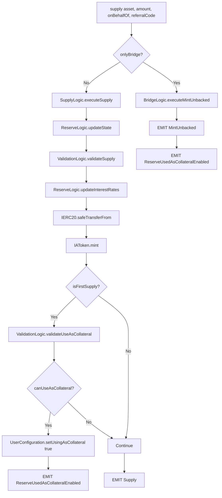

## 2. Withdraw Flow

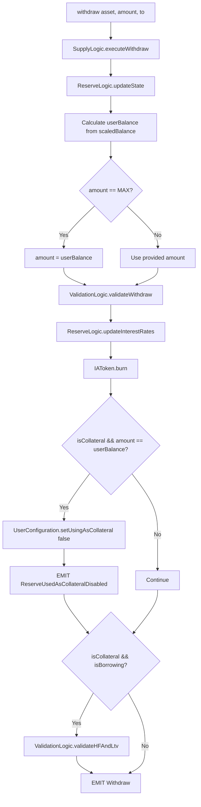

## 3. Borrow Flow

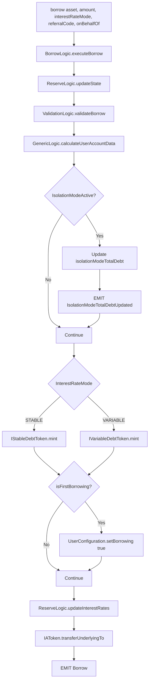

## 4. Repay Flow

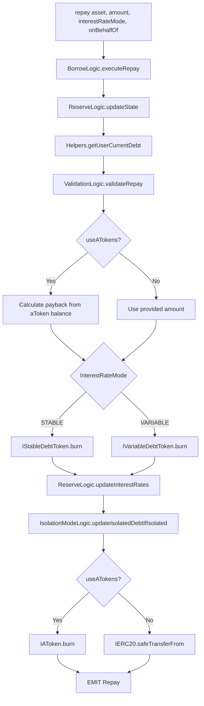

## 5. Liquidation Flow

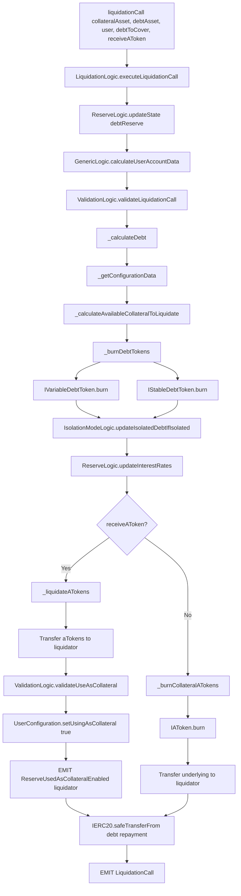

## 6. Flash Loan Flow

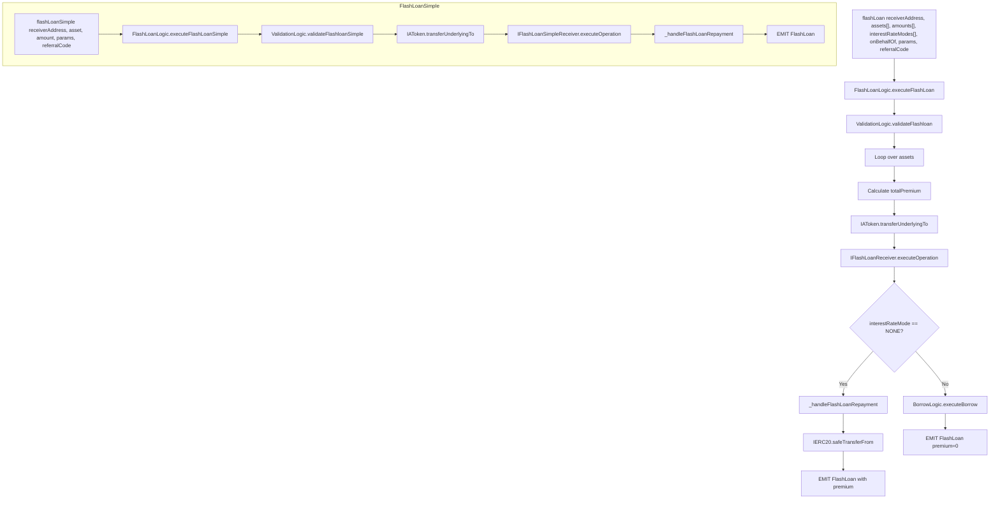

## 7. Rate Management Flows

```mermaid
flowchart TD
    subgraph SwapBorrowRateMode
    A[swapBorrowRateMode asset, interestRateMode] --> B[BorrowLogic.executeSwapBorrowRateMode]
    B --> C[ReserveLogic.updateState]
    C --> D[ValidationLogic.validateSwapRateMode]
    D --> E{currentRateMode}
    E -->|STABLE| F[IStableDebtToken.burn + IVariableDebtToken.mint]
    E -->|VARIABLE| G[IVariableDebtToken.burn + IStableDebtToken.mint]
    F --> H[ReserveLogic.updateInterestRates]
    G --> H
    H --> I[EMIT SwapBorrowRateMode]
    end
    
    subgraph RebalanceStableBorrowRate
    J[rebalanceStableBorrowRate asset, user] --> K[BorrowLogic.executeRebalanceStableBorrowRate]
    K --> L[ReserveLogic.updateState]
    L --> M[ValidationLogic.validateRebalanceStableBorrowRate]
    M --> N[IStableDebtToken.burn]
    N --> O[IStableDebtToken.mint with new rate]
    O --> P[ReserveLogic.updateInterestRates]
    P --> Q[EMIT RebalanceStableBorrowRate]
    end
```

## 8. Collateral Management Flow

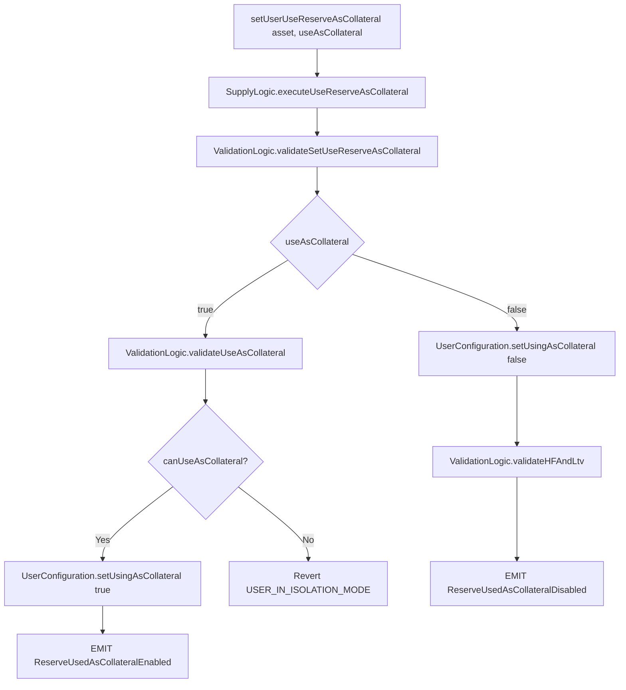

## 9. E-Mode Management Flow

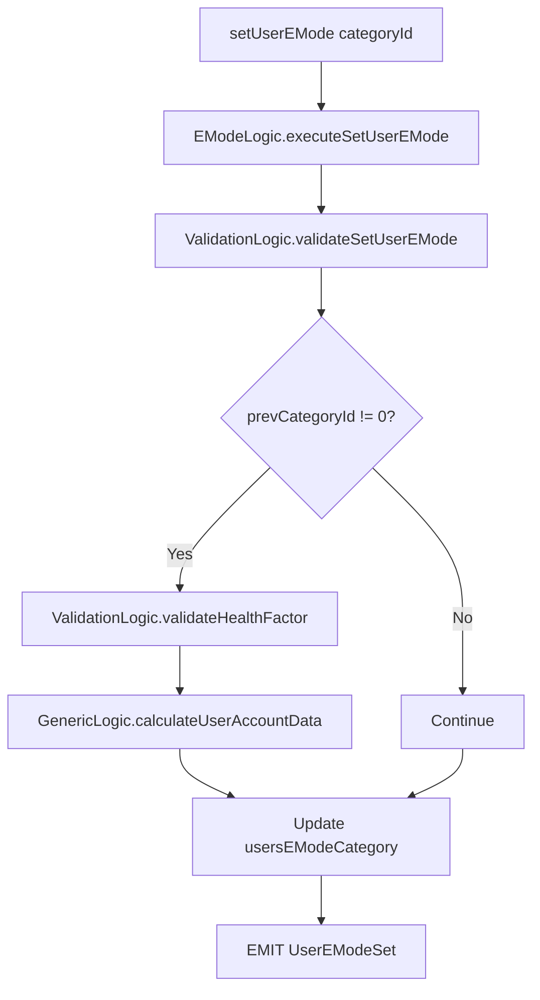

## 10. Bridge Operations Flow

```mermaid
flowchart TD
    subgraph MintUnbacked
    A[mintUnbacked asset, amount, onBehalfOf, referralCode] --> B[BridgeLogic.executeMintUnbacked]
    B --> C[ReserveLogic.updateState]
    C --> D[ValidationLogic.validateSupply]
    D --> E[Check unbackedMintCap]
    E --> F[ReserveLogic.updateInterestRates]
    F --> G[IAToken.mint]
    G --> H{isFirstSupply?}
    H -->|Yes| I[ValidationLogic.validateUseAsCollateral]
    I --> J[UserConfiguration.setUsingAsCollateral true]
    J --> K[EMIT ReserveUsedAsCollateralEnabled]
    H -->|No| L[Continue]
    K --> M[EMIT MintUnbacked]
    L --> M
    end
    
    subgraph BackUnbacked
    N[backUnbacked asset, amount, fee] --> O[BridgeLogic.executeBackUnbacked]
    O --> P[ReserveLogic.updateState]
    P --> Q[Calculate backingAmount]
    Q --> R[Calculate fee splits]
    R --> S[ReserveLogic.cumulateToLiquidityIndex]
    S --> T[Update accruedToTreasury]
    T --> U[ReserveLogic.updateInterestRates]
    U --> V[IERC20.safeTransferFrom]
    V --> W[EMIT BackUnbacked]
    end
```

## 11. Admin Operations Flow

```mermaid
flowchart TD
    subgraph InitReserve
    A[initReserve asset, aTokenAddress, stableDebtAddress, variableDebtAddress, interestRateStrategyAddress] --> B[PoolLogic.executeInitReserve]
    B --> C[Address.isContract asset]
    C --> D[ReserveLogic.init]
    D --> E[Update reservesList]
    E --> F[Increment reservesCount]
    end
    
    subgraph DropReserve
    G[dropReserve asset] --> H[PoolLogic.executeDropReserve]
    H --> I[ValidationLogic.validateDropReserve]
    I --> J{all supplies and debts are zero?}
    J -->|Yes| K[Clear reservesList entry]
    K --> L[Delete reservesData entry]
    J -->|No| M[Revert]
    end
    
    subgraph MintToTreasury
    N["mintToTreasury assets[]"] --> O[PoolLogic.executeMintToTreasury]
    O --> P[Loop over assets]
    P --> Q[Calculate amountToMint]
    Q --> R[IAToken.mintToTreasury]
    R --> S[EMIT MintedToTreasury]
    end
    
    subgraph ConfigureEMode
    T[configureEModeCategory id, category] --> U{onlyPoolConfigurator?}
    U -->|Yes| V[id != 0?]
    V -->|Yes| W[Update eModeCategories id]
    V -->|No| X[Revert EMODE_CATEGORY_RESERVED]
    U -->|No| Y[Revert CALLER_NOT_POOL_CONFIGURATOR]
    end
```

## 12. Interest Rate Update Flow

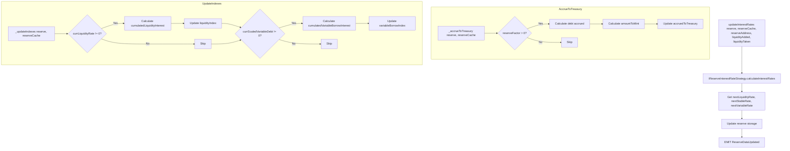

## 13. Finalize Transfer Flow (Internal)

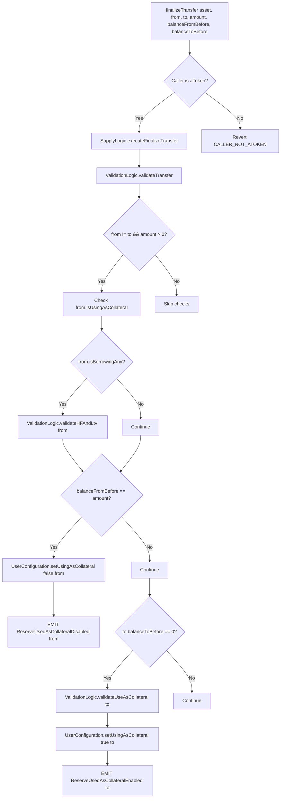

## 14. Events Summary Diagram

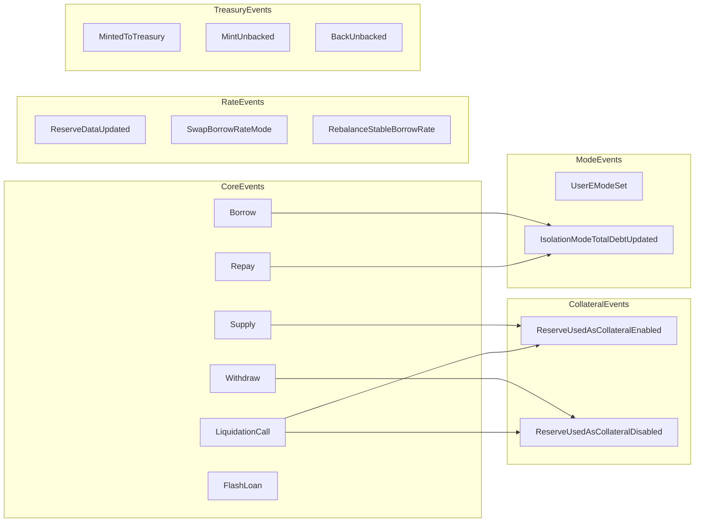

## 15. Library Dependencies

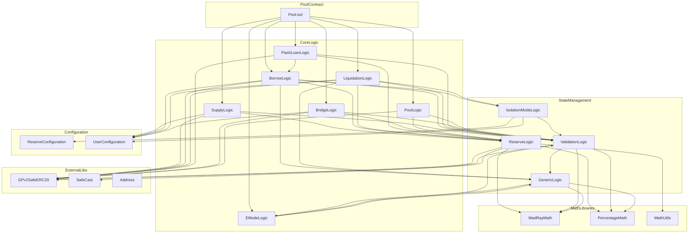

## Usage

To view these diagrams:
1. Install a Mermaid viewer extension in your IDE, or
2. Use the Mermaid Live Editor at https://mermaid.live
3. Copy any diagram code block and paste it into the editor

## Key Patterns

1. **State Update Pattern**: Every write operation starts with `ReserveLogic.updateState()` which:
   - Updates indexes
   - Accrues interest to treasury
   - Updates timestamps

2. **Validation Pattern**: Operations validate inputs via `ValidationLogic` before state changes

3. **Rate Update Pattern**: Operations affecting liquidity end with `ReserveLogic.updateInterestRates()`

4. **Event Emission Pattern**: Events are emitted after successful state changes for off-chain tracking

5. **Library Delegation Pattern**: Pool acts as router, delegating to specialized libraries
