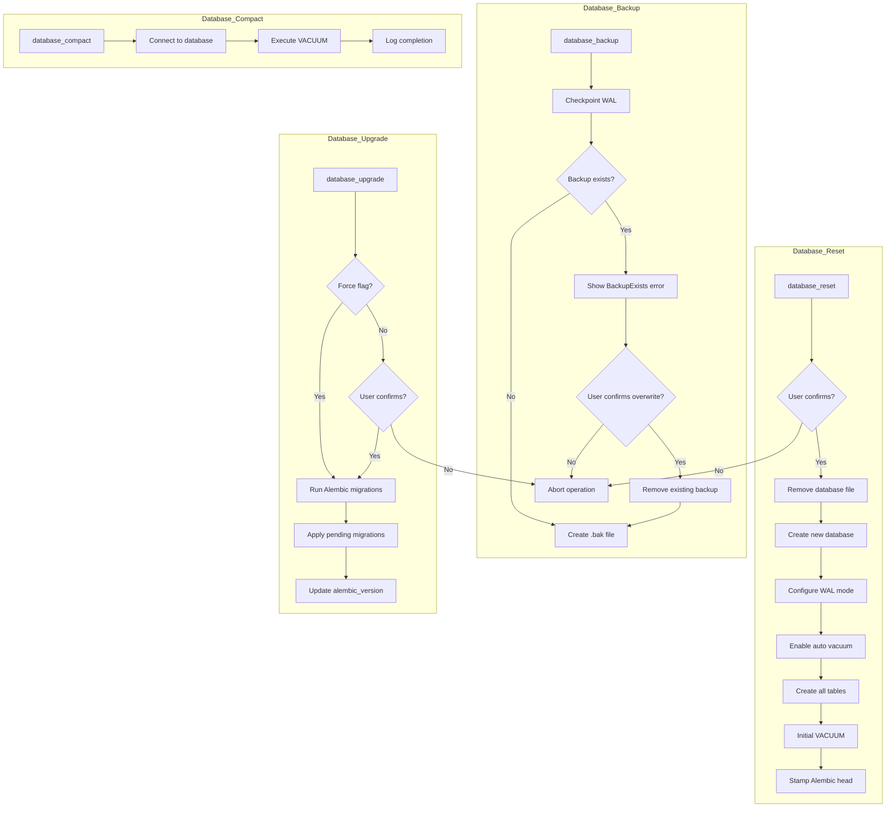

# Database CLI Commands

## Overview

The Database CLI provides commands for managing the SQLite database used by degenbot to store pool metadata, liquidity positions, Aave market data, and other blockchain-derived information. Commands are available for creating, backing up, compacting, upgrading, and resetting the database.

## Background: Database Architecture

### SQLite with Write-Ahead Logging (WAL)

Degenbot uses SQLite with **WAL mode** for improved concurrency and performance:

- **WAL mode**: Allows simultaneous reads and writes
- **Journal file**: Stores changes before committing to main database
- **Auto vacuum**: Enabled to reclaim free space automatically
- **Checkpointing**: WAL checkpoint performed before backups for consistency

### Database Schema

The database contains multiple tables organized by domain:

- **ERC20 tokens**: `Erc20TokenTable` - Token metadata for all tracked assets
- **Pools**: `LiquidityPoolTable` and subclass tables for V2/V3/V4 pool metadata
- **Liquidity positions**: `LiquidityPositionTable` and subclass tables for tick-level data
- **Initialization maps**: `InitializationMapTable` for tick bitmaps
- **Aave V3**: `AaveV3MarketTable`, `AaveV3AssetsTable`, `AaveV3UsersTable`, `AaveV3CollateralPositionsTable`, `AaveV3DebtPositionsTable`, `AaveV3ContractsTable`
- **Exchanges**: `ExchangeTable` for tracking active DEX deployments
- **Pool managers**: `PoolManagerTable` for Uniswap V4 pool managers

All database models are defined in [`src/degenbot/database/models/`](../../src/degenbot/database/models/).

### Alembic Migrations

Database schema changes are managed through **Alembic migrations**:

- **Version tracking**: `alembic_version` table stores current schema revision
- **Migration scripts**: Located in [`src/degenbot/migrations/versions/`](../../src/degenbot/migrations/versions/)
- **Upgrade path**: Migrations can be applied incrementally to the latest version
- **Head revision**: Latest migration marked as `head`

## Commands

All CLI commands are implemented in [`src/degenbot/cli/database.py`](../../src/degenbot/cli/database.py).

### `degenbot database backup`

Back up the database to a `.bak` file.

```bash
degenbot database backup
```

#### Behavior

1. **Checkpoint WAL**: Performs a full WAL checkpoint to ensure data consistency
2. **Create backup**: Copies database to `[database_path].bak`
3. **Error handling**: Raises `BackupExists` if backup file already exists
4. **Confirmation**: Prompts to overwrite existing backup if found

#### Example Usage

```bash
# Create backup of default database
degenbot database backup

# Output when backup exists:
# An existing backup was found at /path/to/database.db.bak. Do you want to remove it and continue? [y/N]:
```

#### Backup File Location

The backup file is created in the same directory as the database with a `.bak` suffix:
- Database: `/path/to/database.db`
- Backup: `/path/to/database.db.bak`

### `degenbot database reset`

Remove and recreate the database with an empty schema.

```bash
degenbot database reset
```

#### Behavior

1. **Confirmation**: Prompts user to confirm deletion
2. **Remove database**: Deletes the existing database file
3. **Create new database**: Initializes with current schema
4. **Configure SQLite**: Sets WAL mode, auto vacuum, and creates all tables
5. **Stamp migrations**: Marks database with latest Alembic revision
6. **Initial vacuum**: Performs VACUUM to optimize storage

#### Example Usage

```bash
degenbot database reset

# Output:
# The existing database at /path/to/database.db will be removed and a new, empty database will be
# initialized using the schema included in degenbot version X.Y.Z. Do you want to proceed? [y/N]:
```

### `degenbot database upgrade`

Upgrade the database schema to the latest version.

```bash
degenbot database upgrade [--force]
```

#### Parameters

| Parameter | Default | Description |
|-----------|---------|-------------|
| `--force` | `False` | Skip confirmation prompt |

#### Behavior

1. **Check versions**: Compares current database version with latest migration
2. **Confirmation**: Prompts unless `--force` is specified
3. **Apply migrations**: Runs all pending Alembic migrations sequentially
4. **Update version**: Updates `alembic_version` table to head revision

#### Example Usage

```bash
# Interactive upgrade with confirmation
degenbot database upgrade

# Force upgrade without confirmation
degenbot database upgrade --force

# Output:
# The database at /path/to/database.db will be upgraded from version abc123 to def456. Do you want to proceed? [y/N]:
```

#### Migration Versioning

The system tracks two versions:

- **Current version**: Revision stored in `alembic_version` table
- **Latest version**: Head revision in migration scripts

A warning is logged on startup if versions don't match:
```
The current database revision (abc123) does not match the latest (def456) for degenbot version X.Y.Z!
Database-related features may raise exceptions if you continue. Perform database migrations with 'degenbot database upgrade'.
```

### `degenbot database compact`

Compact the database to reclaim free space.

```bash
degenbot database compact
```

#### Behavior

1. **Connect to database**: Opens SQLite connection
2. **Run VACUUM**: Rebuilds database file, removing free space and defragmenting
3. **Log completion**: Records compaction completion in logs

#### Example Usage

```bash
degenbot database compact

# No output (silent success)
```

#### When to Use

- After large data deletions (e.g., removing old exchange data)
- Before backups to reduce file size
- When database file has grown significantly with many deletions
- Periodically for maintenance on frequently updated databases

## Database Initialization

When a new database is created (via `reset` or programmatically), the following operations are performed:

```python
# 1. Create engine and connect
engine = create_engine("sqlite:///path/to/database.db")

# 2. Enable WAL mode for concurrent reads/writes
connection.execute(text("PRAGMA journal_mode=WAL;"))

# 3. Enable auto vacuum to reclaim space
connection.execute(text("PRAGMA auto_vacuum=FULL;"))

# 4. Create all tables from SQLAlchemy models
Base.metadata.create_all(bind=engine)

# 5. Perform initial vacuum for optimization
connection.execute(text("VACUUM;"))

# 6. Stamp with latest Alembic revision
command.stamp(get_alembic_config(), "head")
```

## Data Flow



## Database Schema Changes

### Migration Files

Each migration file in [`src/degenbot/migrations/versions/`](../../src/degenbot/migrations/versions/) contains:

- **Revision ID**: Unique hash identifying the migration
- **Upgrade script**: `upgrade()` function for applying changes
- **Downgrade script**: `downgrade()` function for reverting changes
- **Dependencies**: List of parent revisions

Example migration file:
```python
revision = 'abc123def456'
down_revision = '987654321abc'
branch_labels = None
depends_on = None

def upgrade() -> None:
    # Apply schema changes
    op.add_column('table_name', sa.Column('new_column', sa.Integer()))

def downgrade() -> None:
    # Revert schema changes
    op.drop_column('table_name', 'new_column')
```

### Creating New Migrations

To add new database migrations:

```bash
# Generate a new migration script (run from project root)
alembic revision --autogenerate -m "description of changes"

# Edit the generated migration file if needed
# vim src/degenbot/migrations/versions/[new_revision]_description.py

# Apply the migration
degenbot database upgrade
```

## Configuration

The database path is configured via settings:

```python
# From degenbot.config.settings
settings.database.path  # pathlib.Path to database file
```

Default database location depends on the platform and configuration.

### SQLite Performance Settings

The database is configured with these SQLite pragmas:

| Pragma | Value | Purpose |
|--------|-------|---------|
| `journal_mode` | `WAL` | Allow concurrent reads and writes |
| `auto_vacuum` | `FULL` | Automatically reclaim free space |
| `VACUUM` | Run on init/optimize | Defragment and optimize storage |

## Error Handling

### BackupExists

Raised by `backup_sqlite_database()` when a backup file already exists at the target path.

```python
class BackupExists(DegenbotError):
    def __init__(self, path: pathlib.Path) -> None:
        self.path = path
        super().__init__(message=f"A backup at {path} already exists.")
```

**Resolution**: User can choose to overwrite the existing backup or abort.

### Version Mismatch

Logged as a warning on startup if database version doesn't match the code version.

**Resolution**: Run `degenbot database upgrade` to apply pending migrations.

## Related Functions

### Database Operations

All database operations are defined in [`src/degenbot/database/operations.py`](../../src/degenbot/database/operations.py):

- `backup_sqlite_database(db_path)` - Create backup of database
- `create_new_sqlite_database(db_path)` - Create new database with schema
- `compact_sqlite_database(db_path)` - Reclaim free space with VACUUM
- `upgrade_existing_sqlite_database()` - Apply pending Alembic migrations
- `get_scoped_sqlite_session(database_path)` - Get thread-safe SQLAlchemy session
- `get_alembic_config()` - Get Alembic configuration object

### Database Session

The global database session is available in [`src/degenbot/database/__init__.py`](../../src/degenbot/database/__init__.py):

```python
db_session = get_scoped_sqlite_session(database_path=settings.database.path)

# Usage:
from degenbot.database import db_session

with db_session() as session:
    result = session.execute(query)
```

## Dependencies

- **Database**: SQLite 3.x
- **ORM**: SQLAlchemy
- **Migrations**: Alembic
- **CLI**: Click
- **Logging**: degenbot logging module

## Development Notes

### Thread Safety

The database session uses `scoped_session` for thread safety:

```python
return scoped_session(
    session_factory=sessionmaker(bind=create_engine(...))
)
```

This ensures each thread gets its own session while sharing the connection pool.

### WAL Checkpointing

Before creating a backup, the code performs a full WAL checkpoint:

```python
connection.execute(text("PRAGMA wal_checkpoint(FULL);"))
```

This ensures all WAL journal entries are flushed to the main database file for a consistent backup.

### Batch Mode Migrations

Alembic is configured with `render_as_batch=True` for batch mode operations, which is required for SQLite's limited ALTER TABLE support.

```python
context.configure(
    connection=connection,
    target_metadata=target_metadata,
    render_as_batch=True,
)
```

## Example Workflows

### Initial Setup

```bash
# 1. Create a new empty database
degenbot database reset

# 2. Activate exchanges
degenbot exchange activate ethereum_uniswap_v3
degenbot exchange activate base_aerodrome_v2

# 3. Run initial updates
degenbot pool update
```

### Regular Maintenance

```bash
# 1. Create backup before updates
degenbot database backup

# 2. Run updates
degenbot pool update
degenbot aave update

# 3. Compact database if it grew significantly
degenbot database compact
```

### Schema Upgrade

```bash
# After pulling code with new migrations
degenbot database upgrade --force
```

### Data Recovery

```bash
# Restore from backup (manual operation)
cp database.db.bak database.db

# Verify version matches
degenbot database info  # (if command exists)
```
