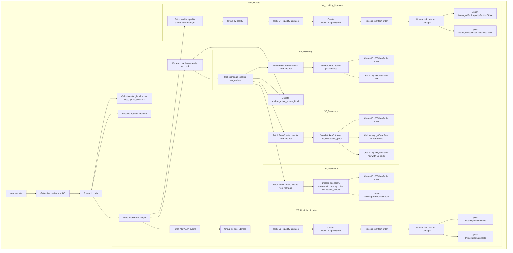

## Overview

The Pool CLI provides commands for managing liquidity pool metadata and tracking liquidity positions across multiple DEX versions (Uniswap 2, 3, and 4) on Base and Ethereum mainnet. The main command `pool update` fetches blockchain events for pool discovery and liquidity updates, synchronizing database with current pool states.

## Background: Pool Architecture

### Uniswap V2 Architecture

V2 pools use a **constant product AMM** (x*y=k) formula. All liquidity is distributed evenly across entire price range. Pools are created by factories with a `PairCreated` event containing token addresses and pool address.

### Uniswap V3 Architecture

V3 introduces **concentrated liquidity** - liquidity providers can allocate capital to custom price ranges using tick boundaries. This requires tracking tick-level liquidity with:

- **Tick bitmap**: 256-bit words mapping initialized tick positions
- **Liquidity mapping**: Net and gross liquidity at each tick for price traversal
- **Tick spacing**: Constraints on allowed tick positions per fee tier

Pools emit `Mint` and `Burn` events for liquidity changes.

### Uniswap V4 Architecture

V4 uses a **centralized pool manager** (instead of per-pool contracts) with hooks for custom logic:

- **PoolManager**: Single contract managing all pools
- **PoolKey**: Keccak256 hash identifying pools (currency0, currency1, fee, tickSpacing, hooks)
- **Hooks**: Customizable behavior at pool boundaries
- **ModifyLiquidity**: Single event type for liquidity operations

V4 uses separate `ManagedPool` database tables with pool manager references.

## Commands

All CLI commands are implemented in [`src/degenbot/cli/pool.py`](../../src/degenbot/cli/pool.py) and [`src/degenbot/cli/exchange.py`](../../src/degenbot/cli/exchange.py).

### `degenbot pool update`

Update pool metadata and liquidity positions for all activated exchanges.

```bash
degenbot pool update [--chunk SIZE] [--to-block BLOCK]
```

#### Parameters

| Parameter | Default | Description |
|-----------|---------|-------------|
| `--chunk` | 10,000 | Maximum number of blocks to process per database commit |
| `--to-block` | `latest:-64` | Last block in update range. Format: `TAG[:OFFSET]` |

#### Block Identifiers

Valid block tags: `earliest`, `finalized`, `safe`, `latest`, `pending`

Examples:
- `latest` - Latest block
- `latest:-64` - 64 blocks before chain tip (default, ensures finality)
- `safe:128` - 128 blocks after last safe block
- `12345678` - Specific block number

#### Behavior

1. **Identify active chains**: Queries database for chains with active exchanges
2. **Determine update range**: Starts from `min(last_update_block + 1)` across exchanges
3. **Process in chunks**: Iteratively processes blocks up to `chunk_size`
4. **Track progress**: Displays progress bar showing blocks processed
5. **Skip up-to-date chains**: If no new blocks exist since last update, skips

#### Example Usage

```bash
# Update to 128 blocks before latest
degenbot pool update --to-block "latest:-128"

# Update using smaller chunks for slower machines
degenbot pool update --chunk 5000

# Update to a specific block for historical analysis
degenbot pool update --to-block "18900000"
```

### `degenbot exchange activate`

Activate an exchange for pool tracking. Creates database entry if not exists.

```bash
degenbot exchange activate [base_aerodrome_v2 | base_aerodrome_v3 | base_pancakeswap_v2 | base_pancakeswap_v3 | base_sushiswap_v2 | base_sushiswap_v3 | base_swapbased_v2 | base_uniswap_v2 | base_uniswap_v3 | base_uniswap_v4 | ethereum_pancakeswap_v2 | ethereum_pancakeswap_v3 | ethereum_sushiswap_v2 | ethereum_sushiswap_v3 | ethereum_uniswap_v2 | ethereum_uniswap_v3 | ethereum_uniswap_v4]
```

V4 exchanges additionally create a PoolManagerTable entry.

### `degenbot exchange deactivate`

Deactivate an exchange (pools not updated).

```bash
degenbot exchange deactivate [exchange_name]
```

## Example Workflow: Uniswap V3 on Ethereum Mainnet

### Step 1: Activate Uniswap V3 on Ethereum

Activate exchange to begin tracking pools:

```bash
degenbot exchange activate ethereum_uniswap_v3
```

This command:
- Creates an `ExchangeTable` entry if it doesn't exist
- Sets `active = True` for the exchange
- Stores the factory contract address from deployment constants
- Outputs: `Activated Uniswap V3 on Ethereum (chain ID 1).`

### Step 2: Run Initial Pool Update

Fetch and process all Uniswap V3 pools created on Ethereum:

```bash
degenbot pool update
```

This command:
- Detects chain ID 1 has an active Uniswap V3 exchange
- Starts from block 0 (no previous updates)
- Processes blocks in 10,000-block chunks by default
- Fetches `PoolCreated` events from Uniswap V3 factory
- Creates `LiquidityPoolTable` entries for each pool discovered
- Fetches `Mint` and `Burn` events for liquidity updates
- Updates `LiquidityPositionTable` and `InitializationMapTable`
- Sets `exchange.last_update_block` to final block processed
- Displays progress bars for:
  - Processing new blocks
  - Adding new pools
  - Updating V3 pool liquidity

### Step 3: Verify Database State

After update completes, verify pools were discovered:

```sql
SELECT address, chain, kind
FROM pools
WHERE chain = 1 AND kind = 'uniswap_v3'
LIMIT 10;
```

Expected result: List of Uniswap V3 pool addresses on Ethereum mainnet.

### Step 4: Run Incremental Update

Subsequent updates only process new blocks:

```bash
degenbot pool update
```

This command:
- Starts from `last_update_block + 1` (not block 0)
- Only processes blocks since the last update
- Continues synchronizing liquidity positions

Output includes: `Chain 1 has not advanced since the last update.` if no new blocks exist.

### Step 5: Deactivate Exchange (Optional)

Stop tracking Uniswap V3 on Ethereum:

```bash
degenbot exchange deactivate ethereum_uniswap_v3
```

This command:
- Sets `active = False` for the exchange
- Subsequent `pool update` commands skip this exchange
- Database records remain intact for historical queries

## Supported Exchanges

### Base Mainnet
- Aerodrome V2, V3
- Pancakeswap V2, V3
- Sushiswap V2, V3
- Swapbased V2
- Uniswap V2, V3, V4

### Ethereum Mainnet
- Pancakeswap V2, V3
- Sushiswap V2, V3
- Uniswap V2, V3, V4

## Fee Structure

### V2 Fees
Fixed fee per pool:
- **Uniswap V2**: 0.3% (3/1000)
- **Sushiswap V2**: 0.3% (3/1000)
- **Swapbased V2**: 0.3% (3/1000)
- **Pancakeswap V2**: 0.25% (25/10000)
- **Aerodrome V2**: Variable (queried from factory via `getFee()`), includes stable pair flag

### V3 Fees
Tiered fee structure (basis points, denominator = 1,000,000):
- **500 bps** (0.05%) - Stable pairs
- **3000 bps** (0.3%) - Standard pairs
- **10000 bps** (1.0%) - Exotic pairs

### V4 Fees
Dynamic fee support:
- Range: 0 to 1,000,000 bps (0% to 100%)
- Specified per pool in PoolKey

## Data Flow



## Pool Discovery Events

### V2: PairCreated Event

Emitted from factory contracts when new pairs are created:

```
PairCreated(
    address indexed token0,
    address indexed token1,
    address pair,
    uint256
)
```

**Common Event Hash**: `0x0d3648bd0f6ba80134a33ba9275ac585d9d315f0ad8355cddefde31afa28d0e9`

Used by: Uniswap V2, Pancakeswap V2, Sushiswap V2, Swapbased V2

### V3: PoolCreated Event

Emitted from factory contracts when new pools are created:

```
PoolCreated(
    address indexed token0,
    address indexed token1,
    uint24 indexed fee,
    int24 tickSpacing,
    address pool
)
```

**Common Event Hash**: `0x783cca1c0412dd0d695e784568c96da2e9c22ff989357a2e8b1d9b2b4e6b7118`

Used by: Uniswap V3, Pancakeswap V3, Sushiswap V3, Aerodrome V3

**Aerodrome V3 Special**: Fetches fee from factory using `getSwapFee(poolAddress)` after discovery.

### V4: PoolCreated Event

Emitted from PoolManager when new pools are created:

```
PoolCreated(
    bytes32 indexed id,
    address indexed currency0,
    address indexed currency1,
    uint24 fee,
    int24 tickSpacing,
    address hooks
)
```

**Event Hash**: `0xdd466e674ea557f56295e2d0218a125ea4b4f0f6f3307b95f85e6110838d6438`

## Liquidity Update Processing

### V3 Mint Event

Emitted when liquidity is added to a position:

```
Mint(
    address sender,
    address indexed owner,
    int24 indexed tickLower,
    int24 indexed tickUpper,
    uint128 amount,
    uint256 amount0,
    uint256 amount1
)
```

**Event Hash**: `0x7a53080ba414158be7ec69b987b5fb7d07dee101fe85488f0853ae16239d0bde`

**Processing**: Updates tick data by adding `liquidity_gross` and `liquidity_net` across tick range. Updates tick bitmap at word boundaries.

### V3 Burn Event

Emitted when liquidity is removed from a position:

```
Burn(
    address indexed owner,
    int24 indexed tickLower,
    int24 indexed tickUpper,
    uint128 amount,
    uint256 amount0,
    uint256 amount1
)
```

**Event Hash**: `0x0c396cd989a39f4459b5fa1aed6a9a8dcdbc45908acfd67e028cd568da98982c`

**Processing**: Updates tick data by subtracting `liquidity_gross` and `liquidity_net` across tick range. Deletes position entries if zero.

### V4 ModifyLiquidity Event

Emitted for both adding and removing liquidity:

```
ModifyLiquidity(
    PoolId indexed id,
    address indexed sender,
    int24 tickLower,
    int24 tickUpper,
    int256 liquidityDelta,
    bytes32 salt
)
```

**Event Hash**: `0xf208f4912782fd25c7f114ca3723a2d5dd6f3bcc3ac8db5af63baa85f711d5ec`

**Processing**: Similar to V3 but uses single event with signed `liquidityDelta`. Updates managed pool tables.

## Mock Pool Helpers

### Purpose

Mock pool classes (`MockV3LiquidityPool` and `MockV4LiquidityPool`) are lightweight versions of full pool implementations used to:

1. **Simulate liquidity updates**: Apply Mint/Burn/ModifyLiquidity events to tick data
2. **Validate calculations**: Ensure tick bitmap and liquidity mapping correctness
3. **Avoid overhead**: Skip expensive operations like state locking, subscriber notifications, and in-range liquidity modification

### MockV3LiquidityPool

Extends [`UniswapV3Pool`](../../src/degenbot/uniswap/v3_liquidity_pool.py) with simplifications:
- `_state_lock`: No-op context manager (no locking)
- `_notify_subscribers`: Empty method (no notifications)
- `_invalidate_range_cache_for_ticks`: Empty method (no caching)
- `_initial_state_block`: Set to `MAX_UINT256` (skip in-range modifications)
- `sparse_liquidity_map`: Set to `False` for full mapping

Stores `tick_bitmap` (word → bitmap) and `tick_data` (tick → liquidity) from database, applies events, exports validated mappings.

### MockV4LiquidityPool

Extends [`UniswapV4Pool`](../../src/degenbot/uniswap/v4_liquidity_pool.py) with similar simplifications:
- Same method overrides as V3 mock
- Includes `pool_id` parameter for V4 identification
- Constructs `PoolKey` from database currencies, fee, tickSpacing, hooks
- Uses external update to set initial state with `MAX_UINT256` liquidity

### Usage Pattern

1. Load current state from database
2. Create mock helper with loaded tick_bitmap and tick_data
3. Process liquidity events chronologically
4. Apply each event via `update_liquidity_map()`
5. Export validated tick data and bitmaps back to database

## Data Model Updates

All database models are defined in [`src/degenbot/database/models/pools.py`](../../src/degenbot/database/models/pools.py) and [`src/degenbot/database/models/base.py`](../../src/degenbot/database/models/base.py):

| Table | Fields Updated | Notes |
|-------|----------------|-------|
| `ExchangeTable` | `last_update_block` | After each chunk completes |
| `Erc20TokenTable` | New rows created | For token0/token1/currency0/currency1 |
| `LiquidityPoolTable` | New rows created | V2/V3 pool metadata from factory events |
| `UniswapV4PoolTable` | New rows created | V4 pool metadata from manager events |
| `PoolManagerTable` | New rows created | V4 manager metadata (on activate) |
| `LiquidityPositionTable` | `liquidity_net`, `liquidity_gross` | Upsert from V3 liquidity events |
| `InitializationMapTable` | `bitmap` | Upsert from V3 tick bitmap updates |
| `ManagedPoolLiquidityPositionTable` | `liquidity_net`, `liquidity_gross` | Upsert from V4 liquidity events |
| `ManagedPoolInitializationMapTable` | `bitmap` | Upsert from V4 tick bitmap updates |

## Algorithm Details

### Chunk Processing

Blocks are processed in chunks to limit memory usage and enable incremental commits:

1. Calculate `working_end_block` as minimum of:
   - `last_block` (target block)
   - `working_start_block + chunk_size - 1`
   - All `exchange.last_update_block` values ahead of current chunk

2. Update exchanges where `last_update_block is None` or `last_update_block + 1 == working_start_block`

3. Commit changes and advance `working_start_block = working_end_block + 1`

4. Repeat until `working_end_block == last_block`

### Event Ordering

Events are processed in block number, then log index order to ensure chronological processing within blocks:

```python
sorted(
    all_events, 
    key=operator.itemgetter(
        "blockNumber", 
        "logIndex"
    )
)
```

Invariants enforced by assertions:
- New event block ≥ last update block
- Same block events must have increasing log index

### SQLite Variable Limits

Upsert operations are chunked to stay below SQLite's 32,766 variable limit per batch statement:

- **Liquidity positions**: 30,000 rows per chunk (4 keys/row)
- **Initialization maps**: 30,000 rows per chunk (3 keys/row)

Zero-bitmap words (all ticks uninitialized) are excluded from upserts to reduce database size.

## Solidity Smart Contract Source Code

### Uniswap V2

**Core Contract**: [UniswapV2Pair.sol](https://github.com/Uniswap/v2-core/blob/main/contracts/UniswapV2Pair.sol)
**Factory**: [UniswapV2Factory.sol](https://github.com/Uniswap/v2-core/blob/main/contracts/UniswapV2Factory.sol)

**Key Libraries**:
- **UniswapV2Library**: Pool address generation, price calculations
  - `getPair()`, `getReserves()`, `quote()`
- **Math**: Overflow-safe arithmetic

**Constant Product**: x * y = k (invariant)

### Uniswap V3

**Core Contract**: [UniswapV3Pool.sol](https://github.com/Uniswap/v3-core/blob/main/contracts/UniswapV3Pool.sol)
**Factory**: [UniswapV3Factory.sol](https://github.com/Uniswap/v3-core/blob/main/contracts/UniswapV3Factory.sol)

**Key Libraries**:
- **TickBitmap**: Efficient tick traversal using bit manipulation
- **TickMath**: Sqrt price ↔ tick conversions (Q96.96 fixed-point)
- **SqrtPriceMath**: Price calculations for swap steps
- **SwapMath**: Compute swap step with liquidity constraints
- **LiquidityMath**: Safe liquidity addition/subtraction
- **FullMath**: Overflow-safe multiplication/division
- **BitMath**: Bit position calculations (LSB/MSB)

**Tick Range**: -887272 to 887272
**Price Representation**: `sqrtPriceX96 = 1.0001^(tick/2) * 2^96`

### Uniswap V4

**Core Contract**: [PoolManager.sol](https://github.com/Uniswap/v4-core/blob/main/src/PoolManager.sol)
**Types**: [Pool.sol](https://github.com/Uniswap/v4-core/blob/main/src/types/Pool.sol) (library)

**Key Libraries**:
- **TickBitmap**: Adapted V3 tick bitmap for manager architecture
- **SwapMath**: Enhanced for dynamic fees and hooks
- **LiquidityMath**: Same as V3
- **FullMath**: Same as V3
- **TickMath**: Same as V3
- **Hooks**: Customization framework

**Hooks**: Custom logic at pool boundaries (before/after swap, modify liquidity, etc.)

## Related Functions

See CLI implementation for pool update logic:

- **Main command**: `pool_update()` in [`src/degenbot/cli/pool.py`](../../src/degenbot/cli/pool.py)
- **Exchange activation**: `activate_exchange()` in [`src/degenbot/cli/exchange.py`](../../src/degenbot/cli/exchange.py)
- **V2 pool discovery**: `update_v2_pools()` in [`src/degenbot/cli/pool.py`](../../src/degenbot/cli/pool.py)
- **V3 pool discovery**: `update_v3_pools()` in [`src/degenbot/cli/pool.py`](../../src/degenbot/cli/pool.py)
- **V4 pool discovery**: `update_v4_pools()` in [`src/degenbot/cli/pool.py`](../../src/degenbot/cli/pool.py)
- **V3 liquidity updates**: `apply_v3_liquidity_updates()` in [`src/degenbot/cli/pool.py`](../../src/degenbot/cli/pool.py)
- **V4 liquidity updates**: `apply_v4_liquidity_updates()` in [`src/degenbot/cli/pool.py`](../../src/degenbot/cli/pool.py)
- **Mock pool helpers**: [`MockV3LiquidityPool`](../../src/degenbot/uniswap/v3_liquidity_pool.py), [`MockV4LiquidityPool`](../../src/degenbot/uniswap/v4_liquidity_pool.py)

## Configuration

The command uses Web3 connections from degenbot config file. Each active chain must have an RPC endpoint configured.

### Required Config

```yaml
rpc:
  1: https://mainnet.example.com  # Ethereum mainnet
  8453: https://base.example.com    # Base mainnet
```

## Dependencies

- **Database**: SQLAlchemy ORM (see [`src/degenbot/database/models/pools.py`](../../src/degenbot/database/models/pools.py))
- **Blockchain**: Web3.py for RPC calls
- **Math**: Uniswap V3/V4 libraries (tick bitmap, tick math, liquidity math)
- **Logging**: Click for CLI output, tqdm for progress bars
